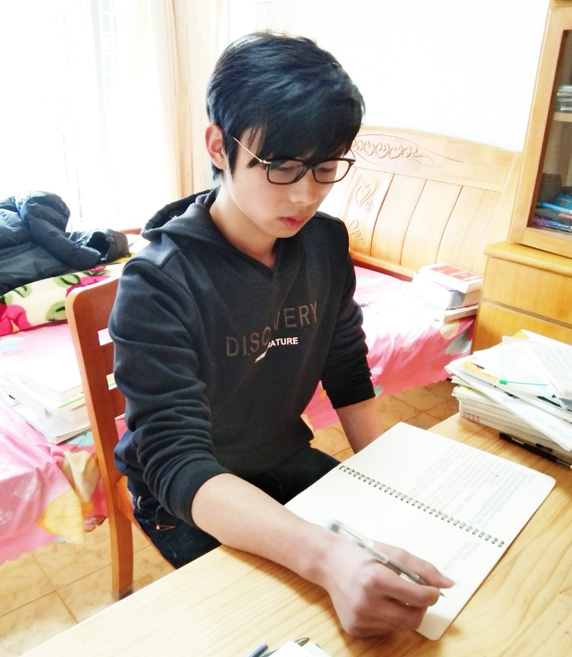
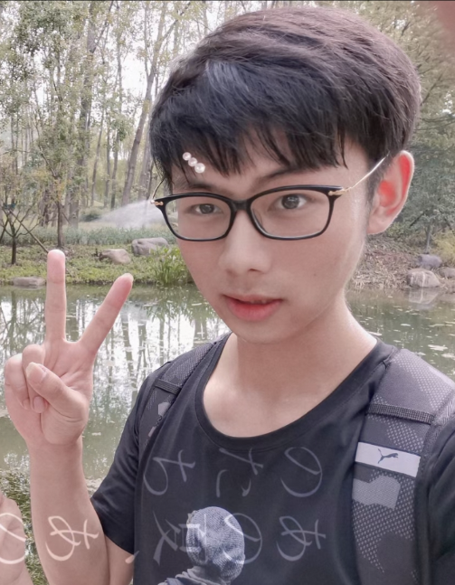
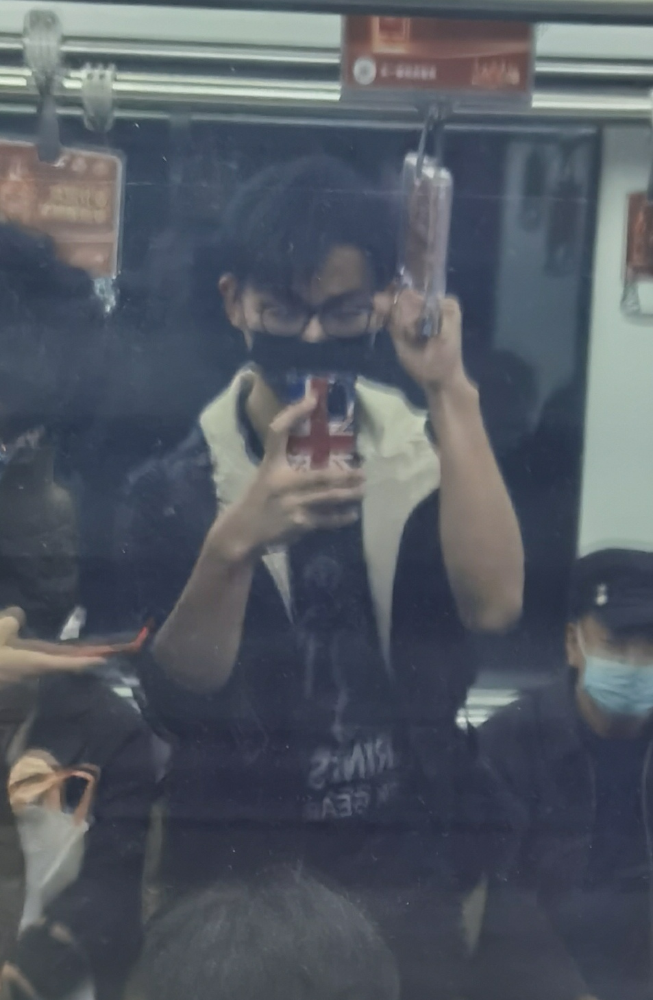
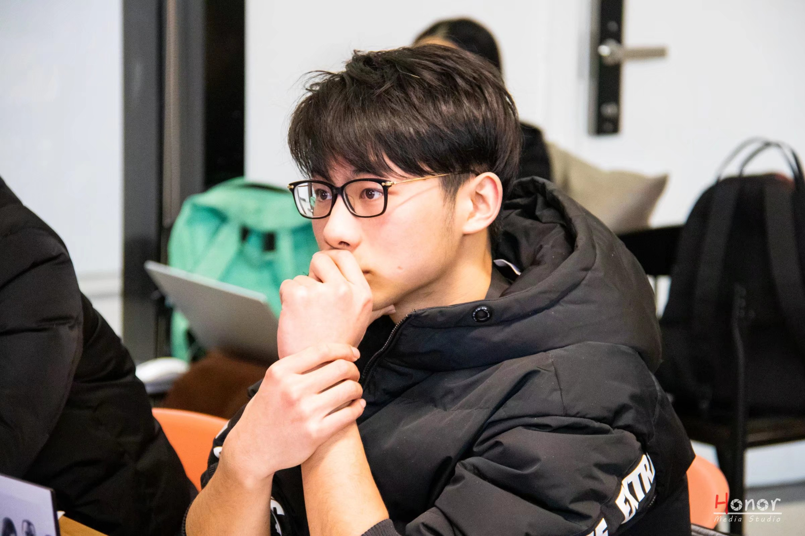

# 设站初衷
* 在写代码的时候我经常会碰到`bug`，记录这些`bug`有利于我在以后碰到同样的问题时不用再费力去`google`了，而是可以直接翻看自己的站点就可以解决问题了。
* 在站点归类整理自己学到的知识也有利于提升我的知识水平，为以后`面试找工作`都有帮助。

# 联系方式
* QQ: 1494121350
* 邮箱: 
  * shihuang.pan@foxmail.com
  * pshpeterpan@gmail.com
* 微信: weixin_psh263

# 站长简介
* 2017/9 ～ 2020/7 就读于嘉兴市秀州中学

这是当时疫情在家学习时，学校要求拍一个在家学习的照片，当时疫情宅在家挺久了，头发也留长了没剪哈哈哈哈。说实话，高考前那段时间我已经放轻松了心态了，就想着赶快考完算了，结果最后结果还可以哈哈哈。

* 高考后的暑假

高考后的暑假生活和🐷差不多，整天吃了睡睡了吃，然后打游戏。现在想起来，如果我当时暑假天天刷OJ的话，现在是不是ACM至少还能得个奖哈哈哈。

这是当时和一位女同学出去玩的时候拍的，那位女同学现在也已经去了兰州大学了。暑假一起玩了会儿但是后来联系得比较少了。

* 2020/9 ～ 2021/7 就读于杭州电子科技大学 --- 会计学

哎，当时不懂事，大一的时候对学啥专业也无所谓，当时我可以去学计算机科学与技术的，但是后来我脑子犯浑了选了会计学。其实会计学以后发展也是可以的，但是我真的对这门课提不起兴趣啊。于是大一下我就萌生了转专业的想法，为了转专业我要提高绩点，为此又不得不学好会计学😭😭😭。

不过会计班的同学都很好的，这是当时和别的班同学一起出去玩时拍的照片。当时还梳了一个三七分哈哈哈😂。

* 2020/9 ～ 至今 就读于杭州电子科技大学 --- 软件工程

索性在经过一个学期的努力之后，我成功转专业了，为了保险我没有选计算机科学与技术而是选了软件工程。虽然从我现在的视角看，选计算机科学与技术学院领导肯定也会让我通过的，但是我也不后悔，因此班上的同学也都很好，我也很快得融入了新的班级。

这是在寒假的时候社团活动拍的，当时学长组织我们机器学习，没想到我认真听讲的样子被学长拍了下来哈哈哈。右下角的水印就是社团标志。

这是我回嘉兴在外面玩的时候拍的，当时还发朋友圈了😂😂😂。

照片太多，就不一一发了。

# 大学生活
* 大一上
  * 这个学期就是迷茫，但是快乐
    * 为什么迷茫呢，因为刚上大学不知道该做什么
    * 为什么快乐呢，因为没啥压力，所以该吃吃该喝喝，玩得确实很开心

* 大一下
  * 这学期有一门课叫《中级财务会计》，彻底劝退我读会计的想法
  * 这个学期为了转专业我也是花费了不少心思

* 大二一学年
  * 忙忙碌碌，刚转专业，要补的课一大堆，索性我挺过来了
  * 参加了很多竞赛，收获满满
    * 数学建模全国一等奖
    * 服务外包全国三等奖
    * 美赛H奖

* 大三上
  * 跟着导师进了实验室，开始阅读知识图谱相关文献，每周汇报
  * 每周组会心里都会push自己一下，还是有一定压力的
  * 还和会计班的同学们参加了一个证券投资竞赛，没想到还拿了一个省三

* 大三下 ～ 至今
  * 写代码、做实验，不过我组会已经成老油条了，一周的工作可以花三周做完哈哈哈
  * 找实习、做笔试，想暑假体验一下生活，感受下职场生活，是时候走出象牙塔了
  * 准备考研，武忠祥、王道408啥的都开始了