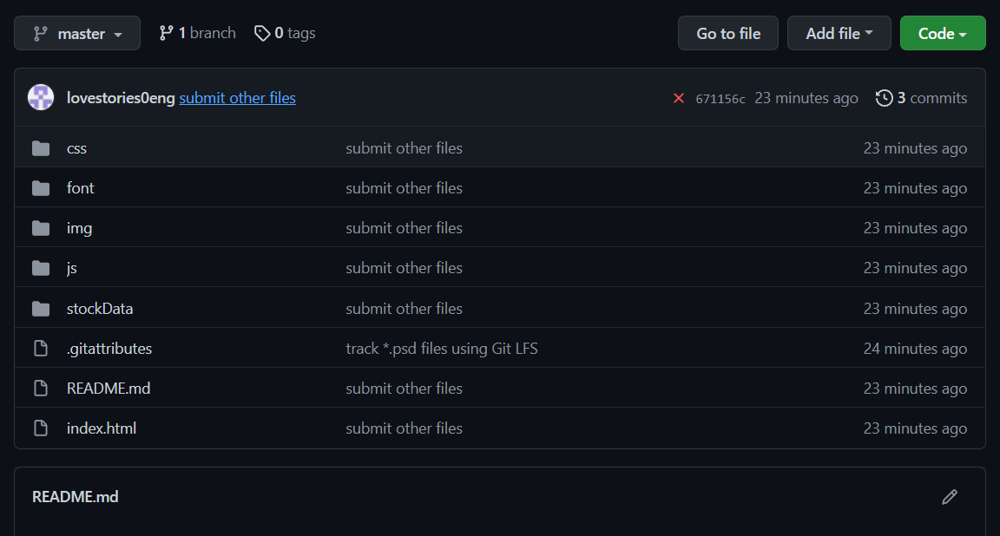
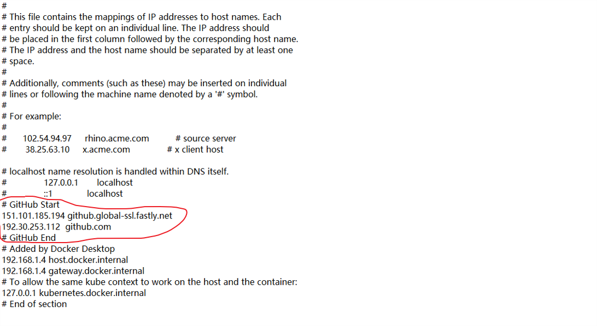
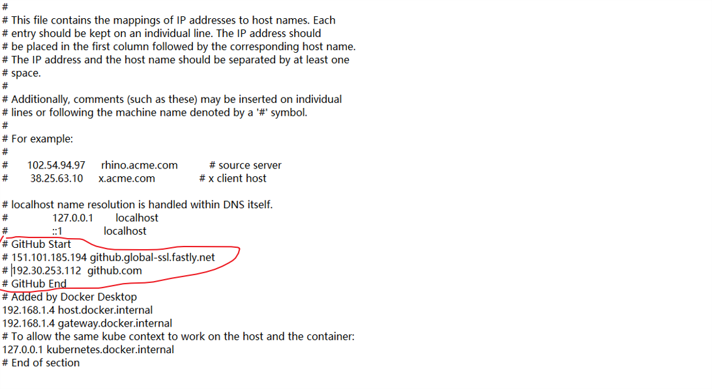

### git上传文件

首先这是我的目录结构

```
├─css
├─font
├─img
├─js
└─stockData
    ├─general_picture
    │  ├─index_dailybasic
    │  └─SZ_daily_info
    ├─HS300
    ├─motion_index
    ├─SSE
    │  ├─bond_summary_sse_df
    │  ├─stock_sse_deal_daily
    │  └─stock_sse_deal_daily_df
    └─SZZS
```

很明显，stockData是一个大文件。

首先需要安装lfs，因为github不允许上传过大的文件，这个模块可以让我们上传大文件。

```
git lfs install
```

追踪所有文件

```
git lfs track *
```

```
$ git lfs track *
Tracking "README.md"
"css" already supported
"font" already supported
"img" already supported
"index.html" already supported
"js" already supported
Tracking "stockData"
```

可以看到追踪到了stockData，但是我想要上传所有的文件，所有需要添加文件

```
git add css
git add font
git add img
git add index.html
git add js
```

最后push到github上面

```
git push origin master
```

```
Uploading LFS objects: 100% (2/2), 3.3 KB | 0 B/s, done.
Enumerating objects: 390, done.
Counting objects: 100% (390/390), done.
Delta compression using up to 8 threads
Compressing objects: 100% (387/387), done.
Writing objects: 100% (388/388), 1.02 MiB | 1015.00 KiB/s, done.
Total 388 (delta 110), reused 0 (delta 0), pack-reused 0
remote: Resolving deltas: 100% (110/110), done.
To https://github.com/lovestories0eng/wecFinancial.git
   3e16a3b..671156c  master -> master
(base) PS E:\JetBrains\bond\dist> git lfs track *
Tracking "*"
Pattern * matches forbidden file .gitattributes. If you would like to track .gitattributes, modify .gitattributes manually.
```



成功

### git clone错误

#### SSL证书错误

```
git clone https://github.com/maclxf/supermall.git
```

报错：

```
Cloning into 'supermall'...
fatal: unable to access 'https://github.com/maclxf/supermall.git/': OpenSSL SSL_read: Connection was reset, errno 10054
```

这是服务器的SSL证书，没有经过第三方签名，所以报错。

如果是由网络不稳定和连接超时引起的。再次尝试的话，您仍然会报告一个错误。

解决方式如下：

```
git config --global http.sslVerify "false"
git init
```

会看到如下结果

```
Initialized empty Git repository in D:/Users/HP/Desktop/Projects/.git/
```

重新clone

```
git clone https://github.com/maclxf/supermall.git
```

成功！

```
Cloning into 'supermall'...
remote: Enumerating objects: 200, done.
remote: Counting objects: 100% (200/200), done.
remote: Compressing objects: 100% (152/152), done.
Receiving objects:  88% (176/200)ote: Total 200 (delta 68), reused 139 (delta 27), pack-reused 0
Receiving objects: 100% (200/200), 198.04 KiB | 594.00 KiB/s, done.
Resolving deltas: 100% (68/68), done.
```

#### Time Out

```
git clone https://github.com/1977474741/vue-waterfall-rapid.git
```

报错:

```
Cloning into 'vue-waterfall-rapid'...
fatal: unable to access 'https://github.com/1977474741/vue-waterfall-rapid.git/': Failed to connect to github.com port 443: Timed out
```

解决方式：找到C:\Windows\System32\drivers\etc\hosts文件，把与github有关的行注释掉即可。





取消代理设置

```
git config --global --unset http.proxy
```

再进行clone

```
git clone https://github.com/itagn/vue-iresume.git
```

```
Cloning into 'vue-iresume'...
remote: Enumerating objects: 455, done.
remote: Total 455 (delta 0), reused 0 (delta 0), pack-reused 455
Receiving objects: 100% (455/455), 367.11 KiB | 402.00 KiB/s, done.
Resolving deltas: 100% (192/192), done.
```

问题解决！