## Section one

**SDK & JDK & JRE & IDE**

* SDK : Software Development Kit 软件开发工具包
* JDK : Java Development Kit Java开发工具包 
* JRE : Java Runtime Environment Java运行时环境
* IDE : Integrated Development Environment 集成开发环境 

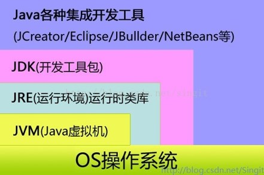

**A simple Java Program**

* 源码编写：记事本、文本编辑器、word、notepad++……

* 源码编译：javac Welcome.java

* 程序执行：java Welcome.class

```java
// This program prints Welcome to Java! 
public class Welcome {	
  public static void main(String[] args) { 
    System.out.println("Welcome to Java!");
  }
}
```

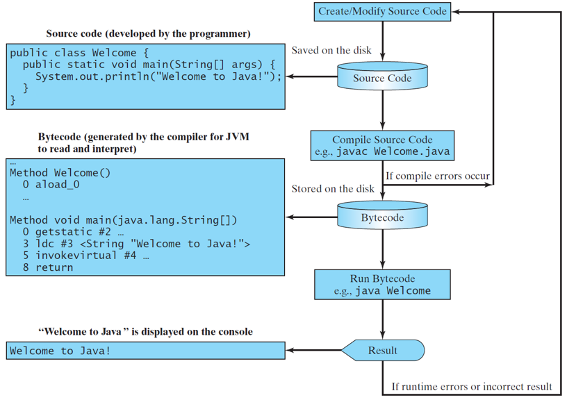

**Programming Errors**

* Syntax Errors 语法错误 **初期常见错误**
* Runtime Errors 运行时错误 **什么时候都可能出现**
* Logic Errors 逻辑错误 **复杂程序容易出现**

## Section two

```
public class ComputerArea {
    public static void main(String[] args) {
    	// define variables
        double radius;
        double area;
        // Assign a radius
        radius = 20;
        // Compute area
        area = radius * radius * 3.14159;
        // Display results
        System.out.println("The area for the circle of radius " + radius + " is " + area);
    }
}

```

**Identifier**

* 标识符：常量、变量、类和方法等命名符号
* 规则
  * 字母(A\~Z、a\~z)、特殊符号($、_)和数字(0~9)
  * 第1个符号不能为数字
  * 不能为关键词、true、false、null
  * 区分大小写
* 一般约定
  * 表示常量的标识符全部大写，如**RED**
  * 表示类名的标识符用大写字母开始，如**MyCar**
  * 表示公有方法和实例变量的标识符用小写字母开始，后面的描述性词以大写开始，如**getCurrentValue**
  * 表示私有或局部变量的标识符全部用小写字母，如**next_value**

| **Name**                   | **Range**                                                    | **Storage** **size** |
| -------------------------- | ------------------------------------------------------------ | -------------------- |
| **byte**                   | **–2****7** **to 2****7** **– 1 (-128 to 127)**              | **1 byte**           |
| **short**                  | **–2****15** **to 2****15** **– 1 (-32768 to 32767)**        | **2 bytes**          |
| **int**                    | **–2****31** **to 2****31** **– 1 (-2147483648 to 2147483647)** | **4 bytes**          |
| **long**                   | **–2****63** **to 2****63** **– 1**  **(-9223372036854775808 to 9223372036854775807)** | **8 bytes**          |
| **float(****单精度****)**  | **Negative:**    **-3.4028235E+38 to -1.4E-45**  **Positive:**    **1.4E-45 to 3.4028235E+38** | **4 bytes**          |
| **double(****双精度****)** | **Negative :     -1.7976931348623157E+308 to -4.9E-324**  **Positive :    4.9E-324  to 1.7976931348623157E+308** | **8 bytes**          |

```
int x = 1;
long x = 8864L;   (or 8864l)
float d = 1.4F;   (or 1.4f)
double d = 1.4;   (or 1.4D 1.4d)
char a = 'A';
```

```
// long:8字节8864在long表示的范围内
long x = 8864;
// JVM中整型默认以int存储
// 自动类型转换（升级）
```

```
long x = 100000000000;
// 错，10e11超过了int的最大范围
// JVM int: 10e11
```

```
long x = 100000000000L;
// 正确，10e11在long的取值范围内
```

```
float x = 0.14;
// float:4字节
// Doublefloat，8字节向4字节，精度可能丢失
// double: 0.14
// JVM默认把0.14看成是Double型的
```

```
float x = 0.14F;
// float:4字节
// 正确
```

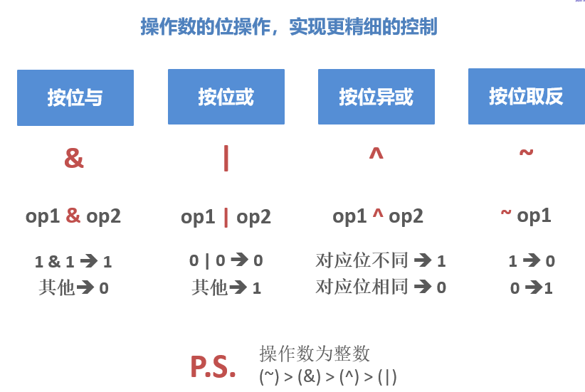

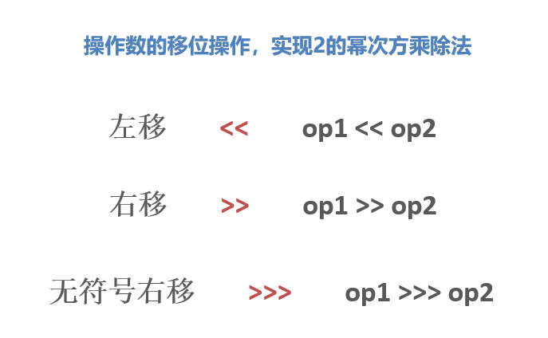

**Type Casting**

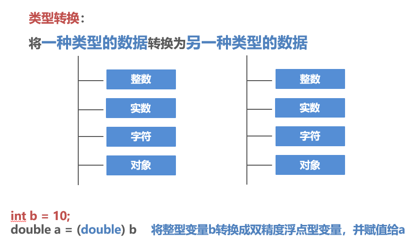

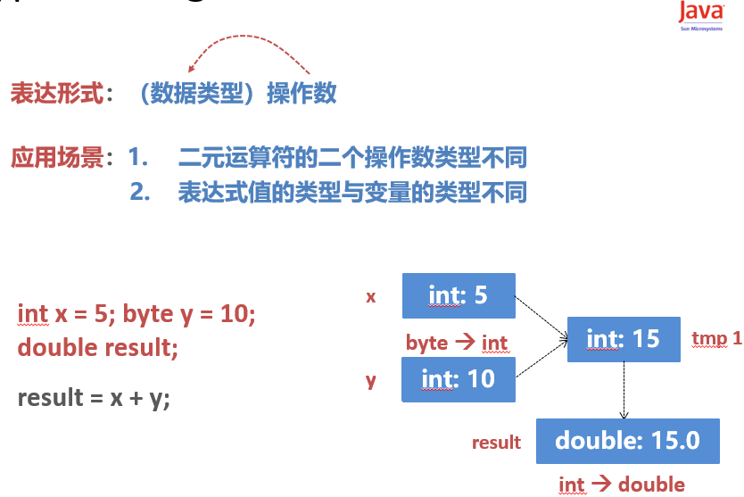

**转换方法** 

* **1.** **隐型**类型转换：自动类型转换（系统完成）
* **2.** **显型**类型转换：强制类型转换

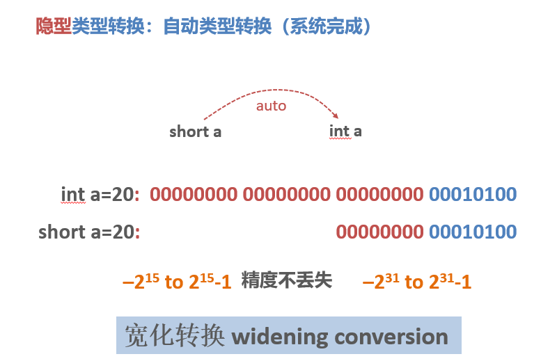

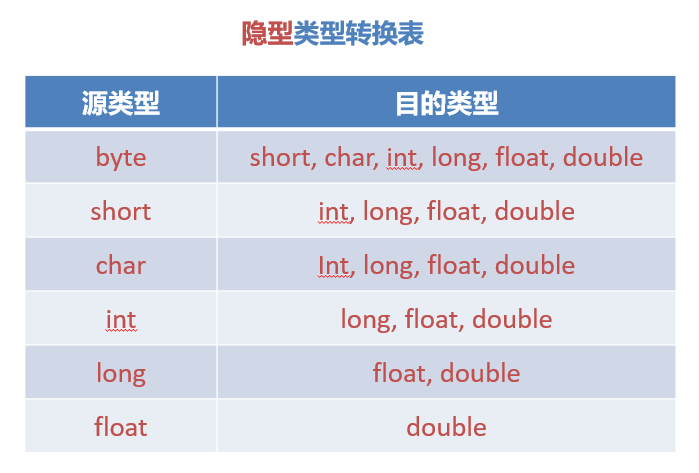

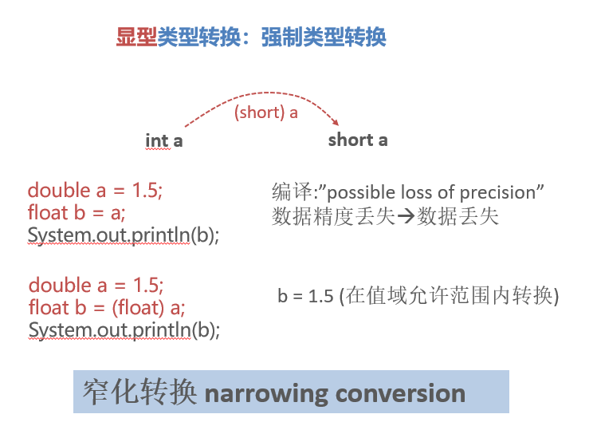

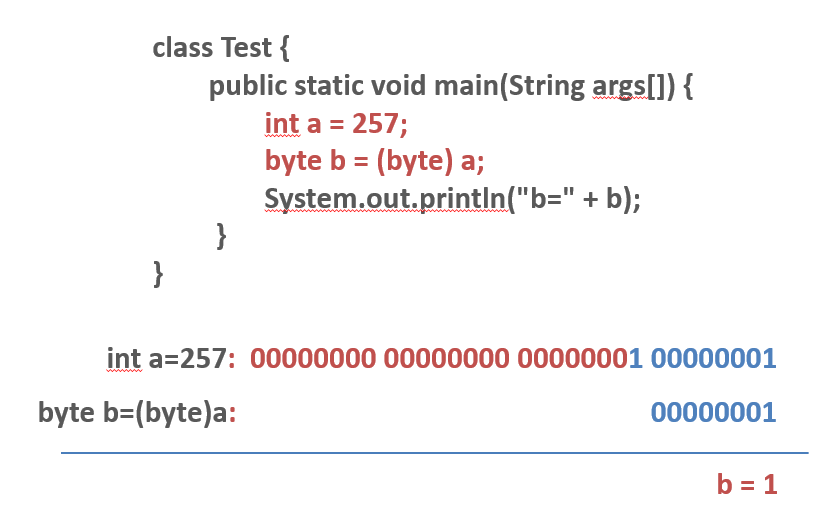

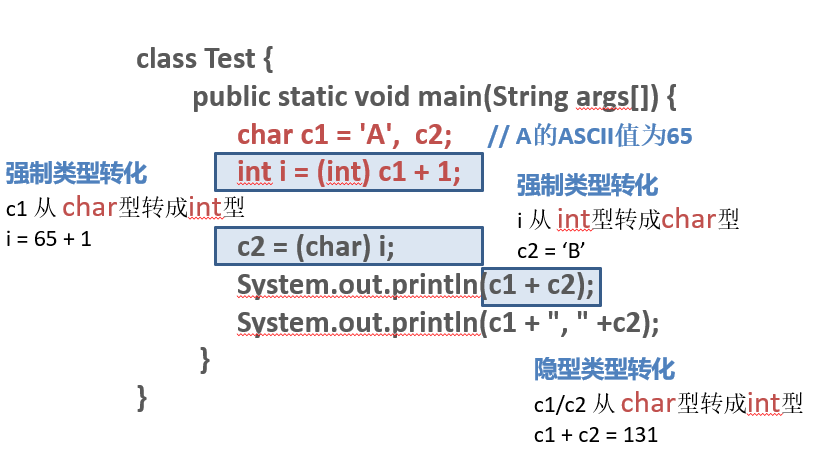

## Section three

**System.in.read()**

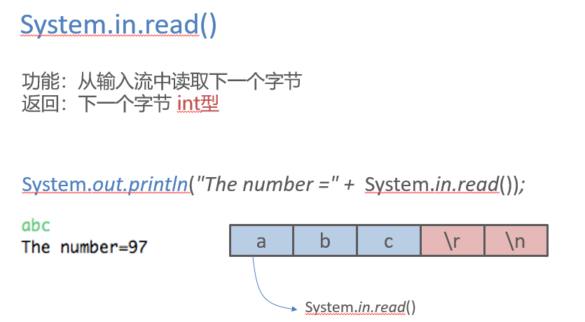

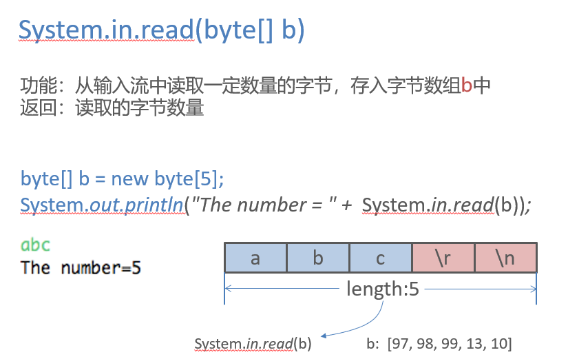

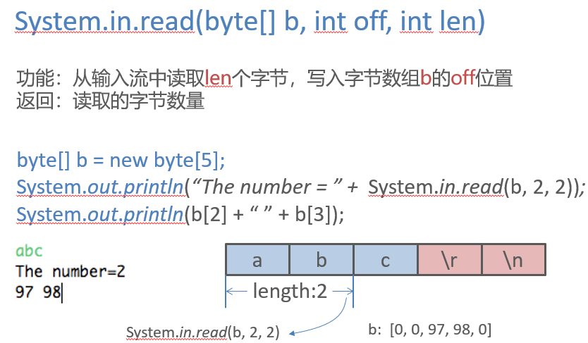

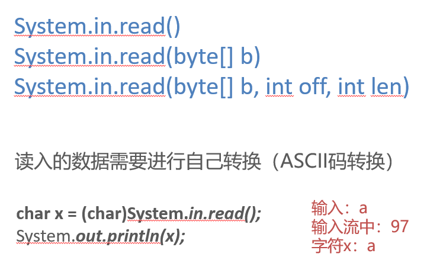

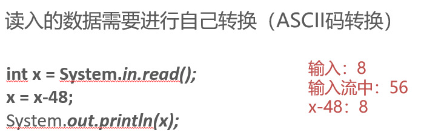

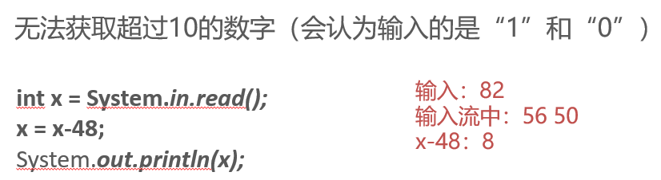

**Scanner**

```
Scanner s = new Scanner(System.in);
System.out.println("Please input string: ");
System.out.println(s.nextLine());
```

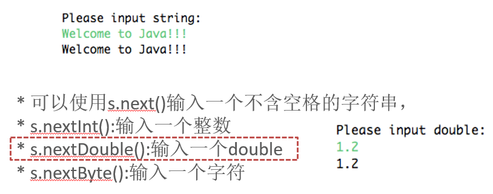

```
public static void main(String[] args) {
	int len = args.length;
	System.out.println(len);
	for (int i = 0; i < len; i++) 
	     System.out.println(args[i]);
}
// 依次打印主程序的输入参数
```

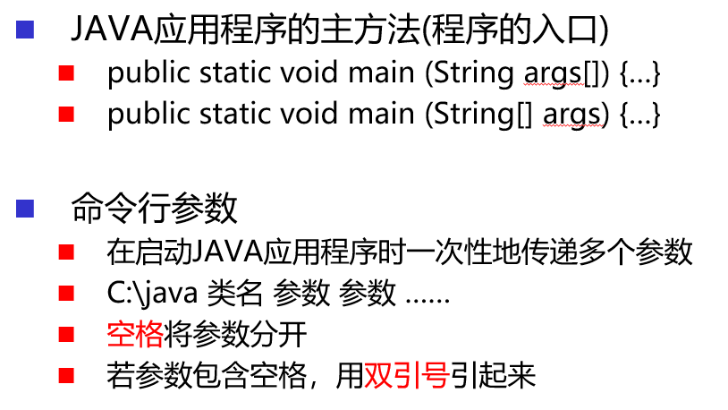

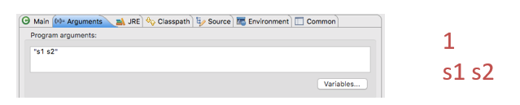

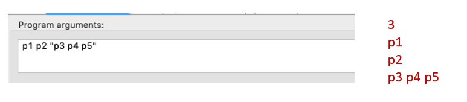

```
public static void main(String[] args) {
	int sum = 0;
	for (int i = 0; i < args.length; i++) 
	     sum = sum + Integer.parseInt(args[i]);
	     System.out.println(sum);
}
// 计算输入参数之和
```

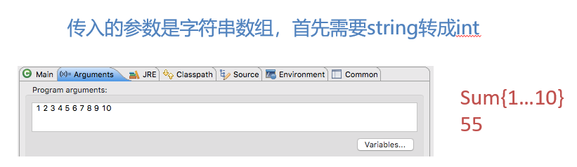

## Section four

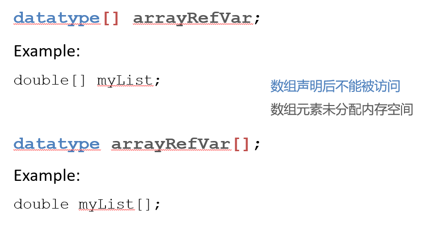

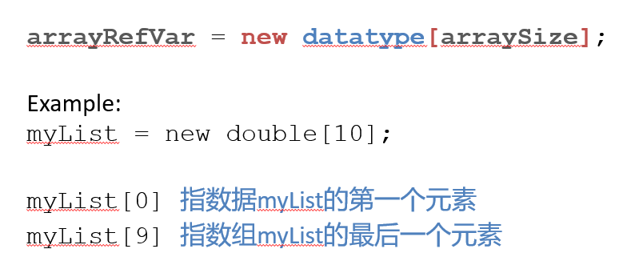

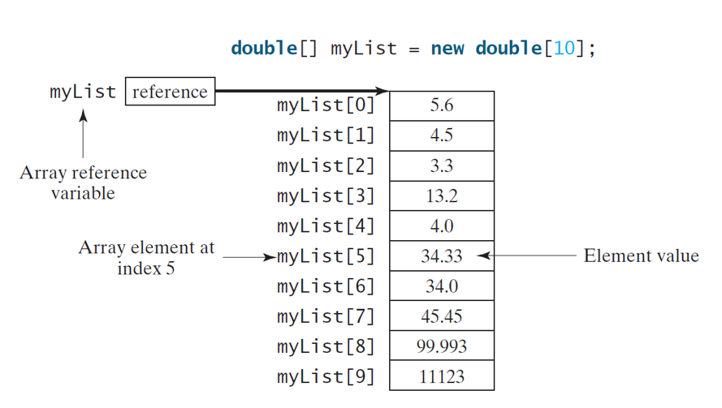

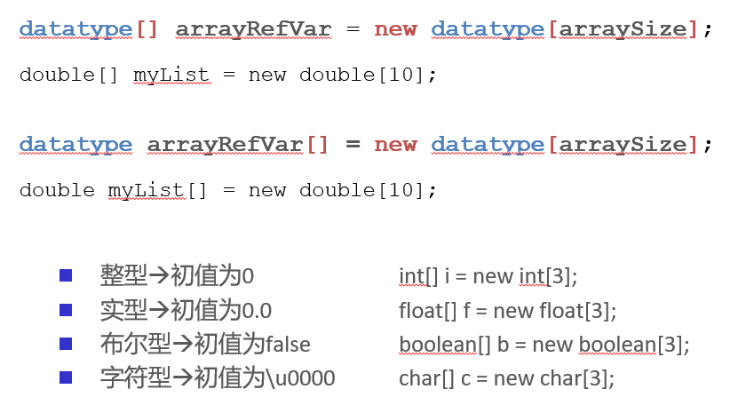

**方式一: 声明和创建数组后对数组初始化**

```
class Test {
	public static void main(String args[]) {
		int a[] = new int[5];
		System.out.println(“\t输出一维数组a: ”);
		for (int i = 0; i < 5; i++) {
		        a[i] = i+1;
		        System.out.println(“a[”+i+“]=”+a[i]);
	       }
       }
}

// a[0]=1
// a[1]=2
// a[2]=3
// a[3]=4
// a[4]=5

```

**方式二: 声明数组的同时对数组初始化**

```
class Welcome {
	public static void main(String args[]) {
		int a[] = {1,2,3,4,5};
		System.out.println(“\t输出一维数组a: ”);
		for (int i = 0; i < 5; i++) {
		        System.out.println(“\ta[”+i+“]=”+a[i]);
	       }
       }
}
```

**Initializing arrays with input values**

```
double[] myList = new double[10];
Scanner input = new Scanner(System.in);
System.out.print("Enter " + myList.length + " values: ");
for (int i = 0; i < myList.length; i++) 
 	myList[i] = input.nextDouble();

```

**Initializing arrays with random values**

```
for (int i = 0; i < myList.length; i++) 
 	myList[i] = Math.random()*100;
// 以[0,100)之间的随机数初始化
```

**Printing arrays**

```
for (int i = 0; i < myList.length; i++) 
 	System.out.println(myList[i]);
```

**Summing all elements**

```
total = 0;
for (int i = 0; i < myList.length; i++) 
 	total += myList[i];
```

**Finding the largest element**

```
double max = myList[0];
for (int i = 1; i < myList.length; i++) {
	if (myList[i] > max) 
		  max = myList[i];
}
```

**Random shuffling**

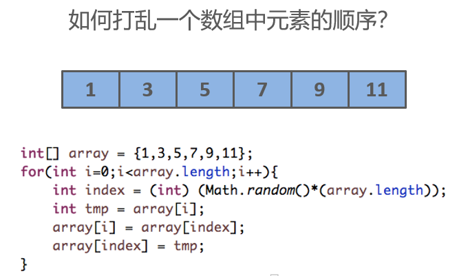

**Shifting elements**

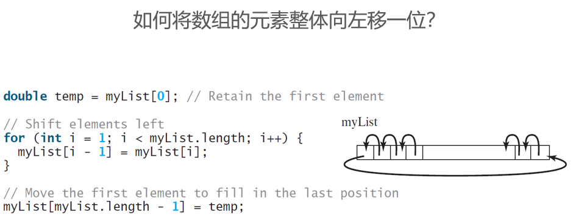

**Array assignment**

方法一：数组的整体赋值

```
public static void main(String args[]) {
	int a[] = {2, 4, 6, 8};
	int b[];    int[] c = {1, 3, 5, 7};
	b = a;     c = a;
	for (int j = 0; j < a.length; j++)
		   System.out.print(a[j] + “ “);
	System.out.println();
	for (int j = 0; j < b.length; j++)
		   System.out.print(b[j] + “ “) ;
	System.out.println();
	for (int j = 0; j < c.length; j++)
		   System.out.print(c[j] + “ “);
}

```

```
C:\>java Test
2 4 6 8
2 4 6 8
2 4 6 8
C:\>

```

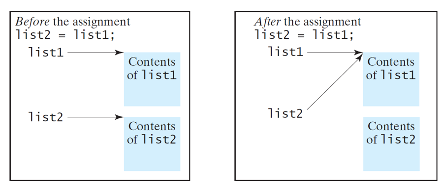

方法二：数组遍历赋值

```
int[] sourceArray = {2, 3, 1, 5, 10};
int[] targetArray = new int[sourceArray.length];

for (int i = 0; i < sourceArrays.length; i++)
        targetArray[i] = sourceArray[i];

```

方法三：java.lang.System类的方法 arraycopy

```
arraycopy(Object src, int srcIndex, Object dest, int destIndex, int length)
```

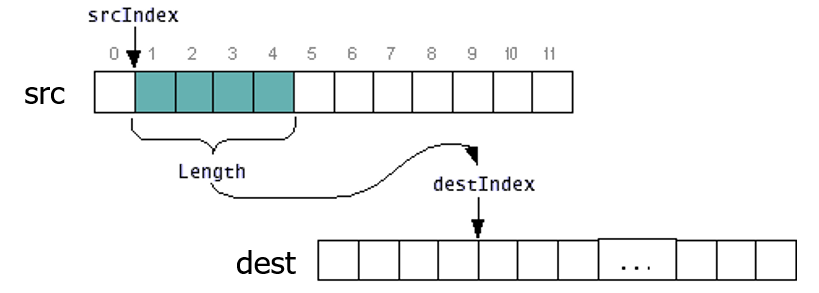

```
public static void main(String args[]) {
	int a[] = {2, 4, 6, 8};
	int b[];
	int[] c = {1, 3, 5, 7, 9};
	b = a;
	System.arraycopy(a, 1, c, 0, 3);
	//打印a,b,c
}

// 数组a: 	2 4 6 8
// 数组b: 	2 4 6 8
// 数组c: 	4 6 8 7 9

```

**Declaring and creating**

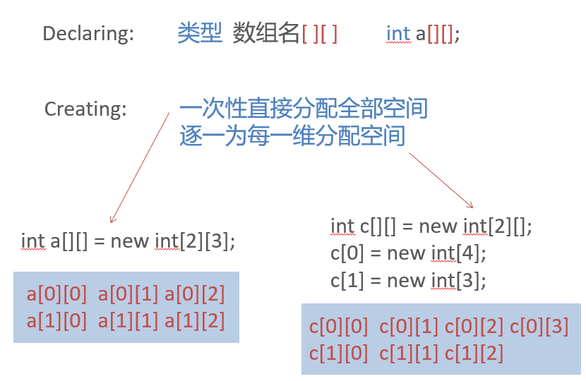

**Initializer**

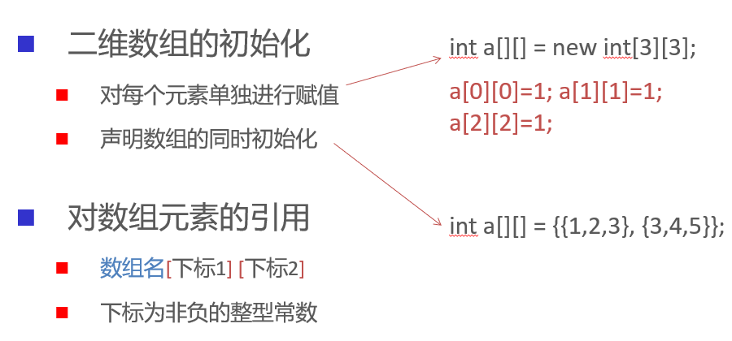

**Example**

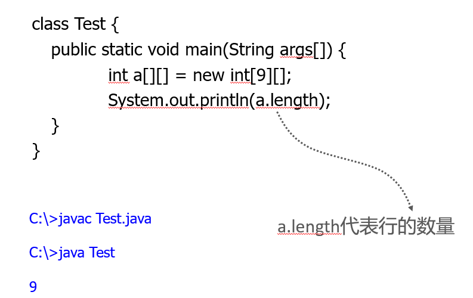

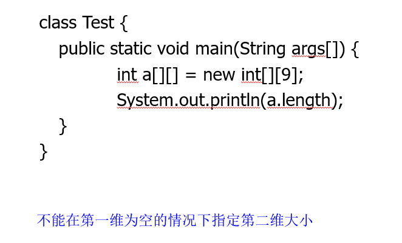

**Simple method of String**

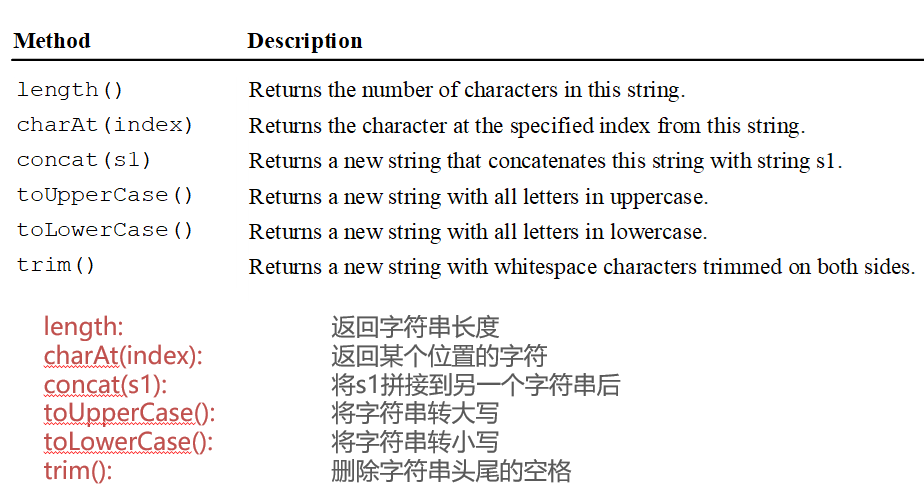

**Getting string length**

```
String message = "Welcome to Java";
System.out.println(message.length());
// message.length() = 15
```

**Getting Characters from a String **

```
String message = "Welcome to Java";
System.out.println("The first character in message is " + message.charAt(0));
```

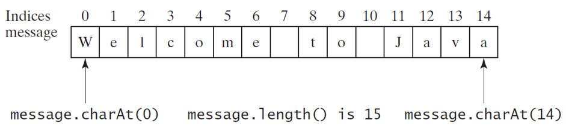

**Converting Strings**

```
“Welcome”.toLowerCase()    返回小写字符串    “welcome”
“Welcome”.toUpperCase()    返回大写字符串    “WELCOME”
“  Welcome  ”.trim()	            删除前后空格        “Welcome”
```

**String Concatenation **

```
String s3 = s1.concat(s2); or String s3 = s1 + s2;

// Three strings are concatenated
String message = "Welcome " + "to " + "Java";
String message = “Welcome”.concat(“ to”).concat(“ Java”);
 
// String Chapter is concatenated with number 2
String s = "Chapter" + 2; // Chapter2
 
// String Supplement is concatenated with character B
String s1 = "Supplement" + 'B'; // SupplementB
```

**Reading a String from the Console **

```
Scanner input = new Scanner(System.in);
System.out.print("Enter three words separated by spaces: ");
String s1 = input.nextLine();
String s2 = input.nextLine();
String s3 = input.nextLine();
System.out.println("s1 is " + s1);
System.out.println("s2 is " + s2);
System.out.println("s3 is " + s3);

// This is Arsenal	回车
// This is Livepool	回车
// This is MU	回车
```

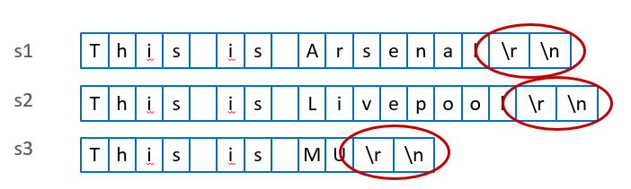

```
Scanner input = new Scanner(System.in);
System.out.println("Enter three words separated by spaces: ");
String s1 = input.next();
String s2 = input.next();
String s3 = input.next();
System.out.println("s1 is " + s1);
System.out.println("s2 is " + s2);
System.out.println("s3 is " + s3);

// This is  回车	
// Arsenal Fan 回车
```

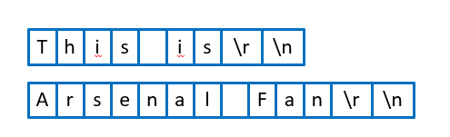

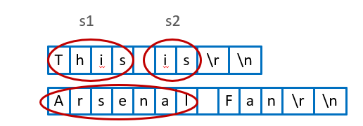

```
Scanner input = new Scanner(System.in);
System.out.print("Enter three words separated by spaces: ");
String s1 = input.nextLine();
String s2 = input.next();
String s3 = input.next();
System.out.println("s1 is " + s1);
System.out.println("s2 is " + s2);
System.out.println("s3 is " + s3);

// This is  回车
// Arsenal Fan	回车

```

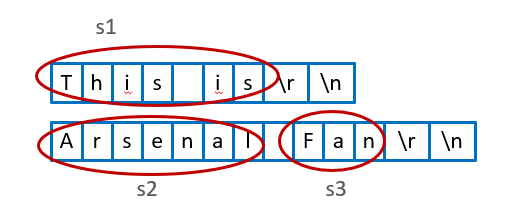

```
Scanner input = new Scanner(System.in);
System.out.print("Enter three words separated by spaces: ");
String s1 = input.next();
String s2 = input.next();
String s3 = input.nextLine();
System.out.println("s1 is " + s1);
System.out.println("s2 is " + s2);
System.out.println("s3 is " + s3);

// This is Arsenal Fan 回车
```

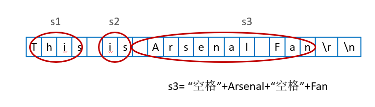

```
Scanner input = new Scanner(System.in);
System.out.print("输入第一个字符串: ");
String s1 = input.next();
System.out.println(s1);
System.out.print("输入第二个字符串: ");
String s2 = input.nextLine();
System.out.println(s2);
// 我们在上课	回车
```

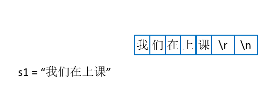

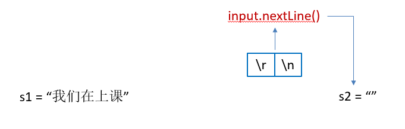

```
Scanner input = new Scanner(System.in);
System.out.print("输入第一个字符串: ");
String s1 = input.next();
System.out.println(s1);
input.nextLine();
System.out.print("输入第二个字符串: ");
String s2 = input.nextLine();
System.out.println(s2);
// 我们在上课	  回车
// 我们在上JAVA课	  回车
```

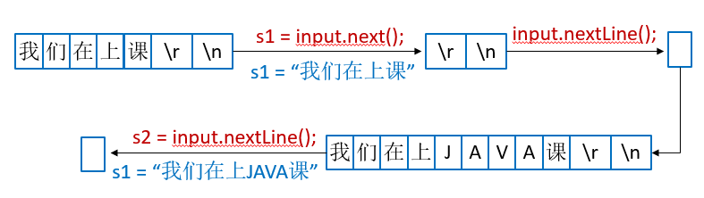

**Comparing Strings**

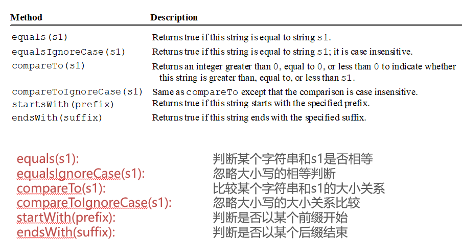

**Obtaining Substrings**

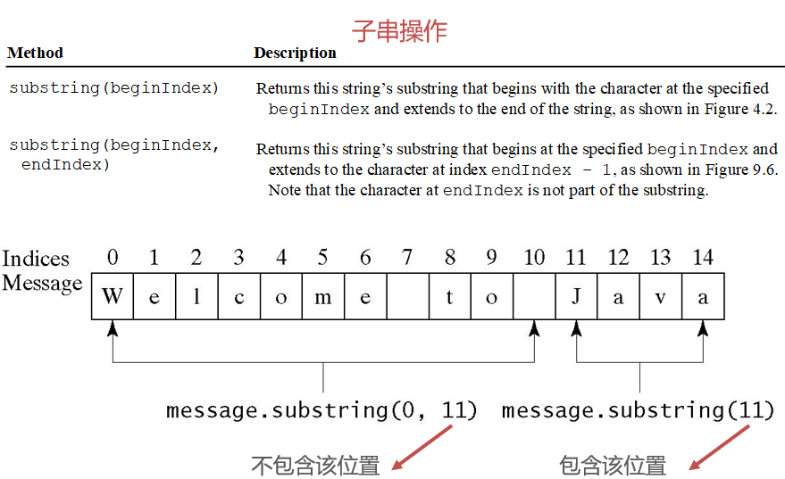

**Finding a Character or a Substring in a String**

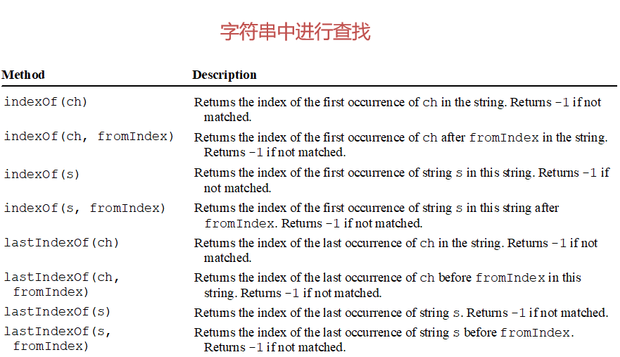

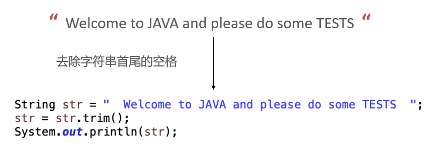

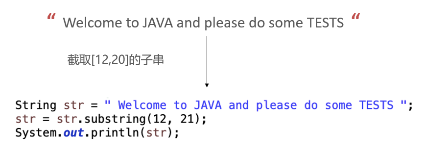

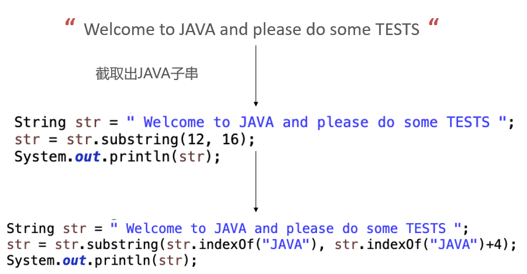


**Obtaining Substrings**


```
int k = s.indexOf(' ');
String firstName = s.substring(0, k);
String lastName = s.substring(k + 1);
```


**int/double…  String**


```
// String to int/double
int intValue = Integer.parseInt(intString);
double doubleValue = Double.parseDouble(doubleString);
```


```
// int/double to String
int number = 2;
String s = number;		//Error	
String s = number + "";
```


## Section five

**Interface**


**Inheritance(继承)**


**Polymorphism(多态)**


**How to define a Class**


```
class Test {
	public static void main(String args[]){
                AutoCar mycar = new AutoCar(“Audi”, 10);
                mycar.display();
                mycar.run();
                mycar.run();
	}
}
```

```
D:\>java Test
品牌: Audi 油量: 10
开车中!
没有油了!
```

**Class modifier**


**Package**


**Class modifier**


**Class members**


**Public members**


**Private members**


**Protected members**


**Conclusion**


**Statics members**


**Object creating**


```
class Test {
	Test() { ; }

	public void print(int x) {
		System.out.println(x);
	}
    
	public static void main(String args[]) {
		int x = 3;
		Test t = new Test();
		t.print(x);
 	}
}
```

```
class Test {
    Test() { ; }

   	public static void print(int x) {
   		System.out.println(x);
   	}
    
    public static void main(String args[]){
		int x = 3;
		print(x);
	}
}
```

```
class Test {
   	public void print(int x) {
   		System.out.println(x);
   	}
   	public static void main(String args[]) {
		int x = 3;
		print(x);
	}
}

```

```
D:\>javac Test.java
Test.java:9: non-static method print(int) 
cannot be referenced from a static context
                print(x);
                ^
1 error

```

**Final members**

**final**(常量/不可重写的方法)

——定义常量以及确保一个方法不可被子类重写

```
同一个包中
class A {
	A(){ ; }
	final int PI = 3.14159;
	final void print() { 
		System.out.println(“A print”); 
	}
}
class B extends A{
	PI = 3.1415926; // 常量不可改变取值
	// 不可被子类重写
	void print(){
		 System.out.println(“B print”);
	} 
}

```

final 变量：变量值不可修改

final 方法：不能被重写（overriding）,即不能被子类重新定义

```
class A {
      final int x;
	final void print() {  
		System.out.println(“1”);
	}
}
class B extends A {
	void print() {
		System.out.println(“2”);
	}
}

```

**Encapsulation**


**Overloading & Overriding**


**Overriding vs. Overloading**


## Section six


| 名称 | 访问权修饰符  | 类本身 | 子类 | 包   | 所有类 |
| ---- | ------------- | ------ | ---- | ---- | ------ |
| 公共 | public        | √      | √    | √    | √      |
| 友好 | 无（default） | √      |      | √    |        |
| 保护 | protected     | √      | √    | √    |        |
| 私有 | private       | √      |      |      |        |

**Object usage**


对象作为方法的参数

```
class Spot {
	private int x, y;
	Spot (int u, int v) {
		setX(u); setY(v);
     }
	void setX(int x1) {  x=x1; }
	void setY(int y1) {  y=y1; }
	int getX() { return x; }
	int getY() { return y; }

    static void move(Spot p, int h, int k){
		p.setX(p.getX() + h);
		p.setY(p.getY() + k);
	}
}
```

```
class Test {
   public static void main(String args[]) {
	   Spot s = new Spot(2, 3);
	   System.out.println(“s点的坐标:” + s.getX()+“,”+s.getY());
	   Spot.move(s, 4, 5);
	   System.out.println(“s点的坐标:” + s.getX()+“,”+s.getY());
	}
}

```

```
D:\java Test
s点的坐标:2,3
s点的坐标:6,8
```

```
class Spot {
	private int x, y;
	Spot (int u, int v) {
		setX(u); setY(v);
     }
	
    void setX(int x1) { x=x1; }
	void setY(int y1) { y=y1; }
	int getX() { return x; }
	int getY() { return y; }
	
     void move(int h, int k){
		x = x + h;
		y = y + k;
	}
}
```

```
class Test {
   public static void main(String args[]) {
	   Spot s = new Spot(2, 3);
	   System.out.println(“s点的坐标:” + s.getX()+“,”+s.getY());
	   s.move(4, 5);
	   System.out.println(“s点的坐标:” + s.getX()+“,”+s.getY());
	}
}
```

```
D:\java Test
s点的坐标:2,3
s点的坐标:6,8
```

对象作为方法的返回值


**Inheritance of Class**


```
class Father {
	public void set() {}
	static void get() {}
}
```

```
class Son extends Father {
	public void set() {}
	static void get() {}
}
// RIGHT!
```

```
class Son extends Father {
	public void get() {}
	static void set() {}
}
// WRONG
```


**子类重写了print()方法，那么父类类型的引用child在调用该方法时将会调用子类中重写的print()。**


**子类重写了print()方法，那么父类类型的引用child在调用该方法时将会调用子类中重写的print()。同上**


**变量只会被隐藏，但是不会被覆盖。**


**Polymorphism**


**Abstract class**


**Interface**


**Interface inheritance**


**Abstract class VS. Interface**


**Encapsulation**


```
public class Person{  
	public String name ;  
    public String sex ;  
    public int age ;  
} 
```

```
Person p = new Person();  
p.age= 30;  
p.name= "张三";  
p.sex= "男"; 
```

```
int age = 25;
Person p = new Person();  
p.age= age;  
p.name= “李四";  
p.sex= "男"; 
```

```
public class Person{  
    public String name ;  
    public String sex ;  
    public String age ;  
} 
```

```
Person p = new Person();  
p.age= String.valueOf(30);  
p.name= "张三";  
p.sex= "男"; 
```

```
int age = 25;
Person p = new Person();  
p.age= String.valueOf(age);  
p.name= “李四";  
p.sex= "男"; 
```

```
public class Person{  
    public String name ;  
    public String sex ;  
    private int age ;     
    public void setAge(int age){
        this.age = age;
    }
} 
```

```
Person p = new Person();  
p.setAge(20);  
p.name= "张三";  
p.sex= "男"; 
```

```
int age = 25;
Person p = new Person();  
p.setAge(age);  
p.name= “李四";  
p.sex= "男"; 
```

```
public class Person{  
    public String name ;  
    public String sex ;  
    private String age ;     
    public void setAge(int age){
        this.age = String.valueOf(age);
    }
} 
```

```
Person p = new Person();  
p.setAge(20);  
p.name= "张三";  
p.sex= "男"; 
```

```
int age = 25;
Person p = new Person();  
p.setAge(age);  
p.name= “李四";  
p.sex= "男"; 
```


**写一个多边形面积计算器，支持circle、triangle等**

定义CircleCalculate类用于计算圆面积

​    ----extends AreaCalculate

​    ----implements Calculate

定义TriangleCalculate类用于计算圆面积

​      ----extends AreaCalculate

​      ----implements Calculate


## Section seven

String---int的转换

```
public static int parseInt(String s) throws NumberFormatException
public static int parseInt(String s, int radix) throws NumberFormatException
```

```
String s = “10”;
int i = Integer.parseInt(s);
```

```
String s = “10”;
int i = Integer.parseInt(s, 2);
```


int---String的转换


```
byte	 largestByte		= Byte.MAX_VALUE;  
                                          	//127 (27-1)
short	 largestShort     	= Short.MAX_VALUE;  
                                          	//32767 (215-1)
int 	 largestInteger      	= Integer.MAX_VALUE;
					//2147483647 (231-1)
long	 largestLong       	= Long.MAX_VALUE;
					//9223372036854775807
float	 largestFloat       	= Float.MAX_VALUE;
					//3.40282e+38
double largestDouble		= Double.MAX_VALUE;
					//1.79769e+308
```

**java.lang.String类**

```
String s = new String();

char c[] = {‘a’, ‘b’, ‘c’};
String s = new String(c);

char c[] = {‘语’, ‘言’};
String s = new String(c);
```

```
byte b[] = {97, 98, 99};
String s = new String(b); // abc

String s = “abc”;
String s = “语言”;

String s = “”;
```

```
String s1 = "java语言";
String s2 = "JavA语言";
System.out.println(s1.equals(s2));
System.out.println(s1.equalsIgnoreCase(s2));
System.out.println(s1.compareTo(s2));
System.out.println(s1.compareToIgnoreCase(s2));
```

```
运行结果：
false  true  32  0
```

```
String s1 = "java语言";
String s2 = "java语言";
System.out.println(s1==s2);
System.out.println(s1.equals (s2));
```

```
运行结果：
true true
```

```
String s1 = new String(“java语言”);
String s2 = new String(“java语言”);
System.out.println(s1==s2);
System.out.println(s1.equals (s2));
```

```
运行结果：
false  true
```


==比较值 equals比较内存地址

```
String s1 = "java语言";
String s2 = "JavA语言";
System.out.println(s1.length());
System.out.println(s2.length());
System.out.println(s1.substring(0, 4));
// 取出索引为4到最后的字符串
System.out.println(s1.substring(4));
System.out.println(s1.charAt(0));
```

```
运行结果：
6
6
java
语言
j
```

字符串分割:  按指定的正则表达式将字符串分割成一个字符串数组

```
String s = “boo:and:foo”;
String[] Result = s.split(“:”);
Regex    Result
 “:”     { “boo”, “and”, “foo” }
```

**字符串操作类—java.lang.StringBuffer类**

```
String s = "java语言";
StringBuffer buffer = new StringBuffer(s);
buffer.append(" easy");
buffer.insert(6, " is");
s = buffer.toString();
System.out.println(s);
```

```
运行结果：
java语言 is easy.
```


```
String s = “java” + “语言”;
String s = “java”.concat(“语言”);
StringBuffer buffer = new StringBuffer(“java”); 
buffer.append(“语言”);                                
String s = buffer.toString();
```

```
String str1 = "";
for (int i = 1; i <= N; i++) 
      str1 = str1 + "*";
// 383663 ms

StringBuffer sb = new StringBuffer();
for (int i = 1; i <= N; i++) 
      sb.append("*");
String str2 = sb.toString();
// 19 ms

String str3 = "";
for (int i = 1; i <= N; i++) 
      str3.concat("*");
// 29 ms
```

```
int a = 1, b = 2; String c = “ men”;

String s = a + b + c;
// 3men

String s = c + b + a;
// men21
```

**字符串操作类— java.util.StringTokenizer类**

字符串分割: 与String.split具有类似功能，但是做了封装

```
String s = "this is a test";
StringTokenizer st = new StringTokenizer(s);
while (st.hasMoreTokens()) {
	System.out.println(st.nextToken());
}
```

```
运行结果:
this
is 
a
test
```

```
String s = "this:is:a:test”;
StringTokenizer st = new StringTokenizer(s, “:”);
while (st.hasMoreTokens()) {
	System.out.println(st.nextToken());
}
```

```
运行结果:
this
is 
a
test
```

```
// 假设有100000个tokens
StringTokenizer st = new StringTokenizer(s1);
// 5ms
String[] st = s1.split(" ");
// 41ms
```

**Arrays class**

```
import java.util.Arrays;
public class ArrayDemo1 {
    public static void main(String args[]) {
        int[] a1 = new int[5];
        int[] a2 = new int[5];
        Arrays.fill(a1, 47);
        Arrays.fill(a2, 47);
        // Arrays.equals：比较两个给定的数组是否相等
        System.out.println(Arrays.equals(a1, a2));
        a2[3]=11;  a2[2]=9;
        System.out.println(Arrays.equals(a1, a2));
        Arrays.sort(a2);
        System.out.println(Arrays.binarySearch(a2, 11));
    }
}
```

```
True
False
9,11,47,47,47
1
```

**Set interface**

Set是一系列不重复元素的集合


```
// 用于找出文本中出现过的词
import java.util.*;
public class SetDemo1 {
    public static void main(String args[]) {
        HashSet s = new HashSet();
        for (int i=0; i<args.length; i++){
            s.add(args[i]);
        }
        System.out.println(s.size()+" distinct words: "+s);
    }
}
```

```
D:\java SetDemo1 i came i saw i left
4 distinct words: [left, came, saw, i]
```

```
// 用HashSet找出文本中的唯一词/重复词
// 一个Set放唯一词，当无法插入该Set时意味着是重复词，则放入另一个Set
import java.util.*;
public class SetDemo2 {
    public static void main(String args[]) {
        HashSet uniques = new HashSet();	//存放唯一词
        HashSet dups = new HashSet();		//存放重复词
        for (int i=0; i<args.length; i++){
            if (!uniques.add(args[i]))
                dups.add(args[i]);
        }
        uniques.removeAll(dups);      
        System.out.println("Unique words: " + uniques);
        System.out.println("Duplicate words: " + dups);
    }
}
```

```
D:\java SetDemo2 i came i saw i left
Unique words: [came, left, saw]
Duplicate words: [i]
```

```
import java.util.*;
public class SetDemo4 {
      public static void main(String args[]) {
          boolean b;
          Set s = new HashSet();
          b = s.add("string1");
          System.out.println("string1 add returns " + b);
          b = s.add("string2");
          System.out.println("string2 add returns " + b);
          b = s.add("string3");
          System.out.println("string3 add returns " + b);
          b = s.add("string1");
          System.out.println("string1 add returns " + b);
          b = s.add("string2");
          System.out.println("string2 add returns " + b);
          Iterator i = s.iterator();
          while (i.hasNext()) 
               System.out.println(i.next());
      }
}

```

```
D:\java SetDemo3
string1 add returns true
string2 add returns true
string3 add returns true
string1 add returns false
string2 add returns false
string3
string1
string2

D:\

```

无序输出

java.util.Iterator

迭代器(interface)

轮循

```
import java.util.*;
public class SetDemo3 {
      public static void main(String args[]) {
          boolean b;
          Set s = new TreeSet();
          b = s.add("string1");
          System.out.println("string1 add returns " + b);
          b = s.add("string2");
          System.out.println("string2 add returns " + b);
          b = s.add("string3");
          System.out.println("string3 add returns " + b);
          b = s.add("string1");
          System.out.println("string1 add returns " + b);
          b = s.add("string2");
          System.out.println("string2 add returns " + b);
          Iterator i = s.iterator();
          while (i.hasNext()) 
               System.out.println(i.next());
      }
}
```

```
D:\java SetDemo3
string1 add returns true
string2 add returns true
string3 add returns true
string1 add returns false
string2 add returns false
string1
string2
string3

D:\
```

有序输出(字典序)

**HashSet VS. TreeSet**


**List interface**

```
import java.util.*;
public class ListDemo1 {
    public static void main(String args[]) {
        List list = new ArrayList();
        for (int i = 1; i <= 10; i++)
            list.add(i + " * " + i + " = " + i * i);
        Iterator iter = list.iterator();
        while (iter.hasNext())
            System.out.println(iter.next());
    }
}
```

```
D:\java ListDemo1
1 * 1 = 1
2 * 2 = 4
3 * 3 = 9
4 * 4 = 16
5 * 5 = 25
6 * 6 = 36
7 * 7 = 49
8 * 8 = 64
9 * 9 = 81
10 * 10 = 100
```

**Map interface**


```
import java.util.*;
public class MapDemo1 {
     private static final Integer ONE = new Integer(1);
     public static void main(String args[]) {
          HashMap m = new HashMap();
          for (int i=0; i<args.length; i++) {
                Integer freq = (Integer) m.get(args[i]);
                m.put(args[i], (freq==null ? ONE:new Integer(freq.intValue() + 1)));
          }
          System.out.println(m.size()+" distinct words detected:");
          System.out.println(m);
    }
}
```

```
D:\java MapDemo1 if it is to be it is up to me to delegate 
 8 distinct words detected: 
{to=3, me=1, delegate=1, it=2, is=2, if=1, be=1, up=1}
```

用HashMap统计文档中单词的出现频率

<key, value>, key是单词，value是频率


**Collections class**


```
import java.util.*;
public class SortDemo {
	public static void main(String args[]) {
	   List list = new ArrayList();
	    list.add(“abc”);
	    list.add(“DEF”);
	    list.add(“ghi”);
	    Collections.sort(list);
	    Iterator iter = list.iterator();
	    while(iter.hasNext())
		System.out.println(iter.next());
		// 使用自定义的比较函数进行排序
	    Collections.sort(list, new MySort());
	    iter = list.iterator();
	    while(iter.hasNext())
		System.out.println(iter.next());
	}
}
```

```
import java.util.*;
class MySort implements Comparator{
    public int compare(Object o1, Object o2) 
   {
	   String s1 = (String)o1;
	   String s2 = (String)o2;
         return s1.compareToIgnoreCase(s2);
    }
}
```

可以让Collections按照自定义比较函数进行排序

## Section eight

**Exception**

```
readFile {
    System.out.println(“Read!”);
    try {
        open the file;
        determine its size;
        allocate that much memory;
        read the file into memory;
        close the file;
    } catch (Exception) {
        doSomething;
    }
}
```

```
readFile {
    System.out.println(“Read!”);
    open the file;
    determine its size;
    allocate that much memory;
    read the file into memory;
    close the file;
}
```

```
readFile {
    System.out.println(“Read!”);
    try {
        open the file;
        determine its size;
        allocate that much memory;
        read the file into memory;
        close the file;
    } catch (fileOpenFailed) {
        doSomething;
    } catch (sizeDeterminationFailed) {
        doSomething;
    } catch (memoryAllocationFailed) {
        doSomething;
    } catch (readFailed) {
        doSomething;
    } catch (fileCloseFailed) {
        doSomething;
    }
}
```

**在被调用的函数抛出异常，在调用它的函数处理异常**

```
method1 {
    call method2;
}
method2 {
    call method3;
}
method3 {
    call readFile;
}
```

```
method1 {
    try {
        call method2;
    } catch (exception) {
        doErrorProcessing;
    }
}
method2 throws exception {
    call method3;
}
method3 throws exception {
    call readFile;
}
```


何时会产生异常？

由于非预期的结果导致系统运行时产生异常

```
class Test {
	public static void main(String args[]) {
		int a = 0;
		int b = 24/a;
	}
}
```

```
java Test
Exception in thread "main“
java.lang.ArithmeticException: / by zero
```

```
class Test {
	public static void main(String args[]) {
		int i = Integer.parseInt(args[0]);
		System.out.println(i);
	}
}
```

```
java Test
Exception in thread "main“
java.lang.NumberFormatException: For input string: “a”
```

```
class Test {
	public static void main(String args[]) {
		int i = Integer.parseInt(args[5]);
		System.out.println(i);
	}
}
```

```
java Test
Exception in thread "main“
java.lang.ArrayIndexOutOfBoundsException: 5
```


throws： 用于方法声明处，指出该方法可能发生的异常

```
public void function() throws NumberFormatException{
	//方法体
}
```

throw： 用于语句执行处，确定的抛出一个异常

```
if(s.equals("abc")) {  
    throw new NumberFormatException();  
}
```

异常处理器

```
import java.io.IOException;
class Test {
    public static void main(String args[]) {
    try {
        char c = (char)System.in.read();
        System.out.println(c);
    } catch (IOException e) {
        System.out.println(e);
	}
  }
} 
```

try--catch程序块

```
try {
  // Code that might generate exceptions
} catch(Type1 id1) {
  // Handle exceptions of Type1
} catch(Type2 id2) {
  // Handle exceptions of Type2
} catch(Type3 id3) {
  // Handle exceptions of Type3
}
// etc ...
```

```
try {
    . . . 
} catch (ArrayIndexOutOfBoundsException e) {
        System.out.println(e);
} catch (IOException e) {
        System.out.println(e);
}
```

try---catch---finally程序块

```
try {
    Java 语句块; 	//指一个或多个抛出异常的Java语句
}
catch (Exception e) {
    java语句块;	//异常处理语句
}
finally {
    java语句块;	//善后工作
}
```

```
try {
  // The guarded region: Dangerous activities
  // that might throw A, B, or C 
} catch(A a1) {
  // Handler for situation A
} catch(B b1) {
  // Handler for situation B
} catch(C c1) {
  // Handler for situation C
} finally {
  // Activities that happen every time
}
```


```
// 自定义异常
class SimpleException extends Exception {}

public class SimpleExceptionDemo {
    public void f() throws SimpleException {
        System.out.println("Throw SimpleException from f()");
        throw new SimpleException();
    }
    public static void main(String[] args) {
        SimpleExceptionDemo sed = new SimpleExceptionDemo();
        try {
            sed.f();
        } catch(SimpleException e) {
			System.out.println(e);
            System.out.println("Caught it!");
        }
	 }
} 

```

```
运行结果:
Throw SimpleException from f()
SimpleException
Caught it!
```

