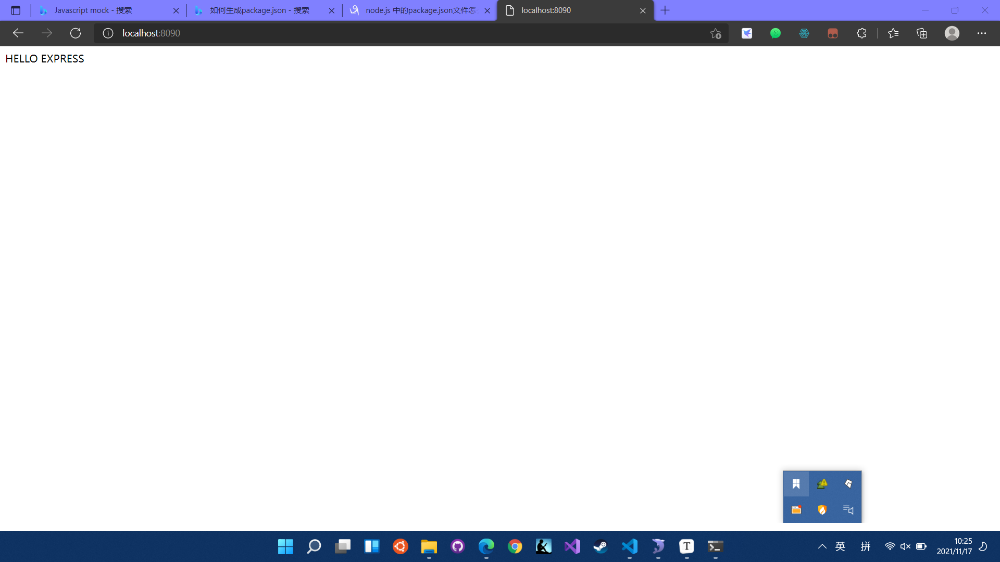
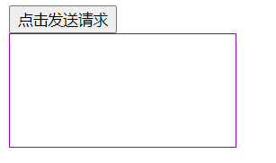
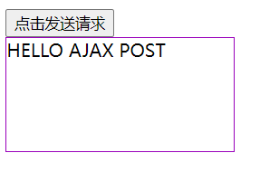
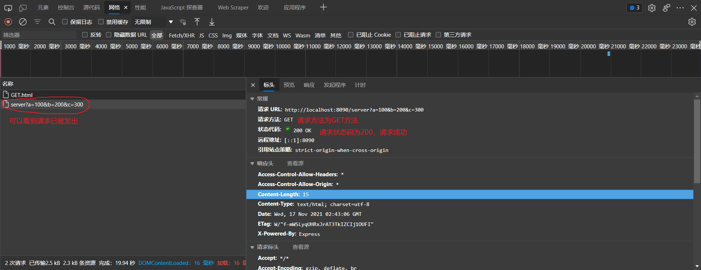
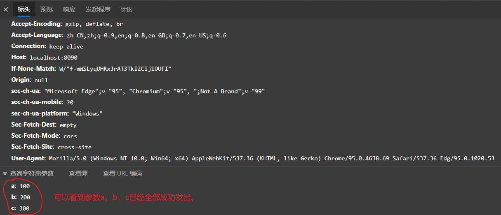

# Node环境部署

### 安装express后端框架

```
npm install express
```

```
npm WARN saveError ENOENT: no such file or directory, open 'D:\Users\HP\Desktop\tech\前端开发\AjaxLearn\package.json'
npm WARN enoent ENOENT: no such file or directory, open 'D:\Users\HP\Desktop\tech\前端开发\AjaxLearn\package.json'
npm WARN AjaxLearn No description
npm WARN AjaxLearn No repository field.
npm WARN AjaxLearn No README data
npm WARN AjaxLearn No license field.

+ express@4.17.1
added 50 packages from 37 contributors in 2.194s
```

### 安装nodemon包

```
npm install -g nodemon
```

```
D:\nodejs\nodemon -> D:\nodejs\node_modules\nodemon\bin\nodemon.js

> nodemon@2.0.15 postinstall D:\nodejs\node_modules\nodemon
> node bin/postinstall || exit 0

npm WARN optional SKIPPING OPTIONAL DEPENDENCY: fsevents@~2.3.2 (node_modules\nodemon\node_modules\chokidar\node_modules\fsevents):
npm WARN notsup SKIPPING OPTIONAL DEPENDENCY: Unsupported platform for fsevents@2.3.2: wanted {"os":"darwin","arch":"any"} (current: {"os":"win32","arch":"x64"})

+ nodemon@2.0.15
added 116 packages from 53 contributors in 4.331s
(base) PS D:\Users\HP\Desktop\tech\前端开发\AjaxLearn> nodemon
  Usage: nodemon [nodemon options] [script.js] [args]

  See "nodemon --help" for more.
```

安装这个包是为了可以让服务端的代码改变之后，按Ctrl+s可以自动重启服务。

### 运行express

在服务端的路径之下运行此服务端。

```
nodemon server.js
```

```
[nodemon] 2.0.15
[nodemon] to restart at any time, enter `rs`
[nodemon] watching path(s): *.*
[nodemon] watching extensions: js,mjs,json
[nodemon] starting `node server.js`
服务以及启动，8090  端口监听中
```

**server.js文件**

```
// 导入express模块
const express = require('express');
const app = express();
app.get('/', (request, response) => {
    // 设置响应
    response.send('HELLO EXPRESS')
});

// 可以接受任何类型的请求
app.all('/server', (request, response) => {
    // 设置响应头，设置允许跨域
    response.setHeader('Access-Control-Allow-Origin', '*');
    //响应头
    response.setHeader('Access-Control-Allow-Headers', '*')
        // 设置响应体
    response.send('HELLO AJAX POST')
});

app.listen(8090, () => {
    console.log("服务以及启动，8090  端口监听中")
})
```

在浏览器的url中输入

```
localhost:8090
```

可以看到后端服务已经可以开始运行了。



# 发送Ajax请求

### 发送GET请求

```html
<!DOCTYPE html>
<html lang="en">

<head>
    <meta charset="UTF-8">
    <meta http-equiv="X-UA-Compatible" content="IE=edge">
    <meta name="viewport" content="width=device-width, initial-scale=1.0">
    <title>Document</title>
    <style>
        #result {
            width: 200px;
            height: 100px;
            border: solid 1px #90b;
        }
    </style>
</head>

<body>
    <button>点击发送请求</button>
    <div id="result">

    </div>
    <script>
        const btn = document.getElementsByTagName('button')[0];
        btn.onclick = function() {
            // 创建对象
            const xhr = new XMLHttpRequest();
            const result = document.getElementById("result");
            // 设置请求方法和url
            xhr.open('GET', 'http://localhost:8090/server?a=100&b=200&c=300');
            // 发送
            xhr.send();
            // 事件绑定
            // on 当---时候
            // readystate 是 xhr 对象的属性 表示状态0（初始化） 1（open） 2（send） 3（部分结果） 4（全部结果）
            // change 改变
            xhr.onreadystatechange = function() {
                // 判断服务端是否返回了所有结果
                if (xhr.readyState == 4) {
                    // 判断相应装填码200 404 403 401 500
                    // 2开头一般都表示成功
                    if (xhr.status >= 200 && xhr.status < 300) {
                        // 处理结果 行 头 空行 体
                        // 1.相应行
                        console.log(xhr.status); // GET.html: 42 200
                        console.log(xhr.statusText); // GET.html: 43 OK
                        console.log(xhr.getAllResponseHeaders); // GET.html: 44 ƒ getAllResponseHeaders() { [native code] }
                        console.log(xhr.response); // GET.html: 45 HELLO AJAX
                        result.innerHTML = xhr.response
                    } else {
						console.log("测试失败");
                    }
                }
            }
            console.log('Test');
        }
    </script>
</body>

</html>
```

前端展示页面如下图所示



点击按钮可以看到请求发送成功



利用浏览器开发者工具，点击网络按钮，就可以看到具体的网路请求信息。





