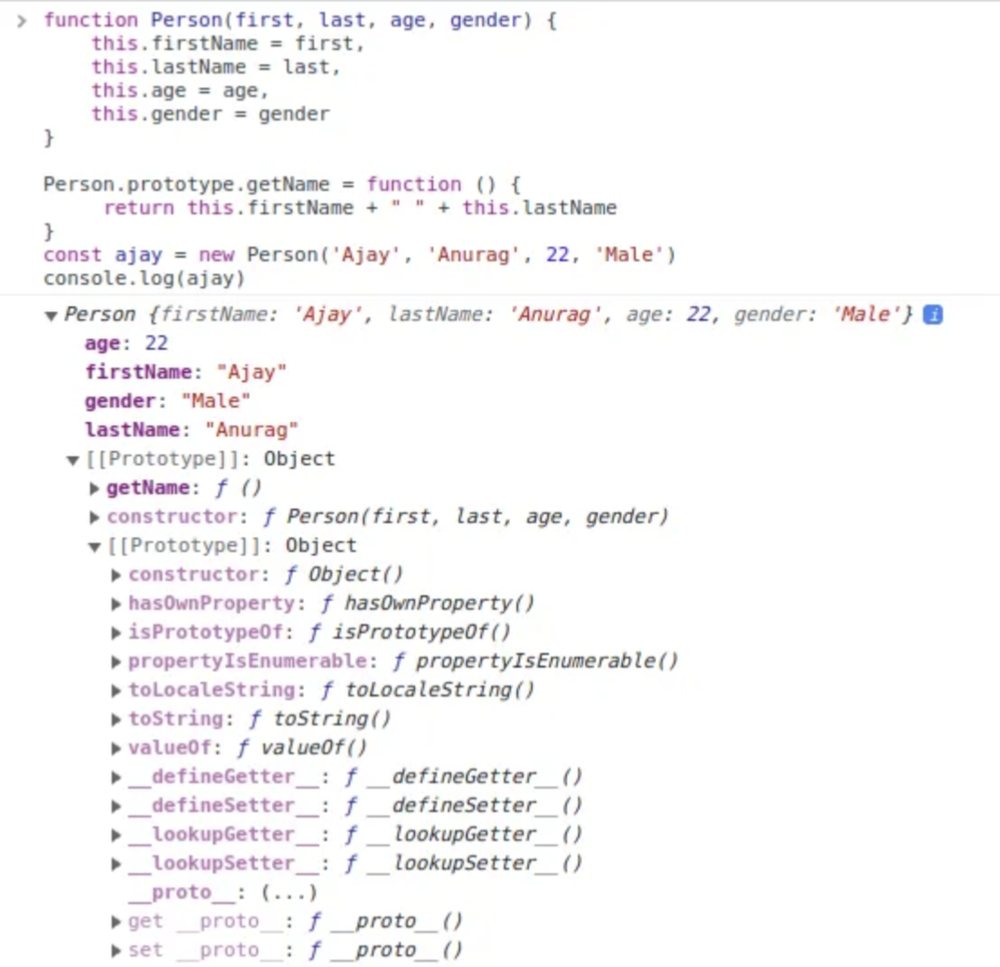
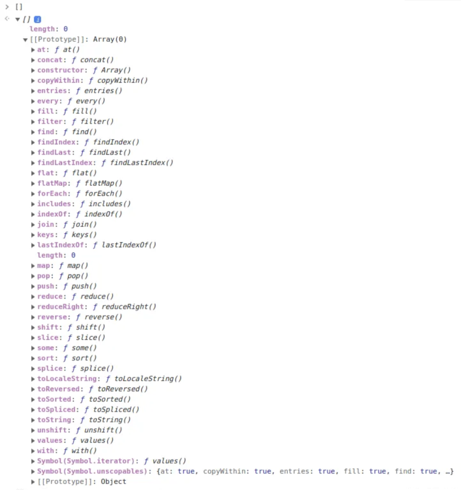

# JavaScript原型
在编程的世界里有一个重要的概念，叫做DRY ( Do not Repeat Yourself )。我们不想把时间花费在编写重复的代码上。

为此，我们使用类。但是直到 2015 年我们才在 `javascript` 中有了类的概念，它是在 `ES6` 中引入的。现在问题来了，那我们是怎么用来创建某个东西的实例的呢？答案是 `Constructor` 函数。

```JavaScript
function Person(first, last, age, gender) {
    this.firstName = first,
    this.lastName = last,
    this.age = age,
    this.gender = gender
}

const ajay = new Person('Ajay', 'Anurag', 22, 'Male')
console.log(ajay)
// Person { firstName: 'Ajay', lastName: 'Anurag', age: 22, gender: 'Male' }
```
这就是我们在`JavaScript`引入类之前创建磊或模版对象的方法，从而生成`instances`。

```JavaScript
// when we write a method in classes in javascript
class Person {
    constructor(first, last, age, gender){
    this.firstName = first,
    this.lastName = last,
    this.age = age,
    this.gender = gender
   }
   
   getName() {
       return this.firstName + " " + this.lastName
   }
}

const ajay = new Person('Ajay', 'Anurag', 22, 'Male')
console.log(ajay)
// Person { firstName: 'Ajay', lastName: 'Anurag', age: 22, gender: 'Male }
```

这就是我们现在使用类创建实例的方式，`constructor`这里的这个函数与上面编写的构造函数相同。

现在让我们了解一下它们的区别。至于如果我们用两种方式写一个方法会发生什么。

```JavaScript
// when we write a method in classes in javascript
class Person {
    constructor(first, last, age, gender) {
        this.firstName = first,
        this.lastName = last,
        this.age = age,
        this.gender = gender
    }
   
    getName() {
        return this.firstName + " " + this.lastName
    }
}

const ajay = new Person('Ajay', 'Anurag', 22, 'Male')
console.log(ajay)
// Person { firstName: 'Ajay', lastName: 'Anurag', age: 22, gender: 'Male }
```

```JavaScript
function Person(first, last, age, gender) {
    this.firstName = first,
    this.lastName = last,
    this.age = age,
    this.gender = gender,
    
    this.getName = function () {
       return this.firstName + " " + this.lastName
   }
}

const ajay = new Person('Ajay', 'Anurag', 22, 'Male')
console.log(ajay)
/*

Person {
  firstName: 'Ajay',
  lastName: 'Anurag',
  age: 22,
  gender: 'Male',
  getName: [Function]
}

*/
```

现在，您是否在这两个实施的结果中看到了问题？在我们使用 `Constructor` 函数的地方，即旧方法，我们可以看到实例，即 `Ajay` 具有`getName`.

现在您可能会想，我们没有再次重写该代码。所以没关系。我的朋友，你错了。无论我们是否为实例编写它，无论何时创建新实例，计算机都必须这样做。现在，想象一下有 100 万个 `person` 类的实例，现在问问自己，让所有这 100 万个实例都带有这段代码是否好。这是一个大问题，我们必须解决这个问题`PROTOTYPE`。

现在让我们终于进入原型。原型是简单的 `javascript` 对象，当我们使用构造函数或创建类的实例时创建它们（因为构造函数也被调用）。

让我们看看当您使用原型对象编写方法时会发生什么。

```JavaScript
function Person(first, last, age, gender) {
    this.firstName = first,
    this.lastName = last,
    this.age = age,
    this.gender = gender
}

Person.prototype.getName = function () {
     return this.firstName + " " + this.lastName
}
const ajay = new Person('Ajay', 'Anurag', 22, 'Male')
console.log(ajay)
// Person { firstName: 'Ajay', lastName: 'Anurag', age: 22, gender: 'Male' }
console.log(ajay.getName())
// Ajay Anurag
```

现在您可以看到，对于 `Person` 实例主体中的函数，我们没有额外的代码，我们实际上可以直接在 `Ajay` 上使用`function getName`。

当我们使用了`Person.prototype.getName`时，我们是在原型中编写函数，它是用一个关键字创建的，该关键字`new`用于运行构造函数，因此我们可以创建一个实例。



如您所见，现在的代码`getName`驻留在`Prototype`对象中。

这个 `Prototype` 对象对继承也很有帮助，有没有想过，数组的所有这些方法是从哪里来的？



可以看到这些方法全部来自原型对象。现在让我们了解另一个重要的概念 `Prototype Chaining`。

原型链接是 `JavaScript` 中的一种机制，允许对象从其原型继承属性和方法，进而从原型的原型继承，等等。

基本上，当我们调用构造函数并创建实例或对象时，就会创建原型。由于实例也是对象，默认情况下，对象具有原型，因此形成了原型的原型。现在，默认添加的原型也是一个对象，所以它也会有一个原型

```txt
Prototype -> Default Prototype -> final prototype
```
因此，无论何时我们调用实例或对象上的方法。首先`javascript`会在里面找那个方法，对象原型，然后是原型的原型，如果还没有找到，那么它会在默认原型的原型里面找，它最终指向`null`。

我知道这有点令人困惑，但事实就是如此，具体的话就牵扯到了`JavaScript`的原型链了。

我们可以用原型做很多事情，正如你在上面看到的，数组的所有方法都写在原型本身里面。

```JavaScript
function Person(first, last, age, gender) {
    this.firstName = first,
    this.lastName = last,
    this.age = age,
    this.gender = gender
}

Person.prototype.getName = function () {
     return this.firstName + " " + this.lastName
}

const ajay = new Person("Ajay", "Anurag", 22, "Male")
console.log(ajay.__proto__)
```
通过这样做，我们实际上可以查看内部，`ajay`的原型也是一个对象。

结论：原型在`javascript`中非常重要。我们已经讨论了一切，从为什么我们需要一个原型，它为我们解决了什么类型的问题，以及我们在 `javascript` 中做的所有事情的必要性。我假设您对 `Prototype` 比以前有了更好的理解。

原文链接：https://medium.com/@codecript/everything-about-prototype-in-javascript-544ec023de58