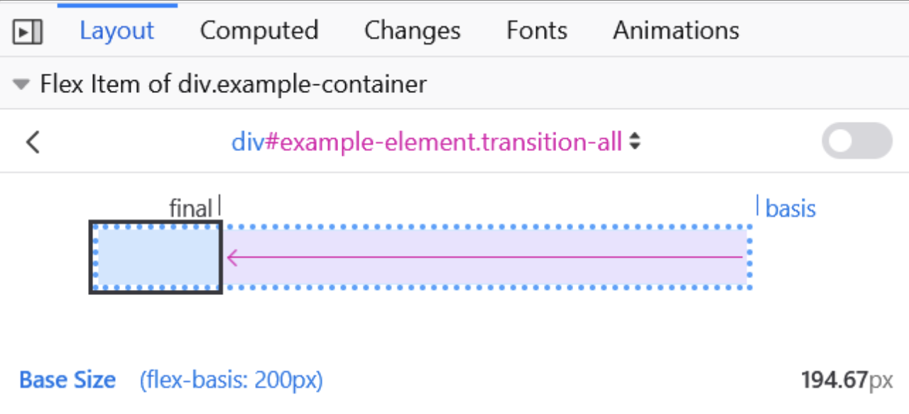

# flex-basis
`flex-basis` 属性设置弹性项目的初始主要尺寸。 它设置内容框的大小，除非用 `box-sizing` 另行设置。

flex-basis: auto;


flex-basis: 0;

可以看到在这里，`flex-basis`已经被`box-sizing`尺寸覆盖了

flex-basis: 200px;


在此示例中，所有三个项目的 flex-grow 和 flex-shrink 属性都设置为 1，表示弹性项目可以从初始 flex-basis 增长和收缩。

该演示随后更改了第一项的 flex-basis。 然后它会在弹性基础上增长和收缩。 这意味着，例如，当第一个项目的 flex-basis 为 200px 时，它将以 200px 开始，然后缩小以适应可用空间，而其他项目至少为最小内容大小。

下图显示了 Firefox Flexbox Inspector 如何帮助您了解项目的大小：


> Note: In case both flex-basis (other than auto) and width (or height in case of flex-direction: column) are set for an element, flex-basis has priority.

# 语法：
```css
/* Specify <'width'> */
flex-basis: 10em;
flex-basis: 3px;
flex-basis: 50%;
flex-basis: auto;

/* Intrinsic sizing keywords */
flex-basis: max-content;
flex-basis: min-content;
flex-basis: fit-content;

/* Automatically size based on the flex item's content */
flex-basis: content;

/* Global values */
flex-basis: inherit;
flex-basis: initial;
flex-basis: revert;
flex-basis: revert-layer;
flex-basis: unset;
```

# 示例
```html
<ul class="container">
  <li class="flex flex1">1: flex-basis test</li>
  <li class="flex flex2">2: flex-basis test</li>
  <li class="flex flex3">3: flex-basis test</li>
  <li class="flex flex4">4: flex-basis test</li>
  <li class="flex flex5">5: flex-basis test</li>
</ul>

<ul class="container">
  <li class="flex flex6">6: flex-basis test</li>
</ul>
```

```css
.container {
  font-family: arial, sans-serif;
  margin: 0;
  padding: 0;
  list-style-type: none;
  display: flex;
  flex-wrap: wrap;
}

.flex {
  background: #6ab6d8;
  padding: 10px;
  margin-bottom: 50px;
  border: 3px solid #2e86bb;
  color: white;
  font-size: 14px;
  text-align: center;
  position: relative;
}

.flex::after {
  position: absolute;
  z-index: 1;
  left: 0;
  top: 100%;
  margin-top: 10px;
  width: 100%;
  color: #333;
  font-size: 12px;
}

.flex1 {
  flex-basis: auto;
}

.flex1::after {
  content: "auto";
}

.flex2 {
  flex-basis: max-content;
}

.flex2::after {
  content: "max-content";
}

.flex3 {
  flex-basis: min-content;
}

.flex3::after {
  content: "min-content";
}

.flex4 {
  flex-basis: fit-content;
}

.flex4::after {
  content: "fit-content";
}

.flex5 {
  flex-basis: content;
}

.flex5::after {
  content: "content";
}
```

