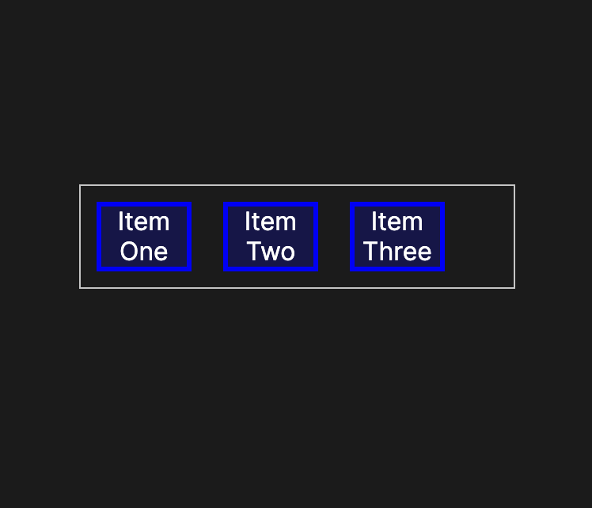
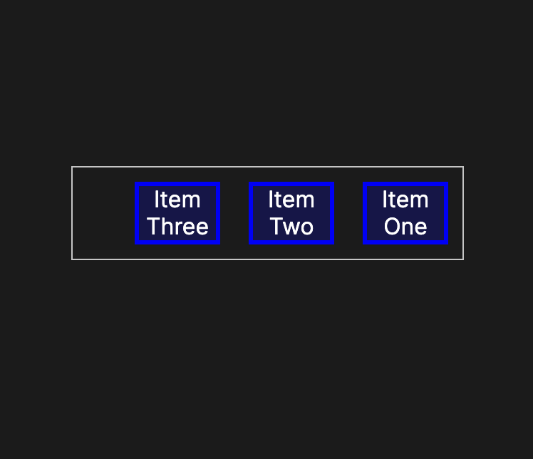
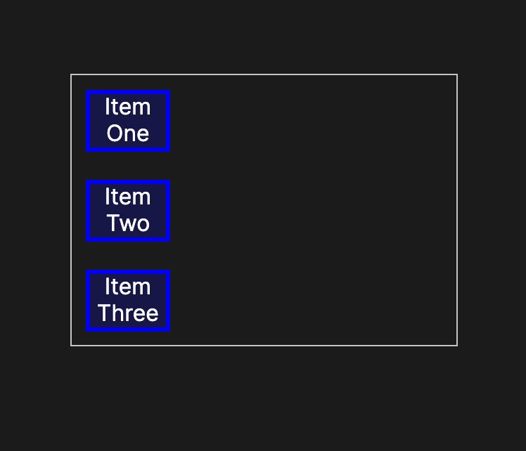
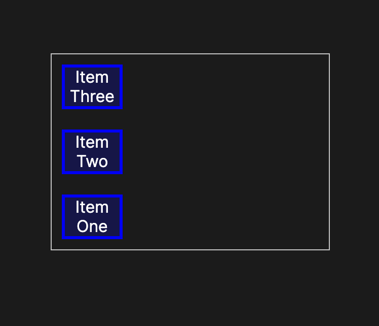
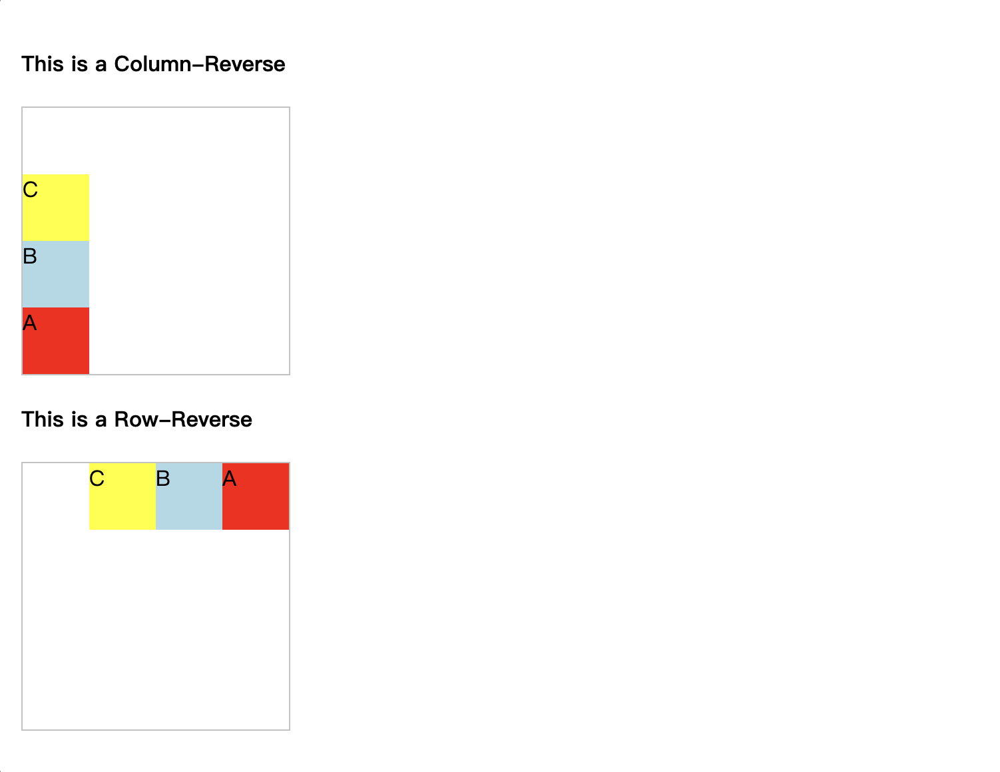

# flex-direction
The flex-direction CSS property sets how flex items are placed in the flex container defining the main axis and the direction (normal or reversed).

flex-direction: row;


flex-direction: row-reverse;


flex-direction: column;


flex-direction: column-reverse;


请注意，值 `row` 和 `row-reverse` 受弹性容器的方向性影响。 如果其`dir`属性为`ltr`，则`row`表示横轴为从左向右，`row-reverse`为从右向左； 如果`dir`属性为`rtl`，`row`表示轴从右到左，`row-reverse`是从左到右。

# 语法
```css
/* The direction text is laid out in a line */
flex-direction: row;

/* Like <row>, but reversed */
flex-direction: row-reverse;

/* The direction in which lines of text are stacked */
flex-direction: column;

/* Like <column>, but reversed */
flex-direction: column-reverse;

/* Global values */
flex-direction: inherit;
flex-direction: initial;
flex-direction: revert;
flex-direction: revert-layer;
flex-direction: unset;
```

接受以下值：

* row: 弹性容器的主轴定义为与文本方向相同。 主起点和主终点与内容方向相同。

* row-reverse: 行为与`row`相同，但主起点和主终点与内容方向相反。

* column: `flex` 容器中的元素竖直排列。

* column-reverse: 行为与`column`相同，但主起点和主终点与内容方向相反。

# 示例
```html
<h4>This is a Column-Reverse</h4>
<div id="col-rev" class="content">
  <div class="box red">A</div>
  <div class="box lightblue">B</div>
  <div class="box yellow">C</div>
</div>
<h4>This is a Row-Reverse</h4>
<div id="row-rev" class="content">
  <div class="box red">A</div>
  <div class="box lightblue">B</div>
  <div class="box yellow">C</div>
</div>
```

```css
.content {
  width: 200px;
  height: 200px;
  border: 1px solid #c3c3c3;
  display: flex;
}

.box {
  width: 50px;
  height: 50px;
}

#col-rev {
  flex-direction: column-reverse;
}

#row-rev {
  flex-direction: row-reverse;
}

.red {
  background-color: red;
}

.lightblue {
  background-color: lightblue;
}

.yellow {
  background-color: yellow;
}

```
