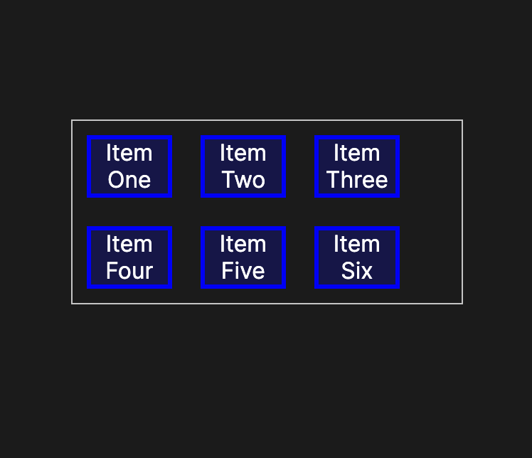
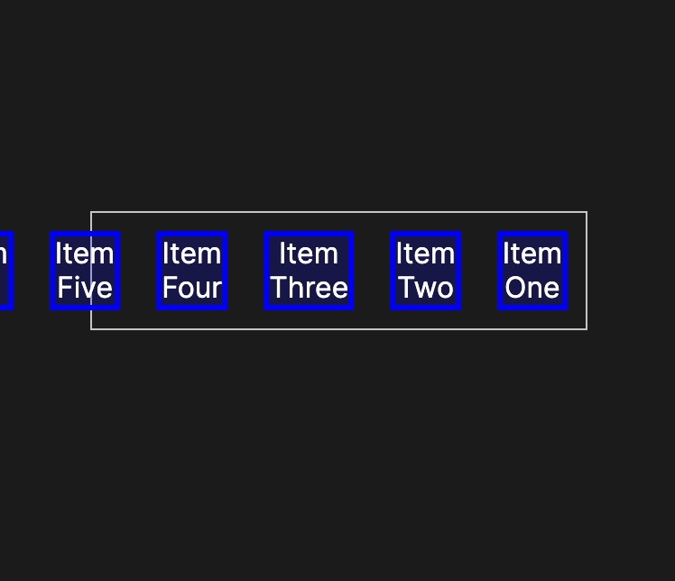
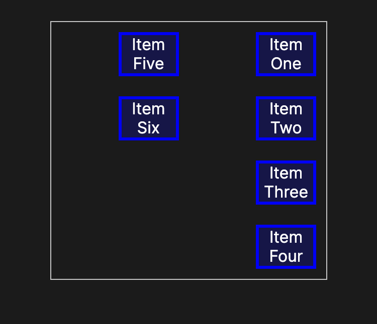
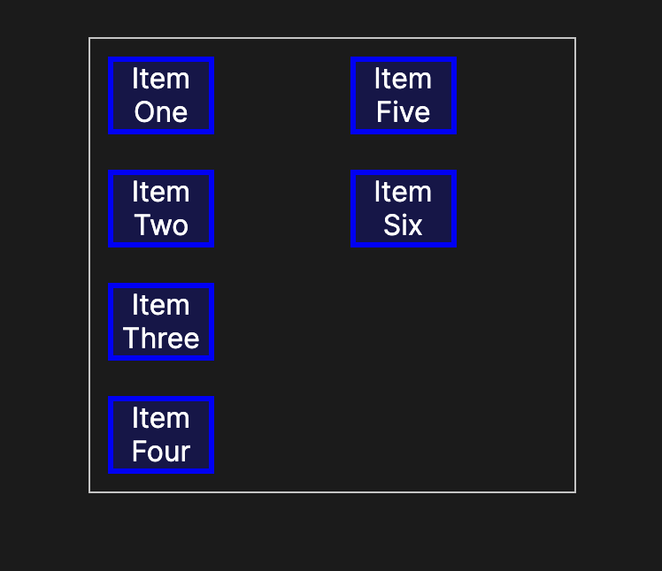

# flex-flow
flex-flow: row wrap;


flex-flow: row-reverse nowrap;


flex-flow: column wrap-reverse;


flex-flow: column wrap;


flex-flow是下列两个属性的缩写
* flex-direction
* flex-wrap

# 语法
```css
/* flex-flow: <'flex-direction'> */
flex-flow: row;
flex-flow: row-reverse;
flex-flow: column;
flex-flow: column-reverse;

/* flex-flow: <'flex-wrap'> */
flex-flow: nowrap;
flex-flow: wrap;
flex-flow: wrap-reverse;

/* flex-flow: <'flex-direction'> and <'flex-wrap'> */
flex-flow: row nowrap;
flex-flow: column wrap;
flex-flow: column-reverse wrap-reverse;

/* Global values */
flex-flow: inherit;
flex-flow: initial;
flex-flow: revert;
flex-flow: revert-layer;
flex-flow: unset;
```

