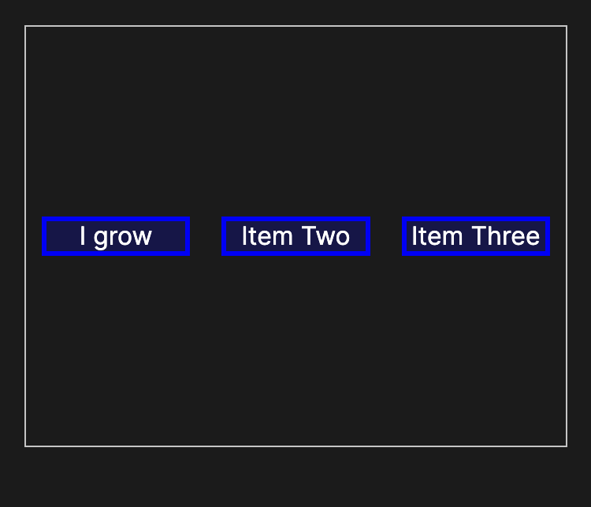
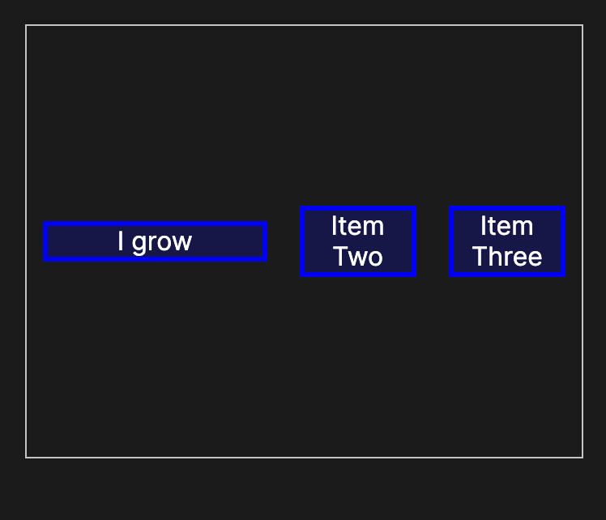
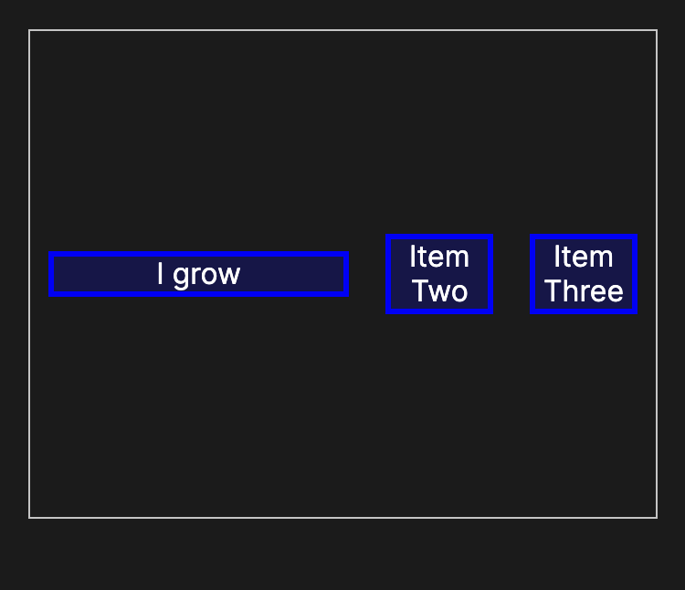
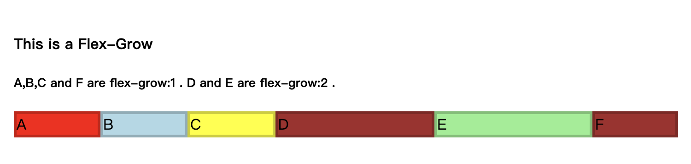

# flex-grow
flex-grow CSS 属性设置 flex grow 因子，它指定 flex 容器的剩余空间有多少应该分配给 flex 项目的主要尺寸。

当 flex-container 的主要尺寸大于 flex 项目的组合主要尺寸时，额外的空间分配给所有元素，每个项目的增长值是它们的 flex grow 因子值占所有容器项目 flex-grow 总和的比例。

flex-grow: 1;


flex-grow: 2;


flex-grow: 3;


# 语法
```css
/* <number> values */
flex-grow: 3;
flex-grow: 0.6;

/* Global values */
flex-grow: inherit;
flex-grow: initial;
flex-grow: revert;
flex-grow: revert-layer;
flex-grow: unset;
```

# 示例
```html
<h4>This is a Flex-Grow</h4>
<h5>A,B,C and F are flex-grow:1 . D and E are flex-grow:2 .</h5>
<div id="content">
  <div class="small" style="background-color:red;">A</div>
  <div class="small" style="background-color:lightblue;">B</div>
  <div class="small" style="background-color:yellow;">C</div>
  <div class="double" style="background-color:brown;">D</div>
  <div class="double" style="background-color:lightgreen;">E</div>
  <div class="small" style="background-color:brown;">F</div>
</div>
```

```css
#content {
  display: flex;

  justify-content: space-around;
  flex-flow: row wrap;
  align-items: stretch;
}

.small {
  flex-grow: 1;
  border: 3px solid rgba(0, 0, 0, 0.2);
}

.double {
  flex-grow: 2;
  border: 3px solid rgba(0, 0, 0, 0.2);
}
```

结果：

当六个弹性项目沿容器的主轴分布时，如果这些弹性项目的主要内容之和小于容器主轴的尺寸，则多余的空间分布在尺寸为A、B的弹性项目中 、C 和 F，每个获得 12.5% 的剩余空间，D 和 E 每个获得 25% 的额外空间。