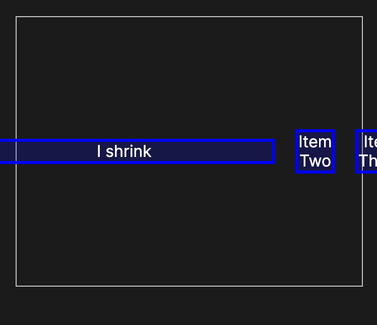
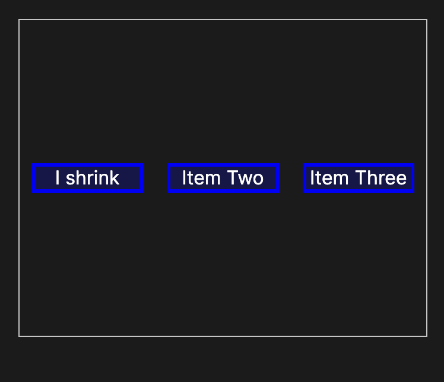
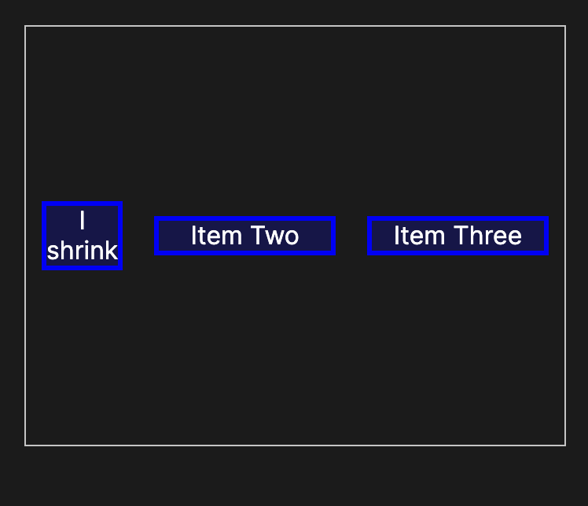
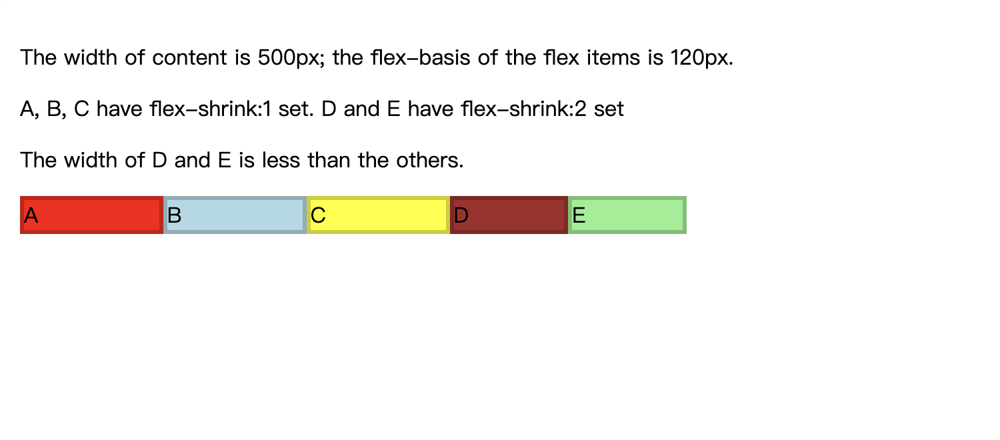

# flex-shrink

`flex-shrink` 属性设置弹性项目的弹性收缩因子。 如果所有 `flex` 项目的大小总和大于 `flex` 容器，项目将根据 `flex-shrink` 收缩以适应。

在使用中，`flex-shrink` 与其他弹性属性 `flex-grow` 和 `flex-basis` 一起使用，通常使用 `flex` 简写来定义。

flex-shrink: 0;


flex-shrink: 1;


flex-shrink: 2;


# 语法
```css
/* <number> values */
flex-shrink: 2;
flex-shrink: 0.6;

/* Global values */
flex-shrink: inherit;
flex-shrink: initial;
flex-shrink: revert;
flex-shrink: revert-layer;
flex-shrink: unset;
```

# 示例
```html
<p>The width of content is 500px; the flex-basis of the flex items is 120px.</p>
<p>A, B, C have flex-shrink:1 set. D and E have flex-shrink:2 set</p>
<p>The width of D and E is less than the others.</p>
<div id="content">
  <div class="box" style="background-color:red;">A</div>
  <div class="box" style="background-color:lightblue;">B</div>
  <div class="box" style="background-color:yellow;">C</div>
  <div class="box1" style="background-color:brown;">D</div>
  <div class="box1" style="background-color:lightgreen;">E</div>
</div>
```

```css
#content {
  display: flex;
  width: 500px;
}

#content div {
  flex-basis: 120px;
  border: 3px solid rgba(0, 0, 0, 0.2);
}

.box {
  flex-shrink: 1;
}

.box1 {
  flex-shrink: 2;
}
```

