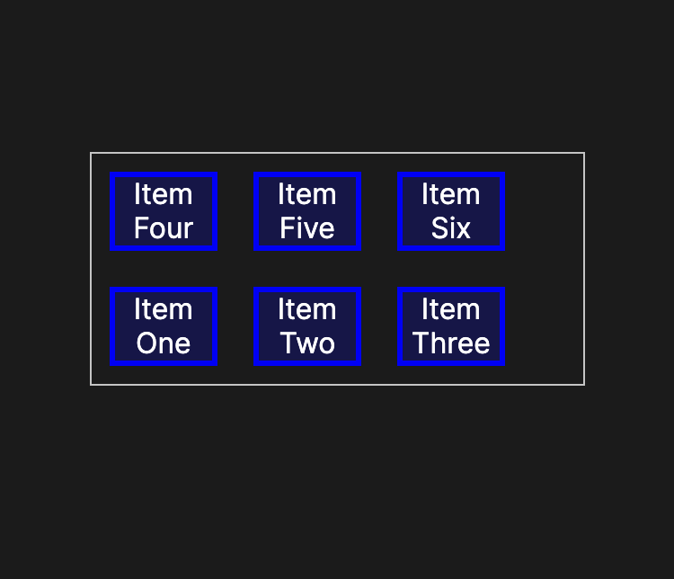

# flex-wrap

flex-wrap: nowrap;


flex-wrap: wrap;


flex-wrap: wrap-reverse;


# 语法
```css
flex-wrap: nowrap; /* Default value */
flex-wrap: wrap;
flex-wrap: wrap-reverse;

/* Global values */
flex-wrap: inherit;
flex-wrap: initial;
flex-wrap: revert;
flex-wrap: revert-layer;
flex-wrap: unset;
```

* nowrap 弹性项目排在一行中，这可能会导致弹性容器溢出。 根据 `flex-direction` 值，`cross-start` 相当于 `start` 或 `before`。 这是默认值。
* wrap 弹性项目分成多行。
* wrap-reverse 行为与 wrap 相同，但交叉起点和交叉终点被置换。

# 示例
```html
<h4>This is an example for flex-wrap:wrap</h4>
<div class="content">
  <div class="red">1</div>
  <div class="green">2</div>
  <div class="blue">3</div>
</div>
<h4>This is an example for flex-wrap:nowrap</h4>
<div class="content1">
  <div class="red">1</div>
  <div class="green">2</div>
  <div class="blue">3</div>
</div>
<h4>This is an example for flex-wrap:wrap-reverse</h4>
<div class="content2">
  <div class="red">1</div>
  <div class="green">2</div>
  <div class="blue">3</div>
</div>
```

```css
/* Common Styles */
.content,
.content1,
.content2 {
  color: #fff;
  font: 100 24px/100px sans-serif;
  height: 150px;
  width: 897px;
  text-align: center;
}

.content div,
.content1 div,
.content2 div {
  height: 50%;
  width: 300px;
}
.red {
  background: orangered;
}
.green {
  background: yellowgreen;
}
.blue {
  background: steelblue;
}

/* Flexbox Styles */
.content {
  display: flex;
  flex-wrap: wrap;
}
.content1 {
  display: flex;
  flex-wrap: nowrap;
}
.content2 {
  display: flex;
  flex-wrap: wrap-reverse;
}
```

结果：
