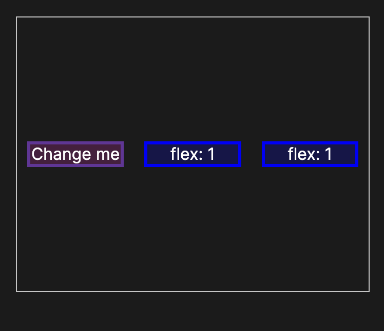
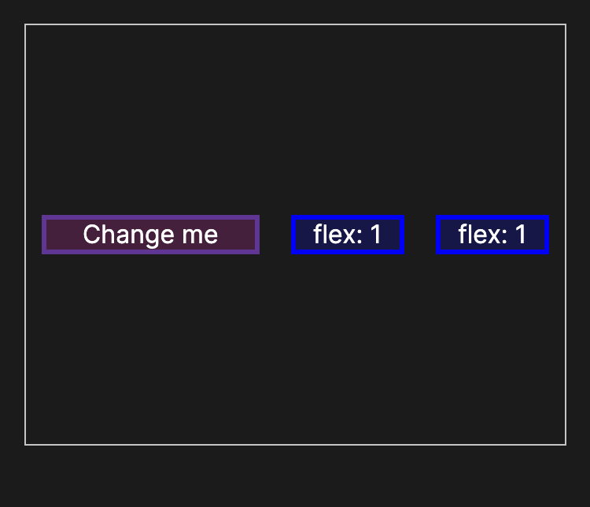
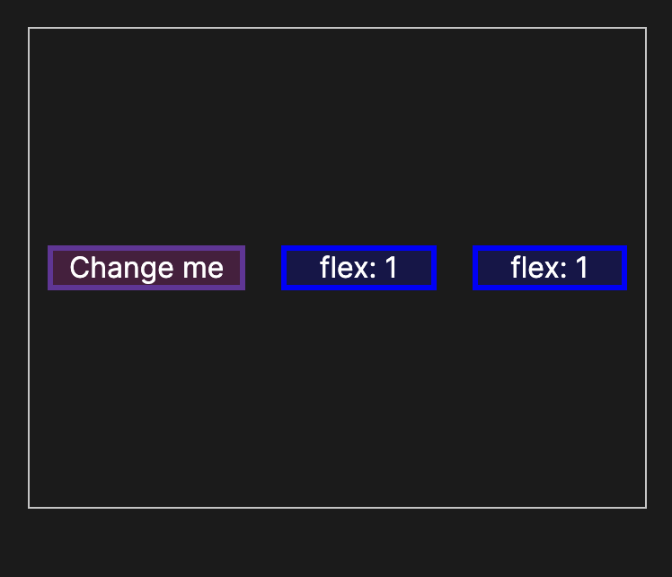
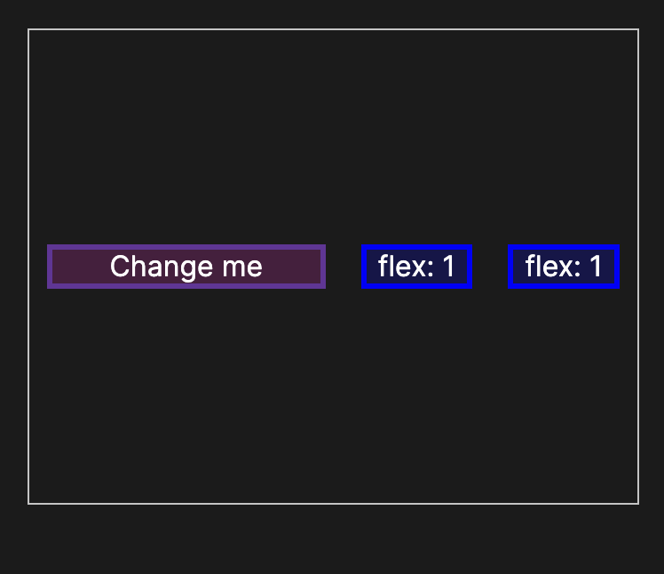

# flex

flex: 1;


flex: 2;


flex: 1 30px;


flex: 1 1 100px;


flex是下列三个属性的缩写
* flex-grow
* flex-shrink
* flex-basis

# 语法
```css
/* Keyword values */
flex: auto;
flex: initial;
flex: none;

/* One value, unitless number: flex-grow
flex-basis is then equal to 0. */
flex: 2;

/* One value, width/height: flex-basis */
flex: 10em;
flex: 30%;
flex: min-content;

/* Two values: flex-grow | flex-basis */
flex: 1 30px;

/* Two values: flex-grow | flex-shrink */
flex: 2 2;

/* Three values: flex-grow | flex-shrink | flex-basis */
flex: 2 2 10%;

/* Global values */
flex: inherit;
flex: initial;
flex: revert;
flex: revert-layer;
flex: unset;
```

>* The flex property may be specified using one, two, or three values.
>* One-value syntax: the value must be one of:
>   * a valid value for `<flex-grow>`: then the shorthand expands to flex: `<flex-grow>` 1 0.
>   * a valid value for `<flex-basis>`: then the shorthand expands to flex: 1 1 `<flex-basis>`.
>   * the keyword `none` or one of the global keywords.
>* Two-value syntax:
>   * The first value must be a valid value for flex-grow.
>   * The second value must be one of:
>       * a valid value for flex-shrink: then the shorthand expands to flex: `<flex-grow>` `<flex-shrink>` 0.
>       * a valid value for flex-basis: then the shorthand expands to flex: `<flex-grow>` 1 `<flex-basis>`.
> * Three-value syntax: the values must be in the following order:
>   * a valid value for flex-grow.
>   * a valid value for flex-shrink.
>   * a valid value for flex-basis.

>* initial
The item is sized according to its width and height properties. It shrinks to its minimum size to fit the container, but does not grow to absorb any extra free space in the flex container. This is equivalent to setting "flex: 0 1 auto".
>* auto
The item is sized according to its width and height properties, but grows to absorb any extra free space in the flex container, and shrinks to its minimum size to fit the container. This is equivalent to setting "flex: 1 1 auto".
>* none
The item is sized according to its width and height properties. It is fully inflexible: it neither shrinks nor grows in relation to the flex container. This is equivalent to setting "flex: 0 0 auto".
>* `<flex-grow>`
Defines the flex-grow of the flex item. Negative values are considered invalid. Defaults to 1 when omitted. (initial is 0)
>* `<flex-shrink>`
Defines the flex-shrink of the flex item. Negative values are considered invalid. Defaults to 1 when omitted. (initial is 1)
>* `<flex-basis>`
Defines the flex-basis of the flex item. A preferred size of 0 must have a unit to avoid being interpreted as a flexibility. Defaults to 0 when omitted. (initial is auto)