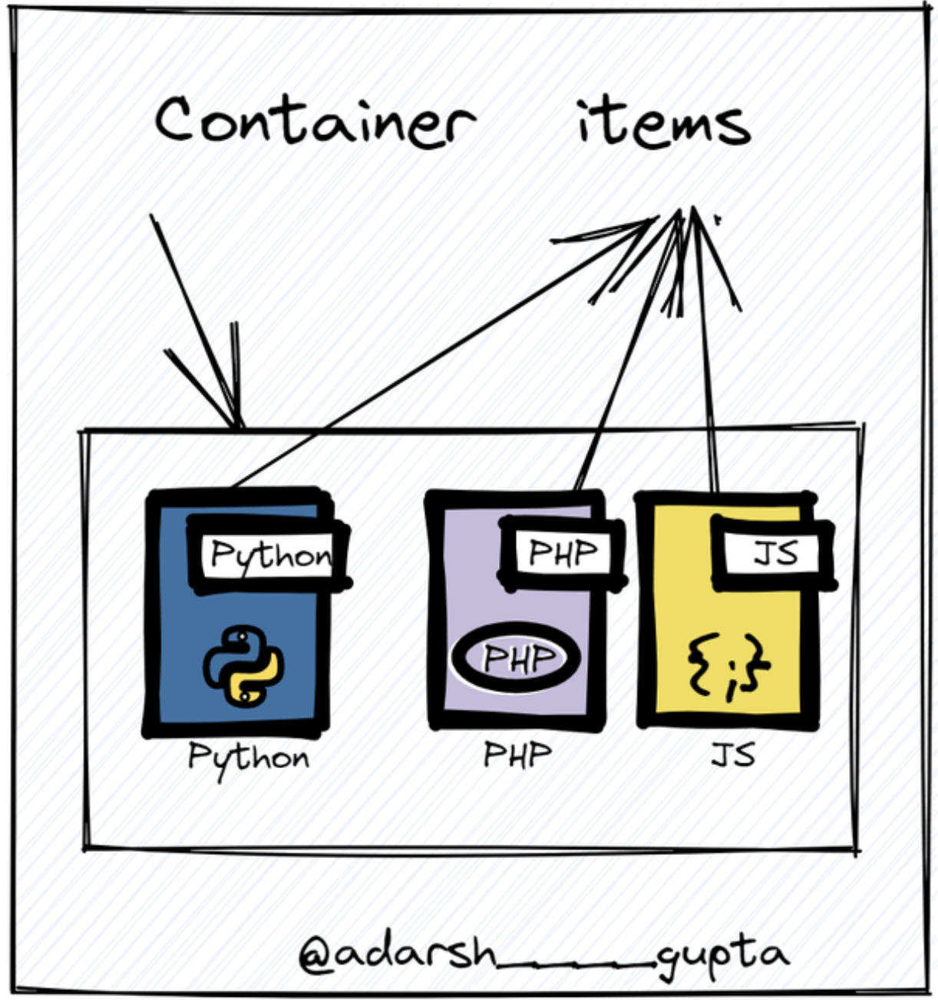
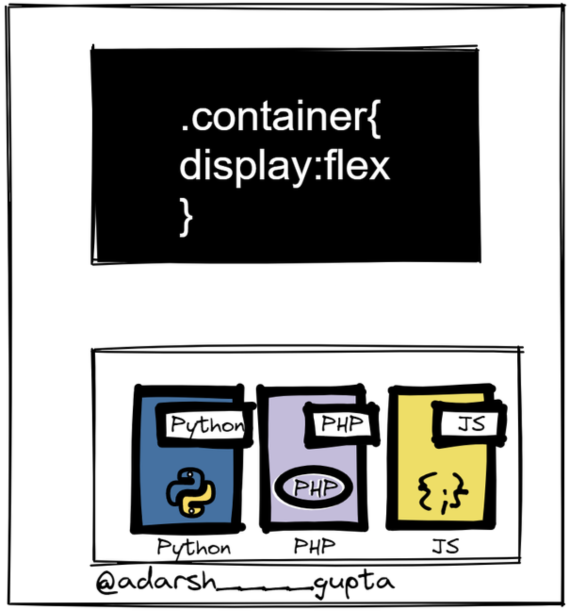
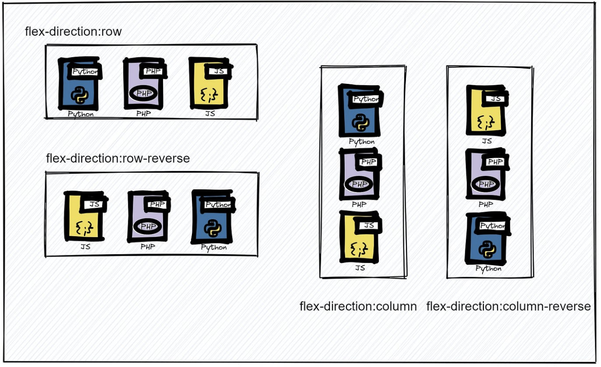
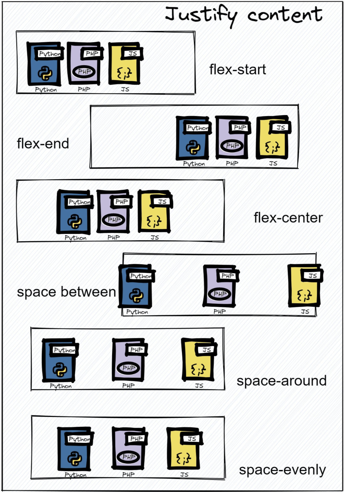
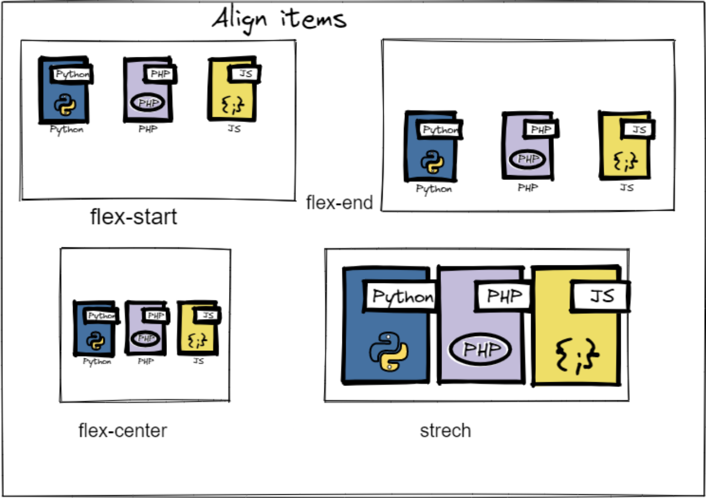

# flex细讲



CSS flex box 是一种布局模型，允许元素在容器内对齐和分布。 它提供了一种有效的方法来创建适应不同屏幕尺寸和设备方向的响应式和灵活的设计。

要使用 flex box，首先需要创建一个容器元素，并将其 display 属性设置为 flex：

```css
.container {
    display: flex;
}
```


设置容器后，您可以使用各种弹性框属性来控制其子元素的对齐方式、分布和大小。 以下是一些常见的属性及其作用：

* flex-direction: 此属性指定弹性项目的方向。 默认值为 row，这意味着项目将从左到右水平排列。 您可以通过将值设置为列来将方向更改为列：

```css
.container {
    display: flex;
    flex-direction: column;
}
```

* justify-content: 此属性确定项目沿主轴的对齐方式。 默认值为 `flex-start`，这意味着项目将与容器的开头对齐。 您可以根据您的设计需要将对齐方式更改为居中、间隔或间隔：

```css
.container {
    display: flex;
    justify-content: center;
}
```

* align-items: 此属性确定项目沿交叉轴的对齐方式。 默认值为 stretch，这意味着项目将填满容器的整个高度。 您可以根据您的设计需要将对齐方式更改为居中、flex-start或flex-end：
```css
.container {
    display: flex;
    align-items: center;
}
```



* flex-grow: 此属性指定弹性项目相对于容器中的其他项目应该增长多少。 默认值为 0，表示项目不会增长。 您可以设置一个正值来使项目增长，例如：
```css
.item {
    flex-grow: 1;
}
```
* flex-basis: 此属性指定弹性项目在增长或收缩之前的初始大小。 默认值为 auto，这意味着该项目将占用所需的空间。 您可以以像素、百分比或其他单位设置特定值来控制项目的大小
```css
.item {
    flex-basis: 200px;
}
```
* flex-shrink: 此属性指定弹性项目相对于容器中的其他项目应收缩多少。 默认值为 1，这意味着该项目将在必要时收缩。 您可以设置一个值为 0 以防止项目缩小，例如：
```css
.item {
    flex-shrink: 0;
}
```

CSS FlexBox技巧：

* 使用 `flex-shrink` 属性来防止项目收缩并保持其初始大小。
* 在单个项目上使用 `align-self` 属性来覆盖由容器上的 `align-items` 属性设置的默认对齐方式。
* 如果容器容不下多个元素，请使用 flex-wrap 属性将项目包装到多行中。
* 使用 `order` 属性更改项目的顺序而不更改它们的 HTML 标记。
* 使用媒体查询根据不同的屏幕尺寸和设备方向调整 flexbox 属性，例如：
```css
@media (max-width: 768px) {
    .container {
        flex-direction: column;
        align-items: center;
    }
}
```
* 使用 `flex-flow` 属性将 `flex-direction` 和 `flex-wrap` 属性组合成一个简写属性。
* 使用 `justify-content` 属性在项目之间分配空间，而不是在单个元素上使用边距或填充。
* 使用 `align-content` 属性对齐容器内的多行项目。
* 在设置 `flexbox` 属性时使用 `calc()` 函数组合不同的单位和值，例如：
```css
.item {
    flex-basis: calc(50% - 20px);
}
```
* 将 box-sizing 属性设置为 border-box ，以在 flex 项目的大小中包含填充和边框。 这有助于防止溢出并确保项目保持其初始大小。