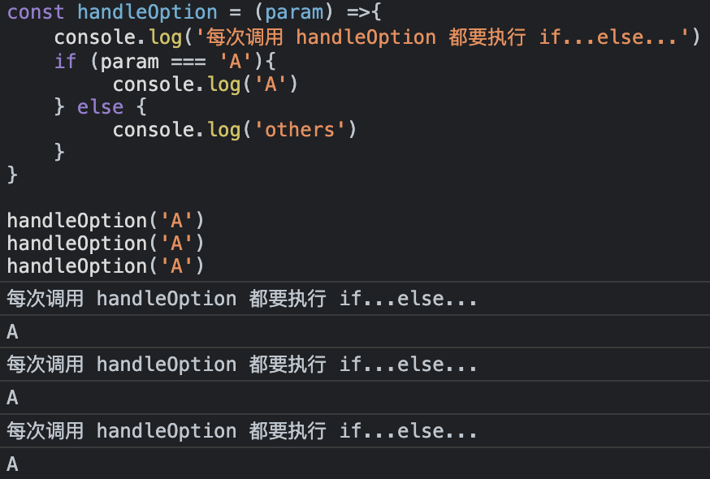

# 在`TypeScript`中使用函数的柯里化

## 函数式编程简史
函数式编程是一种编程范式，非常强调不变性、表现力和高阶函数的使用。它首先与 `Lambda Calculus` 一起引入，这是一个由 `Alonzo Church` 在 1930 年代开发的正式系统。

在 1950 年代，`John McCarthy` 的 `Lisp` 编程语言普及了函数式编程，此后影响了许多语言，包括 `Haskell`、`ML`、`Scala` 和 `JavaScript`。

`TypeScript` 是我们最喜欢的 `JavaScript` 超集，它在像我这样重视静态类型检查和函数式编程结构的专业开发人员中也大受欢迎。

## 函数式编程与命令式编程
函数式编程 (FP) 和命令式编程是两种截然不同的编程范式。
函数式编程强调不变性、无副作用函数和声明式风格。这导致代码通常更简洁、更容易推理和更可测试。高阶函数，例如 `map`、`filter` 和 `reduce`，用于在不改变数据结构的情况下对数据结构进行操作。

命令式编程侧重于可变状态和逐步指令。虽然这可以使代码更直接，但它通常以代码更难推理和更容易因意外副作用而出现错误为代价。

`Currying` 是一种可以进一步增强函数式编程优势的技术，也是我们今天要深入探讨的主题。

## 在 TypeScript 中柯里化：什么和为什么？
柯里化是将一个接受多个参数的函数转换为一系列函数的过程，每个函数接受一个参数。通过将函数分解为更小、更简单的函数，柯里化可以提高代码的可读性、可重用性和可测试性。

考虑 `TypeScript` 中的以下非柯里化函数：

```TypeScript
function  add ( a: number , b: number ): number { 
  return a + b; 
} 

const sum = add ( 5 , 3 ); // 8
```
现在，让我们柯里化这个`add`函数：
```TypeScript
function  add (a: number): (b: number) =>  number { 
  return (b : number): number => { 
    return a + b; 
  }; 
} 

const add5 = add(5); 
const sum = add5(3); // 8
```
通过柯里化`add`函数，我们创建了一个新函数`add5`，可以重复使用它来将 5 加到任何数字上。

## 何时更喜欢在 TypeScript 中使用柯里化
我们稍后会进入现实世界的例子，但让我们先谈谈大局。通常，柯里化在以下情况下特别有用：

* 构建可重用函数：Currying 允许您通过部分应用参数来创建专用函数，这可以减少代码重复。
* 组合函数：柯里化函数可以很容易地组合在一起，从而产生更简洁、更模块化的代码。
* 增强可读性：将复杂函数分解为更小的柯里化函数可以使代码更易于理解。

当然，我应该提到这可能是一个两极分化的问题——一些开发人员认为一切都应该是 100% 的函数式编程，而其他人则更喜欢命令式方法。我则处于两者之间。

## 自定义柯里化与 Ramda
虽然可以在 `TypeScript` 中编写自定义柯里化函数，但使用像`Ramda`这样的函数式编程库可以节省时间并提供额外的实用函数。

引入`ramda`
```shell
npm install ramda
```

下面是一个自定义柯里化函数的示例，我们用它来构建与`add5`之前相同的函数：

```TypeScript
function curry<A, B, R>(fn: (a: A, b: B) => R): (a: A) => (b: B) => R {
  return (a: A) => (b: B) => fn(a, b);
}

const add = curry((a: number, b: number): number => {
  return a + b;
});

const add5 = add(5);
const sum = add5(3); // 8
```
这里涉及到了`TypeScript`中泛型的使用。

下面是使用 Ramda 构建示例函数`add5`：
```TypeScript
import * as R from 'ramda';

const add = R.curry((a: number, b: number): number => {
  return a + b;
});

const add5 = add(5);
const sum = add5(3); // 8
```

这两种方法——编写自定义柯里化函数和使用像 `Ramda` 这样的函数式编程库——都有它们的优点：

自定义柯里化：
* 提供对柯里化过程的细粒度控制。
* 可能更适合小型项目或不需要完整库的特定用例。

`ramda`：
* 提供了一套全面的实用函数，使您能够编写更简洁、更具表现力的代码。
* 鼓励在代码库中采用一致的函数式编程风格。
* 提供性能优化和更好的错误处理。

根据他们的文档， `Ramda` 的一个缺点是只导入`curry`您需要的部分有点烦人。这与 `Lodash()` 存在的问题相同，只是 `Lodash` 具有模块化的包。这不是一个小问题——导入太多未使用的代码将使您的 `JavaScript` 包体积过于臃肿。

一般来说，对于大多数项目，建议使用像 `Ramda` 这样的库，尤其是随着代码库的增长和复杂性的增加。但是，对于较小的项目或特定用例，编写自定义柯里化函数可能更合适。

## 柯里化与链接
柯里化和链接是函数式编程中两个截然不同的概念，尽管它们可以一起使用以实现更具表现力的代码。

柯里化涉及将一个接受多个参数的函数转换为一系列函数，每个函数接受一个参数。这允许通过部分应用参数来创建更专业的函数。

链接是指一种技术，其中通过在对象或数据结构上一个接一个地调用一个方法来顺序执行多个操作。链接依赖于返回一个新对象或数据结构（以保持不变性）的方法，这些方法公开了相同的一组方法，允许进一步的操作。

在 `JavaScript` 或 `TypeScript` 中链接的一个例子是在数组上`.map()`调用：`.reduce()`
```TypeScript
const numbers = [1, 2, 3, 4, 5];

const sumOfSquares = numbers
  .map((x) => x * x)
  .reduce((acc, x) => acc + x, 0);

console.log(sumOfSquares); // 55
```
在此示例中，我们首先`map`数组`numbers`以计算每个元素的平方，然后链接调用`.reduce()`以对平方元素求和。链接允许我们编写更具可读性和表现力的代码，但它不涉及柯里化。

`Currying` 和 `chaining` 可以一起使用来创建更具可组合性和表现力的代码。但是，重要的是要了解它们是具有不同目的的独立概念。

## TypeScript 中柯里化的真实示例
以下是 TypeScript 中柯里化的一些真实示例，展示了该技术的优势和用例：

### 示例 1：使用基本 URL 获取数据
假设您有一个从各种 API 端点获取数据的应用程序。您可以创建一个柯里化函数，它接受一个基本 URL 并返回一个函数以从特定端点获取数据：

```TypeScript
import axios from 'axios';

const fetchFromApi = (baseURL: string) => (endpoint: string) => {
  return axios.get(`${baseURL}/${endpoint}`);
};

const fetchFromMyApi = fetchFromApi("https://api.example.com");

fetchFromMyApi("users")
  .then((response) => console.log(response.data))
  .catch((error) => console.error(error));

fetchFromMyApi("products")
  .then((response) => console.log(response.data))
  .catch((error) => console.error(error));
```

通过柯里化`fetchFromApi`函数，您可以创建一个可重用`fetchFromMyApi`函数，该函数可用于从具有相同基本 `URL`的不同端点获取数据。

### 示例 2：使用不同的日志级别记录日志
考虑一个日志库，它允许您记录具有不同日志级别（例如，信息、警告和错误）的消息。您可以创建一个柯里化函数来记录具有特定日志级别的消息：

```TypeScript
type LogLevel = "info" | "warn" | "error";

const logMessage = (level: LogLevel) => (message: string) => {
  const timestamp = new Date().toISOString();
  console.log(`[${timestamp}] ${level.toUpperCase()}: ${message}`);
};

const logInfo = logMessage("info");
const logWarn = logMessage("warn");
const logError = logMessage("error");

logInfo("This is an informational message.");
logWarn("This is a warning message.");
logError("This is an error message.");
```
通过 `Message` 函数，您可以创建专门的函数（`logInfo`、`logWarn`和`logError`）来记录不同级别的消息，从而产生更清晰、更具表现力的代码。

## 结论：TypeScript 中的函数柯里化
`Currying` 是函数式编程中的一种强大技术，可以提高代码的可读性、可重用性和可测试性。`TypeScript` 具有静态类型检查和函数式编程结构，非常适合应用柯里化。

通过将自定义柯里化函数与使用像 Ramda 这样的库进行比较，您可以就哪种方法最适合您的项目需求做出明智的决定。无论选择如何，在您的 `TypeScript` 代码中采用柯里化将产生更加模块化和可维护的代码。

## 拓展
函数的柯里化实际上就是闭包的孪生子
### 百变可里化
最开始，可以理解 柯里化 == 闭包 + 递归，得出的柯里化写法是这样的：
```JavaScript
let arr = []
function addCurry() {
    let arg = Array.prototype.slice.call(arguments); // 递归获取后续参数
    arr = arr.concat(arg);
    if (arg.length === 0) { // 如果参数为空，则判断递归结束
        return arr.reduce((a,b)=>{return a+b}) // 求和
    } else {
        return addCurry;
    }
}

addCurry(1)(2)(3)()
```
但这样的写法， `addCurry` 函数会引用一个外部变量 `arr`，不符合纯函数的特性，于是就优化为：
```JavaScript
function addCurry() {
    let arr = [...arguments]
    let fn = function () {
        if(arguments.length === 0) {
	    return arr.reduce((a, b) => a + b)
        } else {
            arr.push(...arguments)
            return fn
        }
    }
    return fn
}
```
上述写法，又总是要以 ‘( )’ 空括号结尾，于是再改进为隐式转换 `.toString` 写法：
```JavaScript
function addCurry() {
    let arr = [...arguments]
    // 利用闭包的特性收集所有参数值
    let fn = function() {
        arr.push(...arguments);
        return fn;
    };
    // 利用 toString 隐式转换
    fn.toString = function () {
        return arr.reduce(function (a, b) {
            return a + b;
        });
    }
    return fn;
}
```
好了，到这一步，如果你把上述三种柯里化写法都会手写了，那面试中考柯里化的基础一关算是过了。

然而，不止于此，柯里化实际存在很多变体， 只有深刻吃透它的思想，而非停留在一种写法上，才能算得上“高级”、“优雅”。

### 缓存传参
柯里化最基础的用法是缓存传参。

我们经常遇到这样的场景：

已知一个 `ajax` 函数，它有 3 个参数 `url`、`data`、`callback`
```JavaScript
function ajax(url, data, callback) {
  // ...
}
```
不用柯里化是怎样减少传参的呢？通常是以下这样，写死参数位置的方式来减少传参：
```JavaScript
function ajaxTest1(data, callback) {
  ajax('http://www.test.com/test1', data, callback);
}
```
而通过柯里化，则是这样：
```JavaScript
function ajax(url, data, callback) {
  // ...
}

let ajaxTest2 = partial(ajax,'http://www.test.com/test2')

ajaxTest2(data,callback)
```
其中 `partial` 函数是这样写的：
```JavaScript
function partial(fn, ...presetArgs) { // presetArgs 是需要先被绑定下来的参数
  return function partiallyApplied(...laterArgs) { //  ...laterArgs 是后续参数
        let allArgs =presetArgs.concat(laterArgs) // 收集到一起
        return fn.apply(this, allArgs) // 传给回调函数 fn
  }
}
```
柯里化固定参数的好处在：复用了原本的 `ajax` 函数，并在原有基础上做了修改，取其精华，弃其糟粕，封装原有函数之后，就能为我所用。

并且 `partial` 函数不止对 `ajax` 函数有作用，对于其它想减少传参的函数同样适用。

### 缓存判断
我们可以设想一个通用场景，假设有一个 `handleOption` 函数，当符合条件 `'A'`，执行语句：`console.log('A')；`不符合时，则执行语句：`console.log('others')`

转为代码即：
```JavaScript
const handleOption = (param) =>{
    if (param === 'A'){
         console.log('A')
    } else {
         console.log('others')
    }
}
```

现在的问题是：我们每次调用 `handleOption('A')`，都必须要走完 `if...else...` 的判断流程。比如：
```JavaScript
const handleOption = (param) =>{
    console.log('每次调用 handleOption 都要执行 if...else...')
    if (param === 'A'){
         console.log('A')
    } else {
         console.log('others')
    }
}

handleOption('A')
handleOption('A')
handleOption('A')
```
控制台打印：

> 有没有什么办法，多次调用 `handleOption('A')`，却只走一次 `if...else...`？
答案是：柯里化。

```JavaScript
const handleOption = ((param) =>{
    console.log('从始至终只用执行一次 if...else...')
    if (param === 'A'){
        return () => console.log('A')
    } else {
        return () => console.log('others')
    }
})

const tmp = handleOption('A')

tmp()
tmp()
tmp()
```
这样的场景是有实战意义的，当我们做前端兼容时，经常要先判断是来源于哪个环境，再执行某个方法。比如说在 `firefox` 和 `chrome` 环境下，添加事件监听是 `addEventListener` 方法，而在 `IE` 下，添加事件是 `attachEvent` 方法；如果每次绑定这个监听，都要判断是来自于哪个环境，那肯定是很费劲。我们通过上述封装的方法，可以做到 `一处判断，多次使用`。

### 缓存计算
我们再设想这样一个场景，现在有一个函数是来做大数计算的：
```JavaScript
const calculateFn = (num)=>{
    const startTime = new Date()
    for(let i = 0; i < num; i++) {} // 大数计算
    const endTime = new Date()
    console.log(endTime - startTime)
    return "Calculate big numbers"
}

calculateFn(10_000_000_000)
```
这是一个非常耗时的函数，复制代码在控制台看看，需要 `8s+`
如果业务代码中需要多次用到这个大数计算结果，多次调用 `calculateFn(10_000_000_000)` 肯定是不明智的，太费时。
一般的做法就是声明一个全局变量，把运算结果保存下来:
比如 `const resNums = calculateFn(10_000_000_000)`
如果有多个大数运算呢？沿着这个思路，即声名多个变量：
```JavaScript
const resNumsA = calculateFn(10_000_000_000)
const resNumsB = calculateFn(20_000_000_000)
const resNumsC = calculateFn(30_000_000_000)
```
我们讲就是说：`奥卡姆剃刀原则 —— 如无必要、勿增实体`。

申明这么多全局变量，先不谈占内存、占命名空间这事，就把 `calculateFn()` 函数的参数和声名的常量名一一对应，都是一个麻烦事。

> 有没有什么办法？只用函数，不增加多个全局常量，就实现多次调用，只计算一次？

答案是：柯里化。

代码如下：
```JavaScript
function cached(fn){
  const cacheObj = Object.create(null); // 创建一个对象
  return function cachedFn (str) { // 返回回调函数
    if ( !cacheObj[str] ) { // 在对象里面查询，函数结果是否被计算过
        let result = fn(str);
        cacheObj[str] = result; // 没有则要执行原函数，并把计算结果缓存起来
    }
    return cacheObj[str] // 被缓存过，直接返回
  }
}

const calculateFn = (num)=>{
    console.log("计算即缓存")
    const startTime = new Date()
    for(let i = 0; i < num; i++){} // 大数计算
    const endTime = new Date()
    console.log(endTime - startTime) // 耗时
    return "Calculate big numbers"
}

let cachedCalculate = cached(calculateFn) 

console.log(cachedCalculate(10_000_000_000)) // 计算即缓存 // 9944 // Calculate big numbers
console.log(cachedCalculate(10_000_000_000)) // Calculate big numbers

console.log(cachedCalculate(20_000_000_000)) // 计算即缓存 // 22126 // Calculate big numbers
console.log(cachedCalculate(20_000_000_000)) // Calculate big numbers
```

这样只用通过一个 `cached` 缓存函数的处理，所有的大数计算都能保证：输入参数相同的情况下，全局只用计算一次，后续可直接使用更加语义话的函数调用来得到之前计算的结果。
此处也是柯里化的应用，在 `cached` 函数中先传需要处理的函数参数，后续再传入具体需要操作得值，将多参转化为单个参数逐一传入。

### 缓存函数
柯里化的思想不仅可以缓存判断条件，缓存计算结果、缓存传参，还能缓存“函数”。

设想，我们有一个数字 7 要经过两个函数的计算，先乘以 10 ，再加 100，写法如下：

```JavaScript
const multi10 = function(x) { return x * 10; }
const add100 = function(x) { return x + 100; }
add100(multi10(7))
```
用柯里化处理后，即变成：
```JavaScript
const multi10 = function(x) { return x * 10; }
const add100 = function(x) { return x + 100; }
const compose = function(f,g) { 
    return function(x) { 
        return f(g(x))
    }
}

compose(add100, multi10)(7)
```
前者写法有两个传参是写在一起的，而后者则逐一传参。把最后的执行函数改写：
```JavaScript
let compute = compose(add100, multi10)

compute(7)
```
所以，这里的柯里化直接把函数处理给缓存了，当声明 `compute` 变量时，并没有执行操作，只是为了拿到 `()=> f(g(x))`，最后执行 `compute(7)`，才会执行整个运算；

我们对闭包的解释：“闭包是一个函数内有另外一个函数，内部的函数可以访问外部函数的变量，这样的语法结构是闭包。”与我们对柯里化的解释“把接受多个参数的函数变换成接受一个单一参数（或部分）的函数，并且返回接受余下的参数和返回结果的新函数的技术”，这两种说法几乎是“等效的”，只是从不同角度对 同一问题 作出的解释，就像 lambda 演算和图灵机对希尔伯特第十问题的解释一样。
同一问题：指的是在 lambda 演算诞生之时，提出的：怎样用 lambda 演算实现接收多个参数？

### 防抖与节流
好了，我们再来看看除了其它高阶函数中闭包思想（柯里化思想）的应用。首先是最最常用的防抖与节流函数。

防抖：就像英雄联盟的回城键，按了之后，间隔一定秒数才会执行生效。
```JavaScript
function debounce(fn, delay) {
    delay = delay || 200;
    let timer = null;
    return function() {
        let arg = arguments;
        // 每次操作时，清除上次的定时器
        clearTimeout(timer);
        timer = null;
        // 定义新的定时器，一段时间后进行操作
        timer = setTimeout(function() {
            fn.apply(this, arg);
        }, delay);
    }
};

var count = 0;
window.onscroll = debounce(function(e) {
    console.log(e.type, ++count); // scroll
}, 500);
```
节流函数：就像英雄联盟的技能键，是有 CD 的，一段时间内只能按一次，按了之后就要等 CD；
```JavaScript
// 函数节流，频繁操作中间隔 delay 的时间才处理一次
function throttle(fn, delay) {
    delay = delay || 200;
    let timer = null;
    // 每次滚动初始的标识
    let timestamp = 0;
    return function() {
        let arg = arguments;
        let now = Date.now();
        // 设置开始时间
        if (timestamp === 0) {
            timestamp = now;
        }
        clearTimeout(timer);
        timer = null;
        // 已经到了delay的一段时间，进行处理
        if (now - timestamp >= delay) {
            fn.apply(this, arg);
            timestamp = now;
        }
        // 添加定时器，确保最后一次的操作也能处理
        else {
            timer = setTimeout(function() {
                fn.apply(this, arg);
                // 恢复标识
                timestamp = 0;
            }, delay);
        }
    }
};

var count = 0;
window.onscroll = throttle(function(e) {
    console.log(e.type, ++count); // scroll
}, 500);
```
代码均可复制到控制台中测试。在防抖和节流的场景下，被预先固定住的变量是 timer。

### lodash 高阶函数
`lodash` 大家肯定不陌生，它是最流行的 `JavaScript` 库之一，透过函数式编程模式为开发者提供常用的函数。

其中有一些封装的高阶函数，让一些平平无奇的普通函数也能有相应的高阶功能。

举几个例子：
```JavaScript
// 防抖动
_.debounce(func, [wait=0], [options={}])
// 节流
_.throttle(func, [wait=0], [options={}])

// 将一个断言函数结果取反
_.negate(predicate) 
// 柯里化函数
_.curry(func, [arity=func.length])
// 部分应用
_.partial(func, [partials])

// 返回一个带记忆的函数
_.memoize(func, [resolver])
// 包装函数
_.wrap(value, [wrapper=identity])
```
研究源码你就会发现，`_.debounce` 防抖、`_.throttle` 节流上面说过，`_.curry` 柯里化上面说过、`_.partial` 在“缓存传参”里说过、`_.memoize` 在“缓存计算”里也说过......
再举一个例子：
现在要求一个函数在达到 n 次之前，每次都正常执行，第 n 次不执行。
也是非常常见的业务场景！JavaScript 实现：

```JavaScript
function before(n, func) {
  let result, count = n;
  return function(...args) {
    count = count - 1
    if (count > 0) result = func.apply(this, args)
    if (count <= 1) func = undefined
    return result
  }
}

const fn= before(3,(x)=>console.log(x))
fn(1) // 1
fn(2) // 2
fn(3) // 不执行
```
反过来：函数只有到 n 次的时候才执行，n 之前的都不执行。
```JavaScript
function after(n, func) {
  let count = n || 0
  return function(...args) {
    count = count - 1
    if (count < 1) return func.apply(this, args)
  }
}

const fn= after(3,(x)=>console.log(x))
fn(1) // 不执行
fn(2) // 不执行
fn(3) // 3 
```
全是“闭包”、全是把参数“柯里化”。

细细体会，在控制台上敲一敲、改一改、跑一跑，下次或许你就可以自己写出这些有特定功能的高阶函数了。