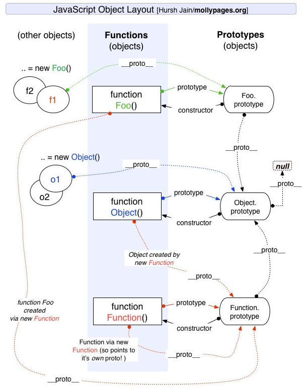
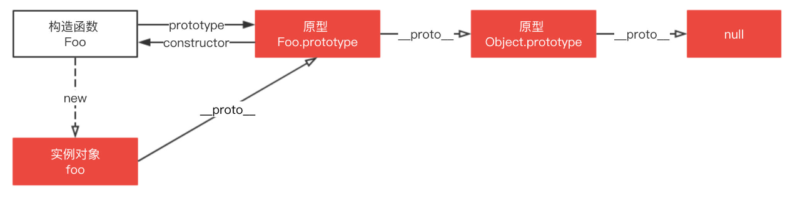
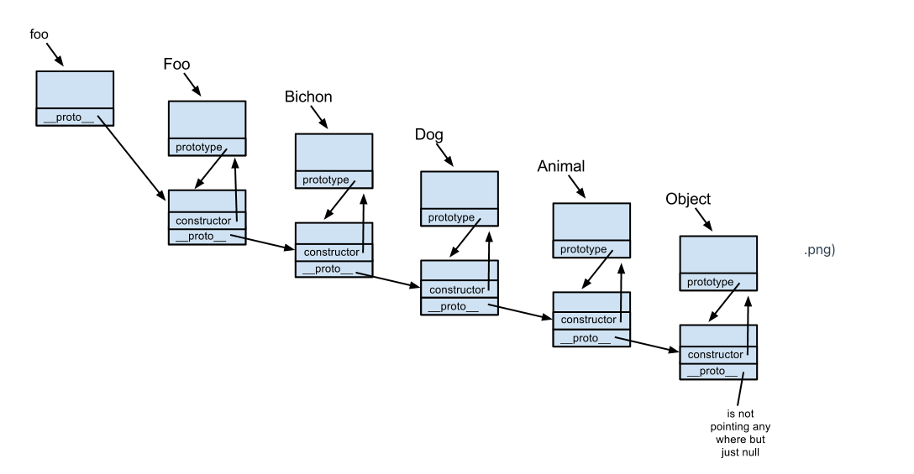

# 图解原型链条



根据规范不建议直接使用 `__proto__`，推荐使用 `Object.getPrototypeOf()`，不过为了行文方便逻辑清晰，下面都以 `__proto__` 代替。

注意上面的说法，原型上的方法和属性被 继承 到新对象中，并不是被复制到新对象，我们看下面这个例子。

```JavaScript
function Foo(name) {
	this.name = name;
}
Foo.prototype.getName = function() {
  	return this.name;
}
Foo.prototype.length = 3;
let foo = new Foo('muyiy'); // 相当于 foo.__proto__ = Foo.prototype
console.dir(foo);
```


原型上的属性和方法定义在 `prototype` 对象上，而非对象实例本身。当访问一个对象的属性 / 方法时，它不仅仅在该对象上查找，还会查找该对象的原型，以及该对象的原型的原型，一层一层向上查找，直到找到一个名字匹配的属性 / 方法或到达原型链的末尾（null）。

比如调用 `foo.valueOf()` 会发生什么？

首先检查 `foo` 对象是否具有可用的 `valueOf()` 方法。
如果没有，则检查 `foo` 对象的原型对象（即 `Foo.prototype`）是否具有可用的 `valueof()` 方法。
如果没有，则检查 `Foo.prototype` 所指向的对象的原型对象（即 `Object.prototype`）是否具有可用的 `valueOf()` 方法。这里有这个方法，于是该方法被调用。


## `prototype` 和 `__proto__`
原型对象 `prototype` 是构造函数的属性，`__proto__` 是每个实例上都有的属性，这两个并不一样，但 `foo.__proto__` 和 `Foo.prototype` 指向同一个对象。

这次我们再深入一点，原型链的构建是依赖于 `prototype` 还是 `__proto__` 呢？

`Foo.prototype` 中的 `prototype` 并没有构建成一条原型链，其只是指向原型链中的某一处。原型链的构建依赖于 `__proto__`，如上图通过 `foo.__proto__ `指向 `Foo.prototype`，`foo.__proto__.__proto__` 指向 `Bichon.prototype`，如此一层一层最终链接到 `null`。

可以这么理解 `Foo`，我是一个 `constructor`，我也是一个 `function`，我身上有着 `prototype` 的 `reference`，只要随时调用 `foo = new Foo()`，我就会将 `foo.__proto__` 指向到我的 `prototype` 对象。

不要使用 `Bar.prototype = Foo`，因为这不会执行 `Foo` 的原型，而是指向函数 `Foo`。 因此原型链将会回溯到 `Function.prototype` 而不是 `Foo.prototype`，因此 `method` 方法将不会在 `Bar` 的原型链上。

```JavaScript
// 木易杨
function Foo() {
  	return 'foo';
}
Foo.prototype.method = function() {
  	return 'method';
}
function Bar() {
  	return 'bar';
}
Bar.prototype = Foo; // Bar.prototype 指向到函数
let bar = new Bar();
console.dir(bar);

bar.method(); // Uncaught TypeError: bar.method is not a function
```

## instanceof 原理及实现
instanceof 运算符用来检测 `constructor.prototype` 是否存在于参数 `object` 的原型链上。

```JavaScript
function C(){} 
function D(){} 

var o = new C();

o instanceof C; // true，因为 Object.getPrototypeOf(o) === C.prototype
o instanceof D; // false，因为 D.prototype 不在 o 的原型链上
```
instanceof 原理就是一层一层查找 `__proto__`，如果和 `constructor.prototype` 相等则返回 `true`，如果一直没有查找成功则返回 `false`。

`instance.[__proto__...] === instance.constructor.prototype`
知道了原理后我们来实现 `instanceof`，代码如下。

```JavaScript
function instance_of(L, R) {//L 表示左表达式，R 表示右表达式
   var O = R.prototype;// 取 R 的显示原型
   L = L.__proto__;// 取 L 的隐式原型
   while (true) { 
       // Object.prototype.__proto__ === null
       if (L === null) 
         return false; 
       if (O === L)// 这里重点：当 O 严格等于 L 时，返回 true 
         return true; 
       L = L.__proto__; 
   } 
}

// 测试
function C(){} 
function D(){} 

var o = new C();

instance_of(o, C); // true
instance_of(o, D); // false
```
## 原型链继承
原型链继承的本质是重写原型对象，代之以一个新类型的实例。如下代码，新原型 `Cat` 不仅有 `new Animal()` 实例上的全部属性和方法，并且由于指向了 `Animal` 原型，所以还继承了`Animal` 原型上的属性和方法。

```JavaScript
function Animal() {
    this.value = 'animal';
}

Animal.prototype.run = function() {
    return this.value + ' is runing';
}

function Cat() {}

// 这里是关键，创建 Animal 的实例，并将该实例赋值给 Cat.prototype
// 相当于 Cat.prototype.__proto__ = Animal.prototype
Cat.prototype = new Animal(); 

var instance = new Cat();
instance.value = 'cat'; // 创建 instance 的自身属性 value
console.log(instance.run()); // cat is runing
```