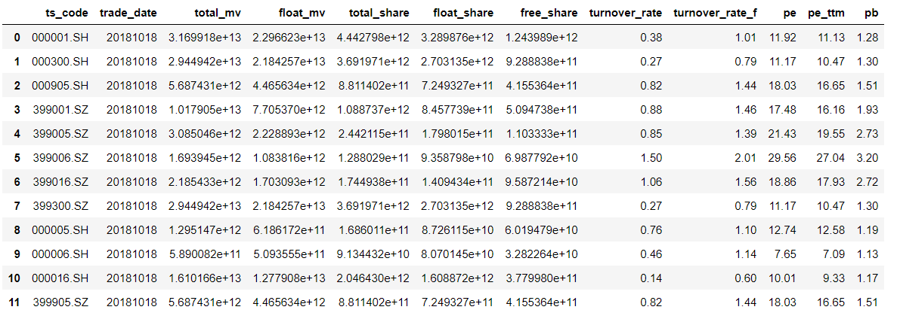
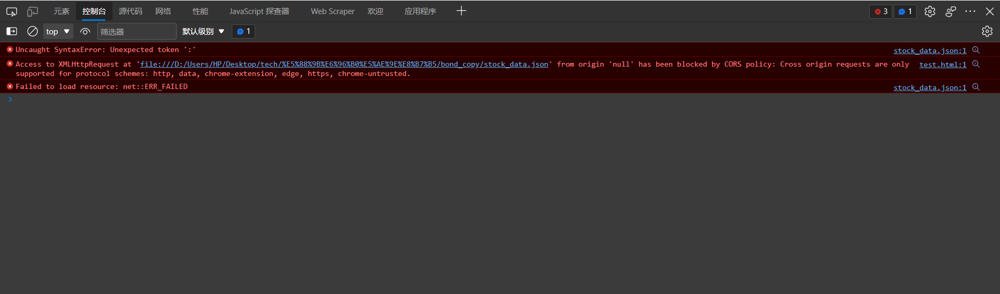
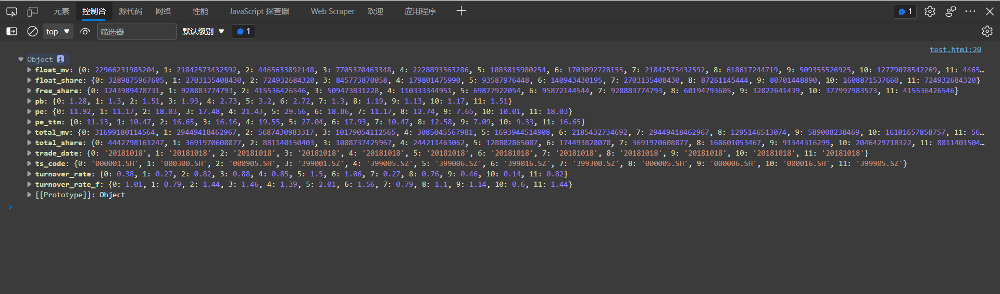

# 在一般情况下请求本地json数据

**Python爬取股票json数据**

```Python
import tushare as ts
token='15e164e74f082e80c989dfb93b1d937ee95b83ea78b2c5bf1d5db211'
pro=ts.pro_api(token)
df = pro.index_dailybasic(trade_date='20181018')
df.to_json()
```



**引入jQuery**

```javascript
<script src="https://cdn.bootcdn.net/ajax/libs/jquery/3.6.0/jquery.js"></script>
```

```javascript
<script type="text/javascript">
    $(document).ready(function() {
        $.getJSON("stock_data.json", function(data) {
            var stock_data = data;
            console.log(stock_data);
        })
    })
</script>
```

出现如下错误：



这是因为此时jQuery是在file协议下请求本地数据的，但是跨源请求只支持协议的模式为:http, data, chrome-extension, edge, https, chrome-untrusted。

让我们来看看要请求的json数据格式

```
{
    "ts_code": {
        "0": "000001.SH",
        "1": "000300.SH",
        "2": "000905.SH",
        "3": "399001.SZ",
        "4": "399005.SZ",
        "5": "399006.SZ",
        "6": "399016.SZ",
        "7": "399300.SZ",
        "8": "000005.SH",
        "9": "000006.SH",
        "10": "000016.SH",
        "11": "399905.SZ"
    },
    "trade_date": {
        "0": "20181018",
        "1": "20181018",
        "2": "20181018",
        "3": "20181018",
        "4": "20181018",
        "5": "20181018",
        "6": "20181018",
        "7": "20181018",
        "8": "20181018",
        "9": "20181018",
        "10": "20181018",
        "11": "20181018"
    },
    "total_mv": {
        "0": 31699180114564.0,
        "1": 29449418462967.0,
        "2": 5687430983317.0,
        "3": 10179054112565.0,
        "4": 3085045567981.0,
        "5": 1693944514908.0,
        "6": 2185432734692.0,
        "7": 29449418462967.0,
        "8": 1295146513074.0,
        "9": 589008238469.0,
        "10": 16101657858757.0,
        "11": 5687430983317.0
    },
    "float_mv": {
        "0": 22966231985204.0,
        "1": 21842573432592.0,
        "2": 4465633892148.0,
        "3": 7705370463348.0,
        "4": 2228893363286.0,
        "5": 1083815980254.0,
        "6": 1703092728155.0,
        "7": 21842573432592.0,
        "8": 618617244719.0,
        "9": 509355526925.0,
        "10": 12779078542269.0,
        "11": 4465633892148.0
    },
    "total_share": {
        "0": 4442798161247.0,
        "1": 3691970608877.0,
        "2": 881140150403.0,
        "3": 1088737425967.0,
        "4": 244211463062.0,
        "5": 128802865087.0,
        "6": 174493828078.0,
        "7": 3691970608877.0,
        "8": 168601053467.0,
        "9": 91344316299.0,
        "10": 2046429718322.0,
        "11": 881140150403.0
    },
    "float_share": {
        "0": 3289875967605.0,
        "1": 2703135408430.0,
        "2": 724932684320.0,
        "3": 845773870058.0,
        "4": 179801475990.0,
        "5": 93587976448.0,
        "6": 140943430195.0,
        "7": 2703135408430.0,
        "8": 87261145444.0,
        "9": 80701448890.0,
        "10": 1608871537660.0,
        "11": 724932684320.0
    },
    "free_share": {
        "0": 1243989478731.0,
        "1": 928883774793.0,
        "2": 415536426546.0,
        "3": 509473831228.0,
        "4": 110333344951.0,
        "5": 69877922054.0,
        "6": 95872144544.0,
        "7": 928883774793.0,
        "8": 60194793605.0,
        "9": 32822641439.0,
        "10": 377997983573.0,
        "11": 415536426546.0
    },
    "turnover_rate": {
        "0": 0.38,
        "1": 0.27,
        "2": 0.82,
        "3": 0.88,
        "4": 0.85,
        "5": 1.5,
        "6": 1.06,
        "7": 0.27,
        "8": 0.76,
        "9": 0.46,
        "10": 0.14,
        "11": 0.82
    },
    "turnover_rate_f": {
        "0": 1.01,
        "1": 0.79,
        "2": 1.44,
        "3": 1.46,
        "4": 1.39,
        "5": 2.01,
        "6": 1.56,
        "7": 0.79,
        "8": 1.1,
        "9": 1.14,
        "10": 0.6,
        "11": 1.44
    },
    "pe": {
        "0": 11.92,
        "1": 11.17,
        "2": 18.03,
        "3": 17.48,
        "4": 21.43,
        "5": 29.56,
        "6": 18.86,
        "7": 11.17,
        "8": 12.74,
        "9": 7.65,
        "10": 10.01,
        "11": 18.03
    },
    "pe_ttm": {
        "0": 11.13,
        "1": 10.47,
        "2": 16.65,
        "3": 16.16,
        "4": 19.55,
        "5": 27.04,
        "6": 17.93,
        "7": 10.47,
        "8": 12.58,
        "9": 7.09,
        "10": 9.33,
        "11": 16.65
    },
    "pb": {
        "0": 1.28,
        "1": 1.3,
        "2": 1.51,
        "3": 1.93,
        "4": 2.73,
        "5": 3.2,
        "6": 2.72,
        "7": 1.3,
        "8": 1.19,
        "9": 1.13,
        "10": 1.17,
        "11": 1.51
    }
}
```

### jsonp实现跨域请求

基本原理： 主要就是利用了 `script` 标签的`src`没有跨域限制来完成的。

执行过程：

- 前端定义一个解析函数(如: `getJson = function (res) {}`)
- 通过`params`的形式包装`script`标签的请求参数，并且声明执行函数(如`cb=jsonpCallback`)
- 后端获取到前端声明的执行函数(`getJson`)，并以带上参数且调用执行函数的方式传递给前端
- 前端在`script`标签返回资源的时候就会去执行`getJson`并通过回调函数的方式拿到数据了。

缺点是只能进行`GET`请求。

**实现代码**

```javascript
<script type="text/javascript">
    // 定义函数
    function getJson(data) {
        // data 就是要取的json数据
        let myData = data;
        console.log(myData);
    }
</script>

<script src="./stock_data.json?callback=getJson"></script>
```

同时我们还要改变Python存储数据的格式，要在json数据外面套上一个函数才能执行。因为script标签会默认引用的是一个脚本文件，如果里面只有json数据浏览器就解析不了，所以要套上一个函数。

```Python
def func_json(function_name, dataframe, filename):
    cancatString = string + '(' + dataframe.to_json() + ')'
    f = open(filename, 'w') 
    f.write(cancatString)
    f.close()
func_json('getJson', df , 'stock_data.json')
```

我们看看此时的Json文件

```
getJson({"ts_code":{"0":"000001.SH","1":"000300.SH","2":"000905.SH","3":"399001.SZ","4":"399005.SZ","5":"399006.SZ","6":"399016.SZ","7":"399300.SZ","8":"000005.SH","9":"000006.SH","10":"000016.SH","11":"399905.SZ"},"trade_date":{"0":"20181018","1":"20181018","2":"20181018","3":"20181018","4":"20181018","5":"20181018","6":"20181018","7":"20181018","8":"20181018","9":"20181018","10":"20181018","11":"20181018"},"total_mv":{"0":31699180114564.0,"1":29449418462967.0,"2":5687430983317.0,"3":10179054112565.0,"4":3085045567981.0,"5":1693944514908.0,"6":2185432734692.0,"7":29449418462967.0,"8":1295146513074.0,"9":589008238469.0,"10":16101657858757.0,"11":5687430983317.0},"float_mv":{"0":22966231985204.0,"1":21842573432592.0,"2":4465633892148.0,"3":7705370463348.0,"4":2228893363286.0,"5":1083815980254.0,"6":1703092728155.0,"7":21842573432592.0,"8":618617244719.0,"9":509355526925.0,"10":12779078542269.0,"11":4465633892148.0},"total_share":{"0":4442798161247.0,"1":3691970608877.0,"2":881140150403.0,"3":1088737425967.0,"4":244211463062.0,"5":128802865087.0,"6":174493828078.0,"7":3691970608877.0,"8":168601053467.0,"9":91344316299.0,"10":2046429718322.0,"11":881140150403.0},"float_share":{"0":3289875967605.0,"1":2703135408430.0,"2":724932684320.0,"3":845773870058.0,"4":179801475990.0,"5":93587976448.0,"6":140943430195.0,"7":2703135408430.0,"8":87261145444.0,"9":80701448890.0,"10":1608871537660.0,"11":724932684320.0},"free_share":{"0":1243989478731.0,"1":928883774793.0,"2":415536426546.0,"3":509473831228.0,"4":110333344951.0,"5":69877922054.0,"6":95872144544.0,"7":928883774793.0,"8":60194793605.0,"9":32822641439.0,"10":377997983573.0,"11":415536426546.0},"turnover_rate":{"0":0.38,"1":0.27,"2":0.82,"3":0.88,"4":0.85,"5":1.5,"6":1.06,"7":0.27,"8":0.76,"9":0.46,"10":0.14,"11":0.82},"turnover_rate_f":{"0":1.01,"1":0.79,"2":1.44,"3":1.46,"4":1.39,"5":2.01,"6":1.56,"7":0.79,"8":1.1,"9":1.14,"10":0.6,"11":1.44},"pe":{"0":11.92,"1":11.17,"2":18.03,"3":17.48,"4":21.43,"5":29.56,"6":18.86,"7":11.17,"8":12.74,"9":7.65,"10":10.01,"11":18.03},"pe_ttm":{"0":11.13,"1":10.47,"2":16.65,"3":16.16,"4":19.55,"5":27.04,"6":17.93,"7":10.47,"8":12.58,"9":7.09,"10":9.33,"11":16.65},"pb":{"0":1.28,"1":1.3,"2":1.51,"3":1.93,"4":2.73,"5":3.2,"6":2.72,"7":1.3,"8":1.19,"9":1.13,"10":1.17,"11":1.51}})
```

可以看到已经套上函数了。

**查看结果**



可以看到成功请求数据了。

### 完整代码

**Python代码**

```python
import tushare as ts

def func_json(function_name, dataframe, filename):
    cancatString = function_name + '(' + dataframe.to_json() + ')'
    f = open(filename, 'w') 
    f.write(cancatString)
    f.close()

token='15e164e74f082e80c989dfb93b1d937ee95b83ea78b2c5bf1d5db211'
pro=ts.pro_api(token)
df = pro.index_dailybasic(trade_date='20181018')
func_json('getJson', df , 'stock_data.json')
```

**html代码**

```html
<!DOCTYPE html>
<html lang="en">

<head>
    <meta charset="UTF-8">
    <meta http-equiv="X-UA-Compatible" content="IE=edge">
    <meta name="viewport" content="width=device-width, initial-scale=1.0">
    <script src="https://cdn.bootcdn.net/ajax/libs/jquery/3.6.0/jquery.js"></script>
    <title>Document</title>
</head>

<body>
</body>

<script type="text/javascript">
    // 定义函数
    function getJson(data) {
        // data 就是要取的json数据
        let myData = data;
        console.log(myData);
    }
</script>

<script src="./stock_data.json?callback=getJson"></script>

</html>
```

