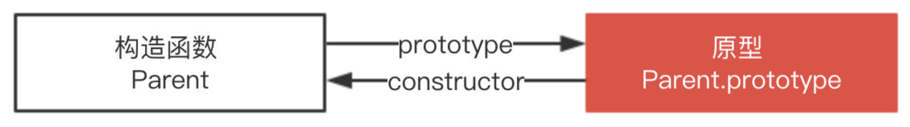
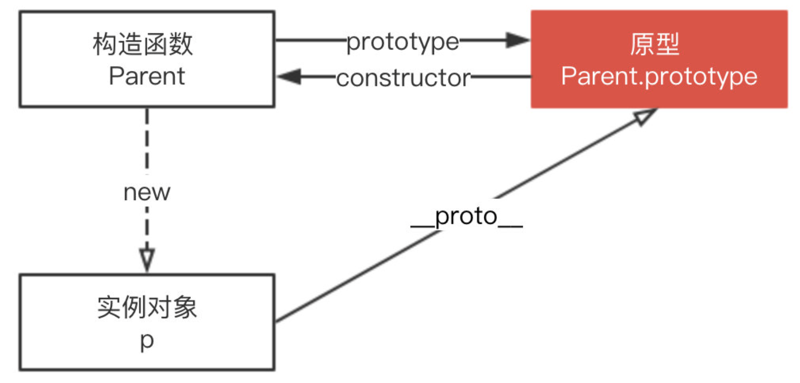
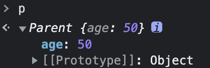
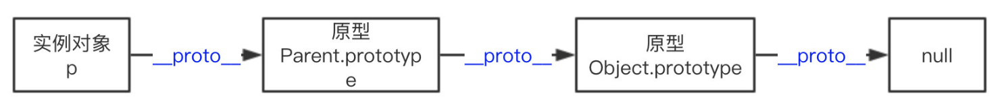

# 对象与原型链

我们先从`__proto__`和`prototype`这两个容易混淆来理解JS的终极命题之一：对象与原型链。
## __proto__和prototype
引用《JavaScript权威指南》的一段描述：
> Every JavaScript object has a second JavaScript object (or null ,
> but this is rare) associated with it. This second object is known as a prototype, and the first object inherits properties from the prototype.

翻译出来就是每个JS对象一定对应一个原型对象，并从原型对象继承属性和方法。好啦，既然有这么一个原型对象，那么对象怎么和它对应的？
对象`__proto__`属性的值就是它所对应的原型对象：
```JavaScript
var one = {x: 1};
var two = new Object();
one.__proto__ === Object.prototype // true
two.__proto__ === Object.prototype // true
one.toString === one.__proto__.toString // true
```
可以看到，不论是利用`{}`还是利用`new Object()`声明的变量，其原型都是`Object.prototype`，那么`Object.prototype`是什么呢？为什么`one`和`two`的原型就是`Object.prototype`？

### `prototype`
`JavaScript` 是一种基于原型的语言 (`prototype-based language`)，这个和 `Java` 等基于类的语言不一样。

`Parent` 对象有一个原型对象 `Parent.prototype`，其上有一个属性，是 `constructor` 。

构造函数 `Parent` 有一个指向原型的指针，原型 `Parent.prototype` 有一个指向构造函数的指针 `Parent.prototype.constructor`，其实就是一个循环引用。



### `__proto__`
上图可以看到 `Parent` 原型（ `Parent.prototype` ）上有 `__proto__` 属性，这是一个访问器属性（即 getter 函数和 setter 函数），通过它可以访问到对象的内部 `[[Prototype]]` (一个对象或 `null` )。

`__proto__` 发音 `dunder proto`，最先被 `Firefox` 使用，后来在 `ES6` 被列为 `Javascript` 的标准内建属性。

`[[Prototype]]` 是对象的一个内部属性，外部代码无法直接访问。

> 遵循 ECMAScript 标准，`someObject.[[Prototype]]` 符号用于指向 someObject 的原型。

这里用 `p.__proto__` 获取对象的原型，`__proto__` 是每个实例上都有的属性，`prototype` 是构造函数的属性，这两个并不一样，但 `p.__proto__` 和 `Parent.prototype` 指向同一个对象。
```JavaScript
function Parent() {}
var p = new Parent();
p.__proto__ === Parent.prototype
// true
```
所以构造函数 `Parent`、`Parent.prototype` 和 `p` 的关系如下图。


`__proto__` 属性在 `ES6` 时才被标准化，以确保 `Web` 浏览器的兼容性，但是不推荐使用，除了标准化的原因之外还有性能问题。为了更好的支持，推荐使用 `Object.getPrototypeOf()`。

通过改变一个对象的 `[[Prototype]]` 属性来改变和继承属性会对性能造成非常严重的影响，并且性能消耗的时间也不是简单的花费在 `obj.__proto__ = ...` 语句上, 它还会影响到所有继承自该 `[[Prototype]]` 的对象，如果你关心性能，你就不应该修改一个对象的 `[[Prototype]]`。

如果要读取或修改对象的 `[[Prototype]]` 属性，建议使用如下方案，但是此时设置对象的 `[[Prototype]]` 依旧是一个缓慢的操作，如果性能是一个问题，就要避免这种操作。

```JavaScript
// 木易杨
// 获取
Object.getPrototypeOf()
Reflect.getPrototypeOf()

// 修改
Object.setPrototypeOf()
Reflect.setPrototypeOf()
```
如果要创建一个新对象，同时继承另一个对象的 `[[Prototype]]` ，推荐使用 `Object.create()`。
```JavaScript
function Parent() {
    age: 50
};
var p = new Parent();
var child = Object.create(p);
```
这里 `child` 是一个新的空对象，有一个指向对象 `p` 的指针 `__proto__`。

## 原型链

每个对象拥有一个原型对象，通过 __proto__ 指针指向上一个原型 ，并从中继承方法和属性，同时原型对象也可能拥有原型，这样一层一层，最终指向 null。这种关系被称为原型链 (prototype chain)，通过原型链一个对象会拥有定义在其他对象中的属性和方法。

我们看下面一个例子

```JavaScript
function Parent(age) {
    this.age = age;
}

var p = new Parent(50);
p.constructor === Parent; // true
```
这里 `p.constructor` 指向 `Parent`，那是不是意味着 `p` 实例存在 `constructor` 属性呢？并不是。

我们打印下 `p` 值就知道了。



由图可以看到实例对象 `p` 本身没有 `constructor` 属性，是通过原型链向上查找 `__proto__` ，最终查找到 `constructor` 属性，该属性指向 `Parent`。

```JavaScript
function Parent(age) {
    this.age = age;
}
var p = new Parent(50);

p;	// Parent {age: 50}
p.__proto__ === Parent.prototype; // true
p.__proto__.__proto__ === Object.prototype; // true
p.__proto__.__proto__.__proto__ === null; // true
```
下图展示了原型链的运作机制。



综上所述:

* `__proto__` 是每个实例上都有的属性，`prototype` 是构造函数的属性，在实例上并不存在，所以这两个并不一样，但 `p.__proto__` 和 `Parent.prototype` 指向同一个对象。
* `__proto__` 属性在 `ES6` 时被标准化，但因为性能问题并不推荐使用，推荐使用 `Object.getPrototypeOf()`。
* 每个对象拥有一个原型对象，通过 `__proto__` 指针指向上一个原型 ，并从中继承方法和属性，同时原型对象也可能拥有原型，这样一层一层，最终指向 `null`，这就是原型链。

## 小结

每个对象拥有一个原型对象，对象以其原型为模板，从原型继承方法和属性，这些属性和方法定义在对象的构造器函数的 `prototype` 属性上，而非对象实例本身。

不像每个对象都有`__proto__`属性来标识自己所继承的原型，只有函数才有`prototype`属性。

为什么只有函数才有`prototype`属性？其实函数在JS中真的很特殊，是所谓的_一等公民_。JS不像其它面向对象的语言，它没有类（`class`，ES6引进了这个关键字，但更多是语法糖）的概念。JS通过函数来模拟类。

当你创建函数时，JS会为这个函数自动添加`prototype`属性，值是一个有 `constructor` 属性的对象，不是空对象。而一旦你把这个函数当作构造函数（`constructor`）调用（即通过`new`关键字调用），那么JS就会帮你创建该构造函数的实例，实例继承构造函数`prototype`的所有属性和方法（实例通过设置自己的`__proto__`指向承构造函数的`prototype`来实现这种继承）。

综上所述，JS通过`__proto__`和`prototype`的 合作实现了原型链，以及对象的继承。
构造函数，通过prototype来存储要共享的属性和方法，也可以设置prototype指向现存的对象来继承该对象。

对象的`__proto__`指向自己构造函数的`prototype`。`obj.__proto__.__proto__`...的原型链由此产生，包括我们的操作符`instanceof`正是通过探测`obj.__proto__.__proto__... === Constructor.prototype`来验证`obj`是否是`Constructor`的实例。

回到开头的代码，`two = new Object()`中`Object`是构造函数，所以`two.__proto__`就是`Object.prototype`。至于`one`，ES规范定义对象字面量的原型就是`Object.prototype`。


## 进一步探讨
我们知道JS是单继承的，`Object.prototype`是原型链的顶端，所有对象从它继承了包括`toString`等等方法和属性。

`Object`本身是构造函数，继承了`Function.prototype`;`Function`也是对象，继承了`Object.prototype`。这里就有一个鸡和蛋的问题：
```JavaScript
Object instanceof Function // true
Function instanceof Object // true
```
那么具体到JS，ES规范是怎么说的？
> `Function`本身就是函数，`Function.__proto__`是标准的内置对象`Function.prototype`。
> `Function.prototype.__proto__`是标准的内置对象`Object.prototype`。

* `Function.prototype`和`Function.__proto__`都指向`Function.prototype`。
* `Object.prototype.__proto__ === null`，说明原型链到`Object.prototype`终止。
