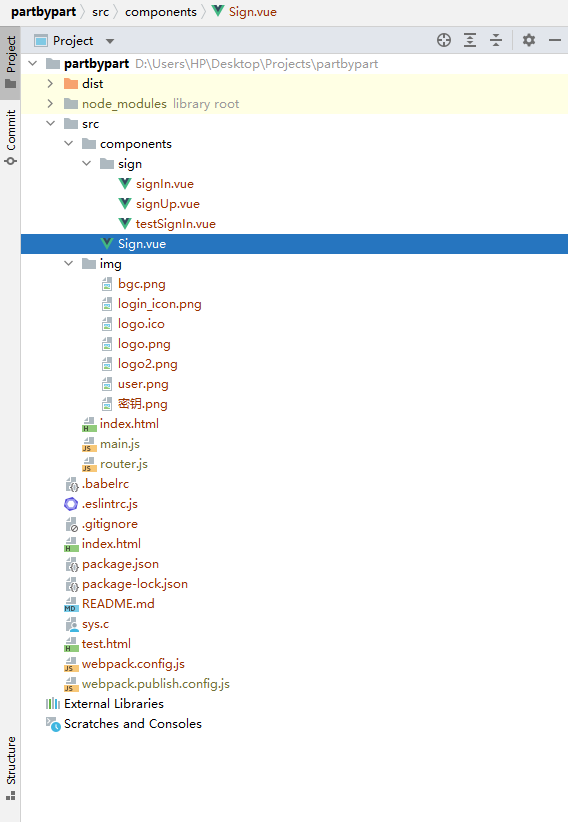
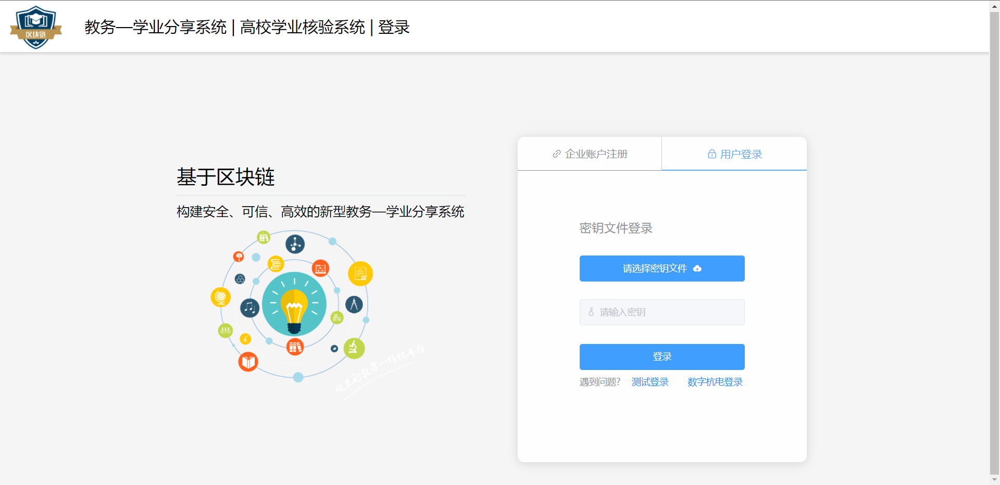
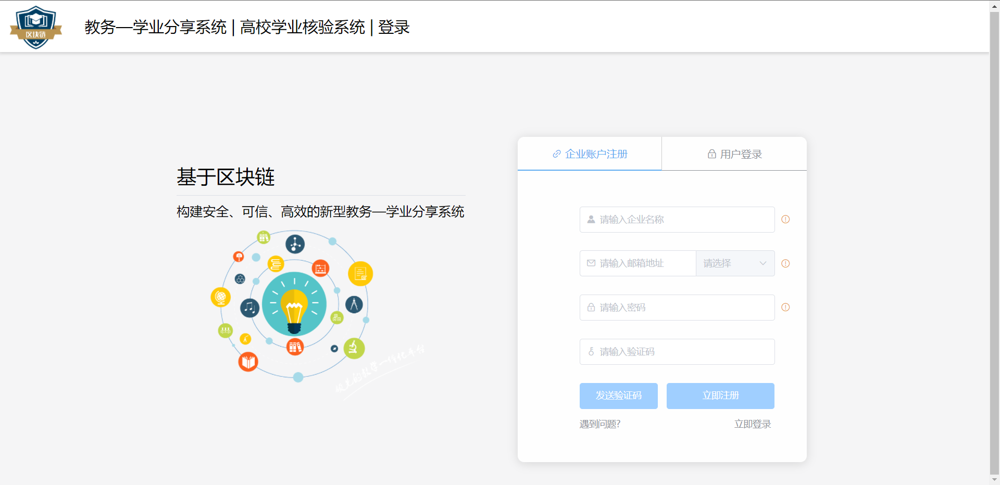

### 前言

利用elementUI来进行界面的开发，利用Vue来实现路由跳转，Vue和elementUI是当今比较流行的一个开发框架。

### 文件目录结构




### 依赖模块

**package.json**

```json
{
  "name": "sever",
  "version": "1.0.0",
  "description": "npm-install-package",
  "main": "app.js",
  "scripts": {
    "test": "echo \"Error: no test specified\" && exit 1",
    "dev": "webpack-dev-server --open --hot",
    "pub": "webpack --config webpack.publish.config.js --mode production",
    "build": "webpack --config webpack.config.js --mode production"
  },
  "keywords": [],
  "author": "",
  "license": "ISC",
  "private": "true",
  "dependencies": {
    "element-ui": "^2.15.5",
    "form-data": "^4.0.0",
    "html2canvas": "^1.3.2",
    "js-base64": "^3.7.2",
    "vue": "^2.6.12",
    "vue-clipboard2": "^0.3.1",
    "vue-router": "^3.5.1"
  },
  "devDependencies": {
    "@babel/core": "^7.13.10",
    "@babel/preset-env": "^7.13.10",
    "axios": "^0.21.1",
    "babel-core": "^6.26.3",
    "babel-loader": "^7.1.5",
    "babel-plugin-transform-runtime": "^6.23.0",
    "babel-preset-env": "^1.7.0",
    "babel-preset-stage-0": "^6.24.1",
    "clean-webpack-plugin": "^3.0.0",
    "css-loader": "^5.1.1",
    "eslint": "^7.32.0",
    "eslint-plugin-vue": "^7.17.0",
    "file-loader": "^6.2.0",
    "html-webpack-plugin": "^4.5.1",
    "mini-css-extract-plugin": "^1.3.9",
    "optimize-css-assets-webpack-plugin": "^6.0.0",
    "style-loader": "^2.0.0",
    "url-loader": "^4.1.1",
    "vue-loader": "^15.9.7",
    "vue-template-compiler": "^2.6.12",
    "webpack": "^4.46.0",
    "webpack-cli": "^3.3.12",
    "webpack-dev-server": "^3.11.3"
  }
}

```

**webpack.publish.config.js**

```javascript
const path = require("path")
// 1. 导入 在内存中生成页面的webpack插件
const HtmlWebpackPlugin = require("html-webpack-plugin")
// 导入删除文件夹的 插件
const { CleanWebpackPlugin } = require("clean-webpack-plugin")
// 导入 webpack 这个模块
const webpack = require("webpack")
// 导入抽取CSS样式文件的插件
// const extractTextPlugin = require('extract-text-webpack-plugin')
const MiniCssExtractPlugin = require("mini-css-extract-plugin");
// 导入优化压缩CSS样式表的插件
const optimizeCSSAssetsPlugin = require("optimize-css-assets-webpack-plugin")
const { VueLoaderPlugin } = require("vue-loader"); // 导入vue-loader

// 使用Node语法，向外暴露配置对象，从而，让webpack运行的时候，加载指定的配置
// 为什么可以使用Node语法？因为 webpack 这个工具，就是基于node构建的；
module.exports = {
    entry: {
        main: path.join(__dirname, "./src/main.js"), // 这是项目的主入口文件
        // vendors: ['jquery'] // 这是第三方包的名称
    }, // 项目的入口文件
    output: {
        path: path.join(__dirname, "./student"), // 输出路径
        filename: "js/[name].js" // 输出文件名
    }, // 打包好的文件的数据配置
    devtool: "nosources-source-map",
    plugins: [ // 插件配置节点
        // 创建一个 htmlWebpackPlugin 的实例对象
        new HtmlWebpackPlugin({
            template: path.join(__dirname, "./src/index.html"), // 指定模板页面路径
            filename: "index.html", // 指定内存中生成的HTMl文件名称
            minify: { // 表示提供压缩选项
                removeComments: true, // 移除页面中的注释
                collapseWhitespace: true, // 合并空白字符
                removeAttributeQuotes: true // 移除属性节点上的引号
            }
        }),
        new CleanWebpackPlugin(), // 指定每次重新发布的时候，要先删除的文件夹
        new VueLoaderPlugin(),
        new MiniCssExtractPlugin({
            filename: "css/vendors.css"
        }),
        new optimizeCSSAssetsPlugin() // 自动压缩CSS
    ],
    module: { // 用来配置 非JS文件对应的loader的
        rules: [ // 就是这些 非 JS 文件 和 loader 之间的对应关系
            {
                test: /\.(sa|sc|c)ss$/,
                use: [{
                        loader: MiniCssExtractPlugin.loader,
                        options: {
                            publicPath: "../"
                        }
                    },
                    "css-loader",
                ],
            }, // 创建处理 css 文件的 loader 匹配规则
            { test: /\.(jpg|png|jpe?g|gif)(\?.*)?$/, use: "url-loader?limit=7631&name=images/[hash:8]-[name].[ext]" }, // 配置 处理 样式表中图片的 loader规则
            // 可以使用?给 url-loader传递参数，其中，有一个固定的参数，叫做 limit，表示图片的大小，需要给定一个 数值；
            // limit 给定的这个数值，是 图片的大小，单位是 Byte（字节）
            // 如果指定了 limit 参数，则只有图片的大小，小于给定的 值时候，才会转为base64格式的图片；否则，就不转换；
            { test: /\.js$/, use: "babel-loader", exclude: /node_modules/ }, // 添加转换JS文件的loader，其中，必须把 node_modules 目录设置为 排除项，这样，在打包的时候，会忽略node_modules 目录下的所有JS文件；否则项目运行不起来！
            { test: /\.vue$/, use: "vue-loader" }, // 解析Vue组件的第三方loader
            {
                test: /\.ttf|eot#iefix|woff|woff2|eot|svg$/,
                use: [
                    { loader: "file-loader", options: { name: "fonts/[name].[hash:8].[ext]" } } //项目设置打包到dist下的fonts文件夹下
                ]
            }, // 处理 样式中字体文件路径的问题
        ]
    },
    performance: {
        hints: "warning", // 枚举
        maxAssetSize: 30000000, // 整数类型（以字节为单位）
        maxEntrypointSize: 50000000, // 整数类型（以字节为单位）
        assetFilter: function(assetFilename) {
            // 提供资源文件名的断言函数
            return assetFilename.endsWith(".css") || assetFilename.endsWith(".js");

        }
    },
}
```


### 路由配置

**文件：src/router.js**

```javascript
//  路由规则模块
import VueRouter from "vue-router"
// 导入路由相关的组件
import signIn from "./components/sign/signIn.vue"
import signUp from "./components/sign/signUp.vue"

const router = new VueRouter({
  routes: [
    // 路由规则
    { path: "/signIn", component: signIn },
    { path: "/signUp", component: signUp }
  ],
})

// 导出路由对象
export default router
```

### Body

**main.js**入口文件

```javascript
import Vue from "vue"
// 导入自己的 .vue 组件
// 在这里，如果要在webpack中使用.vue组件，必须先安装对应的loader加载器，否则webpack处理不了这种文件
import APP from "../src/components/Sign.vue"
// 导入路由模块
import VueRouter from "vue-router"
import router from "./router.js"
import axios from "axios"
// element ui
import ElementUI from "element-ui"
import "element-ui/lib/theme-chalk/index.css"

axios.defaults.withCredentials = true
Vue.prototype.axios = axios

//引入Clipboard2
import VueClipboard from "vue-clipboard2"
Vue.use(VueClipboard)
// 安装路由
Vue.use(VueRouter)

const originalPush = VueRouter.prototype.push
VueRouter.prototype.push = function push(location) {
  return originalPush.call(this, location).catch(err => err)
}
Vue.use(ElementUI)

const vm = new Vue({
  el: "#app",
  router,
  render: h => h(APP)
})

```

**Sign.vue**

```javascript
<template>
  <!-- template 中，只能有唯一的一个根元素 -->
  <el-container>
    <!-- 头部 -->
    <el-header class="logo">
      <span class="tittle">教务—学业分享系统 | 高校学业核验系统 | 登录</span>
    </el-header>
    <!-- 内容 -->
    <el-main>
      <div class="ad_content">
        <span style="font-size: 30px">基于区块链</span>
        <el-divider></el-divider>
        <span style="font-size: 20px">构建安全、可信、高效的新型教务—学业分享系统</span>
      </div>
      <div class="log_content">
        <div class="method_switch">
          <div id="signUp" :style="codeIcon" @click="byChange(0)">
            <i class="el-icon-link"></i>
            <span>企业账户注册</span>
          </div>
          <div id="signIn" :style="psIcon" @click="byChange(1)">
            <i class="el-icon-lock"></i>
            <span>用户登录</span>
          </div>
        </div>
        <router-view></router-view>
      </div>
    </el-main>
  </el-container>
</template>
<script>
// 使用 JS Component 之前，先按需导入一下需要的组件
// import { Toast } from "mint-ui";
export default {
  data() {
    return {
      flag: 1,
      psIcon: {
        color: "#5eacf0",
        borderBottomColor: "#5eacf0",
        borderBottomWidth: "2px",
      },
      codeIcon: {
        color: "",
        borderBottomColor: "#ccc",
        borderBottomWidth: "1px",
      },
    };
  },
  methods: {
    byChange(e) {
      if (this.flag === 1 && e === 0) {
        this.codeIcon.color = this.codeIcon.borderBottomColor = "#5eacf0";
        this.psIcon.color = this.psIcon.borderBottomColor = "#909399";
        this.codeIcon.borderBottomWidth = "2px"
        this.psIcon.borderBottomWidth = "1px";
        this.$router.push("/signUp");
        this.flag = 0
      }
      else if (this.flag === 0 && e === 1) {
        this.psIcon.color = this.psIcon.borderBottomColor = "#5eacf0";
        this.codeIcon.color = this.codeIcon.borderBottomColor = "#909399";
        this.psIcon.borderBottomWidth = "2px"
        this.codeIcon.borderBottomWidth = "1px";
        this.$router.push("/signIn");
        this.flag = 1
      }
    },
    windowHeight() {
      var de = document.documentElement;
      return self.innerHeight || (de && de.clientHeight) || document.body.clientHeight;
    }
  },
  filters: {},
  components: {},
  directives: {},
  props: [],
  watch: {   //监听路由变化
    $route() {
      switch (this.$route.path) {
        case "/signIn":
        case "/testSignIn":
          this.byChange(1)
          break
        case "/signUp":
          this.byChange(0)
          break
      }
      //  console.log(to , from )
      // to , from 分别表示从哪跳转到哪，都是一个对象
      // to.path  ( 表示的是要跳转到的路由的地址 eg: /home );
    }
  },
  mounted() {        //写在mounted或者activated生命周期内即可
    window.onpageshow = window.onload = e => {      //刷新时弹出提示
      var wh = this.windowHeight();
      document.querySelector(".el-main").style.height = wh - 80 + "px";
      switch (this.$route.path) {
        case "/signIn":
        case "/testSignIn":
          this.byChange(1)
          break
        case "/signUp":
          this.byChange(0)
          break
      }
    };
    if (localStorage.getItem("jw_student_file") !== null && localStorage.getItem("jw_ent_file") === null)
      window.location.href = "https://limkim.xyz/newEdu/student"
    else if (localStorage.getItem("jw_student_file") === null && localStorage.getItem("jw_ent_file") !== null)
      window.location.href = "https://limkim.xyz/newEdu/company"
  },
};
</script>

<style>
* {
  margin: 0;
  padding: 0;
  text-decoration: none;
  list-style: none;
  outline: none;
  box-sizing: border-box;
}
body {
  margin: 0 !important;
}
.el-header {
  background: url(../img/logo2.png) no-repeat;
  background-size: 90px;
  background-position: 10px 0;
  background-color: #fff;
  box-shadow: 0 2px 4px 1px rgba(0, 0, 0, 0.13);
  z-index: 99;
  height: 80px !important;
}
.el-header .el-menu-item {
  padding: 0 30px !important;
}
.el-main {
  padding: 20px;
  min-width: 1440px;
  background-color: #f5f5f6;
}
.tittle {
  height: 80px;
  margin-left: 100px;
  padding-left: 10px;
  font-size: 24px;
  line-height: 80px;
  /* border-left: 1px solid ; */
}
.ad_content {
  float: left;
  width: 30%;
  max-width: 560px;
  height: 460px;
  margin: 150px 0 0 17%;
  background: url(../img/login_icon.png) no-repeat;
  background-size: 75%;
  background-position: 50px 100px;
}
.log_content {
  float: left;
  position: relative;
  margin: 110px 0 0 80px;
  width: 30%;
  max-width: 500px;
  height: 500px;
  background-color: rgba(255, 255, 255, 0.85);
  box-shadow: 0 2px 15px rgba(0, 0, 0, 0.13);
  border-radius: 10px;
}
.method_switch {
  height: 52px;
}
.method_switch div {
  float: left;
  margin: 0 !important;
  width: 50%;
  height: 52px;
  line-height: 52px;
  text-align: center;
  border-bottom: 1px solid #ccc;
  cursor: pointer;
}
#signUp {
  border-right: 1px solid #ccc;
}
.else {
  position: absolute;
  height: 44px;
  bottom: 0;
  width: 100%;
  border-top: 1px solid #ccc;
  color: #5eacf0;
  cursor: pointer;
  text-align: center;
  line-height: 44px;
}
/* .else span {
    display: inline-block;
    margin: 0 !important;
    width: 300px;
    text-align: center;
} */
.el-divider--horizontal {
  margin: 10px 0 !important;
}
</style>
```

**signIn.vue**

```javascript
<template>
  <el-form ref="form">
    <h3 style="font-weight: 400; margin-bottom: 30px; color: #909399">密钥文件登录</h3>
    <el-form-item style="margin-bottom: 27px">
      <el-button type="primary" style="width: 100%; height: 40px" onclick="path.click()">
        请选择密钥文件
        <i class="el-icon-upload el-icon--right"></i>
      </el-button>
      <input type="file" id="path" style="display: none" accept=".json" />
    </el-form-item>
    <el-form-item style="margin-bottom: 27px">
      <el-input
        type="password"
        placeholder="请输入密钥"
        v-model="code"
        style="width: 100%"
        prefix-icon="el-icon-key"
        clearable
        show-password
        disabled
      ></el-input>
    </el-form-item>
    <el-form-item style="margin-bottom: 5px">
      <el-button
        type="primary"
        @click="onSubmit()"
        style="width: 100%"
        :loading="btnLoad"
      >登录</el-button>
    </el-form-item>
    <div class="footer">
      <el-link
        type="info"
        :underline="false"
        target="_blank"
        href="http://wpa.qq.com/msgrd?v=3&uin=1625753207&site=qq&menu=yes&hm"
      >遇到问题?</el-link>
      <el-link type="info" @click="test()" style="color: #1890ff; margin-left: 5%;" :underline="false">测试登录</el-link>
      <el-link
        type="info"
        @click="byHDU()"
        style="color: #1890ff; margin-left: calc(95% - 216px)"
        :underline="false"
      >数字杭电登录</el-link>
    </div>
  </el-form>
</template>
<script>
export default {
  data() {
    return {
      code: "",//密钥
      btnLoad: false,//登录按钮加载
    };
  },
  methods: {
    test() {
      // 测试登录，使用指定的学号和token
      // localStorage.setItem("jw_student_file", JSON.stringify({"token":"52bae146-f956-42f5-b3af-b9378710954a","staffID":"18271126"}))
      // window.location.href = "https://limkim.xyz/newEdu/student"
      this.$router.push("/testSignIn");
    },
    byHDU() {
      window.location.href = "https://api.hduhelp.com/gormja_wrapper/oauth/request";
    },
    onSubmit() {
      this.btnLoad = true;
      var input = document.querySelector("#path");
      var reader = new FileReader();
      reader.readAsText(input.files[0], "utf8");
      reader.onload = () => {
        //判断企业密钥文件可用性
        var token = JSON.parse(reader.result);
        if (
          token.FileID === undefined ||
          token.CompanyCode === undefined ||
          token.Name === undefined ||
          token.AccountForm === undefined ||
          token.PrivateKey === undefined
        ) {
          this.$message.error("密钥文件错误, 请检查后重试");
          this.btnLoad = false;
        }
        else {
          localStorage.setItem("jw_ent_file", reader.result);
          this.$message.success("登录成功");
          setTimeout(() => {
            this.btnLoad = false;
            window.location.href = "../company";
          }, 500);
        }
      };
    },
  },
};
</script>

<style scoped>
.el-form {
  margin: 70px 90px 0 90px;
  width: calc(100% - 180px);
  height: 300px;
  padding: 5px 5px;
  background-color: rgba(255, 255, 255, 0);
}
.footer {
  user-select: none;
}
</style>
```

**signUp.vue**

```javascript
<template>
  <el-form ref="form" :rules="rules">
    <el-form-item style="margin-bottom: 27px" prop="uname">
      <el-input placeholder="请输入企业名称" prefix-icon="el-icon-s-custom" v-model="uname" clearable maxlength="10"></el-input>
      <el-popover
        placement="right-start"
        title="注意："
        width="200"
        trigger="hover"
        content="企业名由字母、数字以及汉字组成，区分大小写"
      >
      <i slot="reference" class="el-icon-warning-outline" style="cursor: pointer; color: #E6A23C"></i></el-popover>
    </el-form-item>
    <el-form-item style="margin-bottom: 27px" prop="eAddress">
      <el-input placeholder="请输入邮箱地址" prefix-icon="el-icon-message" v-model="eAddress" clearable>
        <el-select v-model="com" slot="append" placeholder="请选择" style=" width: 140px">
        <el-option label="@qq.com" value="@qq.com"></el-option>
        <el-option label="@163.com" value="@163.com"></el-option>
        <el-option label="@gmail.com" value="@gmail.com"></el-option>
    </el-select></el-input>
    <el-popover
        placement="right-start"
        title="注意："
        width="200"
        trigger="hover"
        content="请确保该邮箱真实可用，我们将会发送一条验证码至该邮箱，输入验证码才能完成验证"
      >
      <i slot="reference" class="el-icon-warning-outline" style="cursor: pointer; color: #E6A23C"></i></el-popover>
    </el-form-item>
    <el-form-item  style="margin-bottom: 27px" prop="password">
      <el-input placeholder="请输入密码" v-model='password' prefix-icon="el-icon-lock" clearable maxlength="16" show-password></el-input>
      <el-popover
        placement="right-start"
        title="注意："
        width="200"
        trigger="hover"
        content="密码由6~14位字母、数字和唯一符号@组成,区分大小写"
      >
      <i slot="reference" class="el-icon-warning-outline" style="cursor: pointer; color: #E6A23C"></i></el-popover>
    </el-form-item>
    <el-form-item  style="margin-bottom: 27px" prop="code">
      <el-input placeholder="请输入验证码" prefix-icon="el-icon-key" v-model='code' clearable maxlength="6"></el-input>
    </el-form-item>
    <el-form-item style="margin-bottom: 10px">
      <el-button type="primary" @click="getCode()" style="width: 120px;" :loading="btnLoad1" :disabled = "disabled1">{{placeholder}}</el-button>
      <el-button type="primary" @click="onSubmit()" style="width: 165px;" :loading="btnLoad2" :disabled = "disabled2">立即注册</el-button>
    </el-form-item>
    <div class="footer">
      <el-link style="margin-right: 170px" type="info" :underline="false" target="_blank" href="http://wpa.qq.com/msgrd?v=3&uin=1625753207&site=qq&menu=yes&hm">遇到问题?</el-link>
      <el-link type="info" :underline="false" @click="signIn">立即登录</el-link>
    </div>
  </el-form>
</template>
<script>
export default {
  data() {
    var validateUname = (rule, value, callback) => {
      if(this.uname === "")
        return false;
      var newUname = this.uname.replace(/\s/g, "")
      if(newUname.length <=5){
        callback(new Error("用户名长度为6~10位，不能包含空格"));
        this.uname = "";
        return false;
      }
      var zg =  /^[0-9a-zA-Z]*$/;
      if (!zg.test(newUname)){
        callback(new Error("用户名只能由数字和字母组成"));
        this.uname = "";
        return false;
      }
      callback();
    }
    var validatePwd = (rule, value, callback) => {
      if(this.password === "")
        return false;
      var newpassword = this.password.replace(/\s/g, "")
      if(newpassword.length <=5){
        callback(new Error("密码长度为6~14位，不能包含空格"));
        this.password = "";
        return false;
      }
      var zg =  /^[0-9a-zA-Z]*$/;
      if (!zg.test(newpassword)){
        var newPwd = newpassword.replaceAll("@","");
        if(!zg.test(newPwd)){
          callback(new Error("用户名只能由数字和字母组成"));
          this.password = "";
        }
      }
      callback();
    }
    var validateAdd = (rule, value, callback) => {
      if(this.eAddress === "")
        return false;
      var neweAddress = this.eAddress.replace(/\s/g, "")
      if(neweAddress.length === 0||neweAddress.length !== this.eAddress.length){
        callback(new Error("请输入正确邮箱"));
        this.eAddress = "";
        return false;
      }
      callback();
    }
    var validateCode = (rule, value, callback) => {
      if(this.code === "")
        return false;
      var newcode = this.code.replace(/\s/g, "")
      if(newcode.length !== 6 ){
        callback(new Error("验证码为6位数字"));
        this.code = "";
        return false;
      }
      var zg =  /^\d+$/;
      if (!zg.test(newcode)){
          callback(new Error("验证码为6位数字"));
          this.code = "";
      }
      callback();
    }
   return {
      com: "",
      uname: "",
      code: "",
      eAddress: "",
      password: "",
      placeholder: "发送验证码",
      btnLoad1: false,
      disabled1: true,
      btnLoad2: false,
      disabled2: true,
      rules: {
        uname: [
          { validator: validateUname, trigger: "blur" },
        ],
        password: [
          { validator: validatePwd, trigger: "blur" },
        ],
        eAddress: [
          { validator: validateAdd, trigger: "blur" },
        ],
        code: [
          { validator: validateCode, trigger: "blur" },
        ]
      },
    };
  },
  methods: {
    signIn() {
      this.$router.push("/signIn");
    },
    getCode() {
      if(this.eAddress === ""||this.com === ""){
        this.$message.error("请填写邮箱地址");
        return false;
      }
      if(this.eAddress.replace(/\s/g, "").length !== this.eAddress.length){
        this.$message.error("请填写正确的邮箱地址");
        return false;
      }
      this.disabled1 = true;
      this.btnLoad1 = true
      var that = this
      this.axios({
          method: "post",
          url: "https://api.limkim.xyz/sendCode",
          data: {
            eAddress: this.eAddress + this.com
        },
      })
      .then(function (response) {
          if(response.data.status === "OK"){
            that.$message({
              message: "验证码发送成功,请注意查收",
              type: "success"
            });
            var count = 59
            var countDown = setInterval(function (){
              that.placeholder = count +"s后重发"
              count = count -1;
              if(count === -1){
                that.placeholder = "发送验证码";
                that.disabled1 = false;
                clearInterval(countDown);
              }
            }, 1000)
          }
          else if(response.data.status === "Wrong eAddress"){
            that.$message.error("邮箱已经注册过啦，换个试试吧");
            that.disabled1 = false;
          }
          that.btnLoad1 = false;
      })
      .catch((error) => {
        if(error.response.data.status === "Email Error")
          that.$message.error("出错啦,请检查邮箱地址后再试,或点击遇到问题联系站长");
        if(error.response.data.status === "Ip Error")
          that.$message.error("非法请求");
        else
          that.$message.error("出错啦,请稍后再试,或点击遇到问题联系站长");
        that.btnLoad1 = false;
        that.disabled1 = false;
      });
    },
    onSubmit() {
      if(this.uname ===""||this.password ===""||this.eAddress ===""||this.code ===""||this.com ===""){
        this.$message.error("请将表单填写完成,不要偷懒哦");
        return false;
      }
      var that = this
      this.btnLoad2 = true
      this.disabled2 = true;
      this.axios({
          method: "post",
          url: "https://api.limkim.xyz/signUp",
          data: {
          uname: this.uname,
          password: this.password,
          eAddress: this.eAddress + this.com,
          code: this.code
        },
      })
      .then(function (response) {
          if(response.data.status === "OK"){
            that.$message({
              message: "注册成功！",
              type: "success"
            });
            setTimeout(function (){
              that.disabled2 = false;
              that.$router.push("/signIn");
            }, 1000)
          }
          else if(response.data.status === "Wrong Uname"){
            that.disabled2 = false;
            that.$message.error("用户名已存在，换个试试吧");
          }
          else if(response.data.status === "Wrong Code"){
            that.disabled2 = false;
            that.$message.error("验证码错误,请核对后再试");
          }
          else if(response.data.status === "Wrong eAddress"){
            that.disabled2 = false;
            that.$message.error("邮箱已经注册过啦，换个试试吧");
          }
          that.btnLoad2 = false;
      })
      .catch((error) => {
        if(error.response.data.status === "Ip Error")
          that.$message.error("非法请求");
        else
          that.$message.error("出错啦,请稍后再试,或点击遇到问题联系站长");
        that.btnLoad2 = false;
        that.disabled2 = false;
      });
    },
  },
};
</script>

<style scoped>
.el-form {
  margin: 50px 130px 0 90px;
  width: 340px;
  height: 250px;
  padding: 5px 5px;
  background-color: rgba(255, 255, 255, 0);
}
.el-input {
  width: 300px;
  margin-right: 5px;
}
.footer {
  user-select: none;
}
</style>
<style>
.el-input-group__append {
  padding-left: 0 !important;
}
</style>
```

**testSignIn.vue**

```javascript
<template>
  <el-form ref="form">
    <h3 style="font-weight: 400; margin-bottom: 30px; color:#909399">测试登录</h3>
    <el-form-item style="margin-bottom: 27px">
      <el-input
        placeholder="请输入学号"
        v-model="uName"
        style="width: 300px;"
        prefix-icon="el-icon-user-solid"
        clearable
      ></el-input>
    </el-form-item>
    <el-form-item style="margin-bottom: 27px">
      <el-input
        placeholder="请输入对应token"
        v-model="token"
        style="width: 300px;"
        prefix-icon="el-icon-key"
        clearable
      ></el-input>
    </el-form-item>
    <el-form-item style="margin-bottom: 5px;">
      <el-button
        type="primary"
        @click="onSubmit()"
        style="width: 300px;"
        :loading="btnLoad"
      >登录</el-button>
    </el-form-item>
    <div class="footer">
      <el-link
        type="info"
        :underline="false"
        target="_blank"
        href="http://wpa.qq.com/msgrd?v=3&uin=1625753207&site=qq&menu=yes&hm"
      >遇到问题?</el-link>
      <el-link
        type="info"
        @click="byCode()"
        style="color: #1890ff; margin-left: 70px;"
        :underline="false"
      >密钥登录</el-link>
      <el-link
        type="info"
        @click="byHDU()"
        style="color: #1890ff; margin-left: 20px;"
        :underline="false"
      >数字杭电登录</el-link>
    </div>
  </el-form>
</template>
<script>
export default {
  data() {
    return {
      uName: "",
      token: "",
      btnLoad: false
    };
  },
  methods: {
    byCode() {
      this.$router.push("/signIn");
    },
    byHDU() {
      window.location.href = "https://api.hduhelp.com/gormja_wrapper/oauth/request";
    },
    onSubmit() {
      this.btnLoad = true
      if (this.uName.length === 8 && this.uName.length !== 0)
        localStorage.setItem("jw_student_file", JSON.stringify({ "token": this.token, "staffID": this.uName }))
      else {
        this.$message.error("请正确输入学号和token");
        return
      }
      window.location.href = "https://limkim.xyz/newEdu/student"
    },
  },
};
</script>

<style scoped>
.el-form {
  margin: 70px 130px 0 100px;
  width: 340px;
  height: 300px;
  padding: 5px 5px;
  background-color: rgba(255, 255, 255, 0);
}
.footer {
  user-select: none;
}
</style>
```

### 结果





### 图片资源


### 源码解析

目前暂无时间写一个源码解析的博客，还需要过一段时间才能更新。
