## 成绩管理表

### 定义

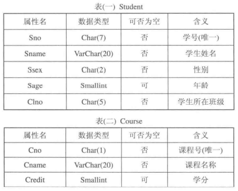

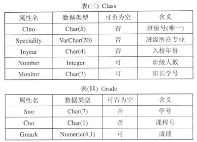

### 表内容

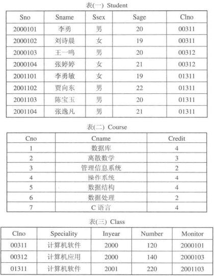

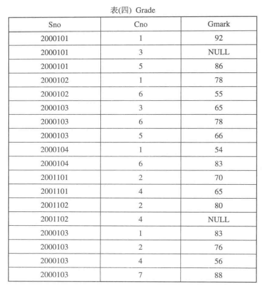

## 职工管理数据查询

### 内容

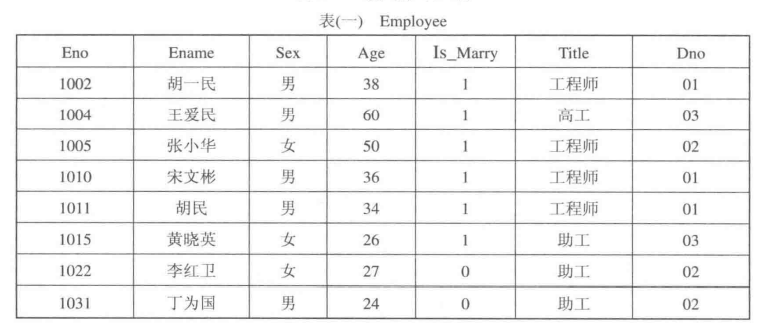

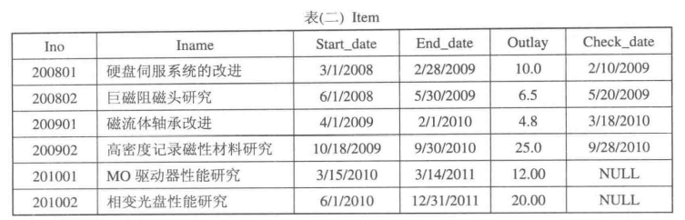

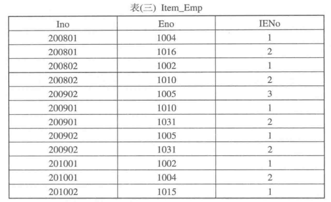

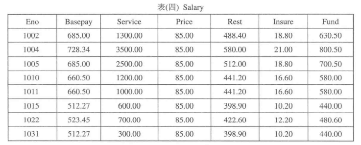

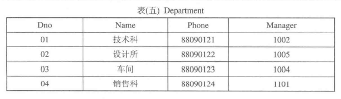

## 题目

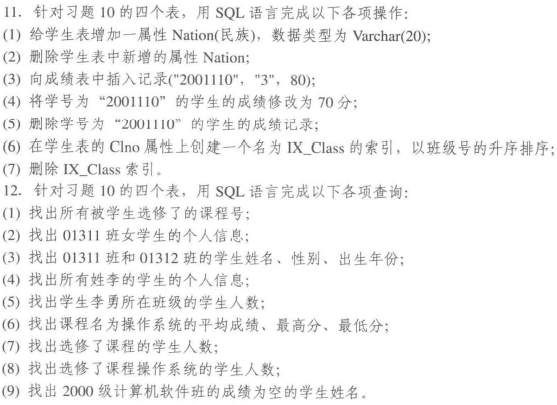

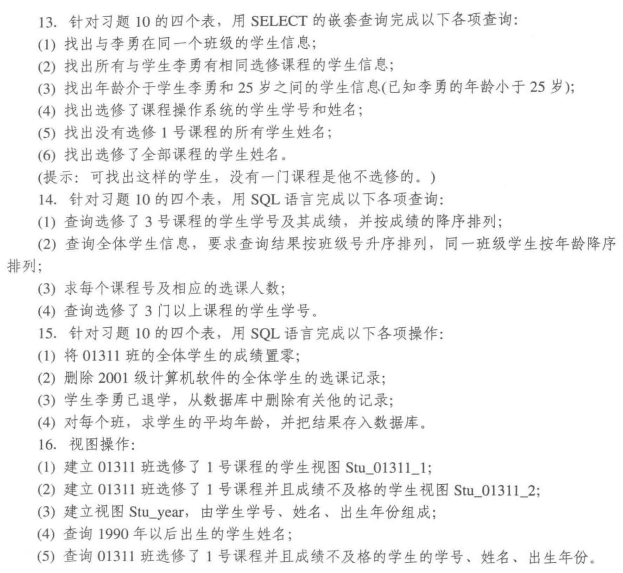

## 成绩管理表SQL

```mysql
-- 11.0
-- 创建学生表

DROP TABLE IF EXISTS student;

CREATE TABLE Student
(

    Sno   CHAR(7)     NOT NULL UNIQUE,

    Sname VARCHAR(20) NOT NULL,

    Ssex  CHAR(2)     NOT NULL,

    Sage  SMALLINT,

    Clno  CHAR(5)

);


-- 创建课程表

DROP TABLE IF EXISTS course;

CREATE TABLE Course
(

    Cno    CHAR(1)     NOT NULL,

    Cname  VARCHAR(20) NOT NULL,

    Credit SMALLINT

);


-- 创建班级表

DROP TABLE IF EXISTS class;

CREATE TABLE Class
(

    Clno       CHAR(5)     NOT NULL UNIQUE,

    Speciality VARCHAR(20) NOT NULL,

    Inyear     CHAR(4)     NOT NULL,

    Number     INTEGER,

    Monitor    CHAR(7)

);


-- 创建成绩表

DROP TABLE IF EXISTS grade;

CREATE TABLE Grade
(

    Sno   CHAR(7) NOT NULL,

    Cno   CHAR(1) NOT NULL,

    Gmark NUMERIC(4, 1)

);
```

```mysql
-- 插入Class数据

INSERT INTO class
VALUES ('00311', '计算机软件', '2000', 120, '2000101'),

       ('00312', '计算机应用', '2000', 140, '2000103'),

       ('01311', '计算机软件', '2001', 220, '2001103');

SELECT *
FROM Class;


-- 插入Course数据

INSERT INTO Course
VALUES ('1', '数据库', 4),

       ('2', '离散数学', 3),

       ('3', '管理信息系统', 2),

       ('4', '操作系统', 4),

       ('5', '数据结构', 4),

       ('6', '数据处理', 2),

       ('7', 'C语言', 4);

SELECT *
FROM Course;


-- 插入Grade数据

INSERT INTO Grade
VALUES ('2000101', '1', 92),

       ('2000101', '3', NULL),

       ('2000101', '5', 86),

       ('2000102', '1', 78),

       ('2000102', '6', 55),

       ('2000103', '3', 65),

       ('2000103', '6', 78),

       ('2000103', '5', 66),

       ('2000104', '1', 54),

       ('2000104', '6', 83),

       ('2001101', '2', 70),

       ('2001101', '4', 65),

       ('2001102', '2', 80),

       ('2001102', '4', NULL),

       ('2000103', '1', 83),

       ('2000103', '2', 76),

       ('2000103', '4', 56),

       ('2000103', '7', 88);

SELECT *
FROM Grade;


-- 插入student数据

INSERT INTO Student
VALUES ('2000101', '李勇', '男', 20, '00311'),

       ('2000102', '刘诗晨', '女', 19, '00311'),

       ('2000103', '王一鸣', '男', 20, '00312'),

       ('2000104', '张婷婷', '女', 21, '00312'),

       ('2001101', '李勇敏', '女', 19, '01311'),

       ('2001102', '贾向东', '男', 22, '01311'),

       ('2001103', '陈宝玉', '男', 20, '01311'),

       ('2001104', '张逸凡', '男', 21, '01311');
       
SELECT *
FROM Student;
```

## 职工管理数据表SQL

```mysql
-- 创 建数据库
CREATE DATABASE EMPMANAGER

-- 绑定当前数据库
USE EMPMANAGER

-- 创建职工Employee表：
CREATE TABLE Employee
 ( Eno VARCHAR(4) NOT NULL UNIQUE ,    /* Eno取唯一值 */
   Ename VARCHAR(8) NOT NULL ,
   Sex VARCHAR(2) NOT NULL DEFAULT ('男'),  /* Sex的默认值为“男”*/
   Age INT NULL ,
   Is_Marry VARCHAR(1) NULL ,
   Title VARCHAR(6) NULL ,
   Dno VARCHAR(2) NULL );

-- 创建Item_Emp表
CREATE TABLE Item_Emp
 ( Ino VARCHAR(6) NOT NULL,
   Eno VARCHAR(4) NOT NULL,
   IENo VARCHAR(1) );

-- 创建Item表
CREATE TABLE Item
 ( Ino VARCHAR(6) NOT NULL,
   Iname VARCHAR(40) NOT NULL,
   Start_date DATETIME,
   End_date DATETIME,
   Outlay DECIMAL(4,1),
   Check_date DATETIME );

-- 创建Salary表
CREATE TABLE Salary
 ( Eno VARCHAR(4) NOT NULL,
   Basepay DECIMAL(6,2),
   Service DECIMAL(6,2),
   Price DECIMAL(4,2),
   Rest DECIMAL(6,2),
   Insure DECIMAL(4,2),
   Fund DECIMAL(6,2) );

-- 创建Department表
CREATE TABLE Department
 ( Dno VARCHAR(2) NOT NULL,
   Dname VARCHAR(10) NOT NULL,
   Phone VARCHAR(8),
   Manager VARCHAR(4) );
```

```mysql
-- 向Employee表插入数据
INSERT INTO Employee
VALUES('1002','胡一民','男',38,'1','工程师','01');

INSERT INTO Employee
VALUES('1004','王爱民','男',60,'1','高工','03');

INSERT INTO Employee
VALUES('1005','张小华','女',50,'1','工程师','02');

INSERT INTO Employee
VALUES('1010','宋文彬','男',36,'1','工程师','01');

INSERT INTO Employee
VALUES('1011','胡民','男',34,'1','工程师','01');

INSERT INTO Employee
VALUES('1015','黄晓英','女',26,'1','助工','03');

INSERT INTO Employee
VALUES('1022','李红卫','女',27,'0','助工','02');

INSERT INTO Employee
VALUES('1031','丁为国','男',24,'0','助工','02');

-- 向Item表插入数据
INSERT INTO Item
VALUES('200801','硬盘伺服系统的改进','3/1/2008','2/28/2009','10.0','2/10/2009');

INSERT INTO Item
VALUES('200802','巨磁阻磁头研究','6/1/2008','5/30/2009','6.5','5/20/2009');

INSERT INTO Item
VALUES('200901','磁流体轴承改进','4/1/2009','2/1/2010','4.8','3/18/2010');

INSERT INTO Item
VALUES('200902','高密度记录磁性材料研究','10/18/2009','9/30/2010','25.0','9/28/2010');

INSERT INTO Item
VALUES('201001','MO驱动器性能研究','3/15/2010','3/14/2011','12.00',NULL);

INSERT INTO Item
VALUES('201002','相变光盘性能研究','6/1/2010','12/31/2011','20.00',NULL);

-- 向Item_Emp表添加数据
INSERT INTO Item_Emp
VALUES('200801','1004','1');

INSERT INTO Item_Emp
VALUES('200801','1015','2');

INSERT INTO Item_Emp
VALUES('200802','1002','1');

INSERT INTO Item_Emp
VALUES('200802','1010','2');

INSERT INTO Item_Emp
VALUES('200902','1005','3');

INSERT INTO Item_Emp
VALUES('200901','1010','1');

INSERT INTO Item_Emp
VALUES('200901','1031','2');

INSERT INTO Item_Emp
VALUES('200902','1005','1');

INSERT INTO Item_Emp
VALUES('200902','1031','2');

INSERT INTO Item_Emp
VALUES('201001','1002','1');

INSERT INTO Item_Emp
VALUES('201001','1004','2');
	
INSERT INTO Item_Emp
VALUES('201002','1015','1');

-- 向Salary表插入数据
INSERT INTO Salary
VALUES('1002', 685.00, 1300.00, 85.00, 488.40, 18.80, 630.50);

INSERT INTO Salary
VALUES('1004', 728.34, 3500.00, 85.00, 580.00, 21.00, 800.50);

INSERT INTO Salary
VALUES('1005', 685.00, 2500.00, 85.00, 512.00, 18.80, 700.50);

INSERT INTO Salary
VALUES('1010', 660.50, 1200.00, 85.00, 441.20, 16.60, 580.00);

INSERT INTO Salary
VALUES('1011', 660.50, 1000.00, 85.00, 441.20, 16.60, 580.00);

INSERT INTO Salary
VALUES('1015', 512.27, 600.00, 85.00, 398.90, 10.20, 440.00);

INSERT INTO Salary
VALUES('1022', 523.45, 700.00, 85.00, 422.60, 12.20, 480.60);

INSERT INTO Salary
VALUES('1031', 512.27, 300.00, 85.00, 398.90, 10.20, 440.00);

-- 向表插入数据
INSERT INTO Department
VALUES('02','设计所','88090122','1010');

INSERT INTO Department
VALUES('01','技术科','88090121','1002');

-- 对空值数据的插入
INSERT INTO Department
VALUES('04','销售科',NULL,'1101');

INSERT INTO Department(Dno,Dname,Manager)
VALUES('03','车间','1004');
```


## 第十一题

### 11.1

```mysql
ALTER TABLE Student
    ADD Nation VARCHAR(20);
```

### 11.2

```mysql
ALTER TABLE Student
    DROP Nation;
```

### 11.3

```mysql
INSERT INTO Grade
VALUES ('2001110', '3', 80);
```

### 11.4

```mysql
UPDATE Grade
SET Gmark = 70
WHERE Sno = '2001110';
```

### 11.5

```mysql
DELETE
FROM Grade
WHERE Sno = '2001110';
```

### 11.6

```mysql
CREATE INDEX IX_Class ON Student (Clno ASC);
```

### 11.7

```mysql
DROP INDEX IX_Class ON Student;
```

## 第十二题

### 12.1

```mysql
SELECT DISTINCT cno
FROM grade,
     student

WHERE grade.sno = student.sno;
```

### 12.2

```mysql
SELECT sno, sname, ssex, sage, clno
FROM student

WHERE clno = '01311'
  AND ssex = '女';
```

### 12.3

```mysql
SELECT sname, ssex, sno
FROM student

WHERE (clno = '01311' OR clno = '00312');
```

### 12.4

```mysql
SELECT *
FROM student
WHERE sname LIKE '李%';
```

### 12.5

```mysql
SELECT number AS '李勇所在班级人数'
FROM class

WHERE (SELECT clno FROM student WHERE sname = '李勇') = class.clno;
```

### 12.6

```mysql
SELECT AVG(Gmark) AS '平均分', MAX(Gmark) AS '最高分', MIN(Gmark) AS '最低分'

FROM grade,
     course
WHERE course.`Cno` = grade.`Cno`
  AND course.`Cname` = '操作系统';
```

### 12.7

```mysql
SELECT COUNT(sno) AS '选修课程的总人数'
FROM student

WHERE EXISTS(SELECT * FROM grade WHERE student.`Sno` = grade.`Sno`);
```

### 12.8

```mysql
SELECT COUNT(DISTINCT sno) AS '选修了课程操作系统的人数'
FROM grade,
     course

WHERE grade.`Cno` = course.`Cno`
  AND course.`Cname` = '操作系统';
```

### 12.9

```mysql
SELECT DISTINCT sname
FROM student
WHERE student.`sno` IN
      (SELECT DISTINCT sno
       FROM grade,
            class
       WHERE grade.`Gmark` IS NULL
         AND sno LIKE '2000%'
         AND class.`Speciality` = '计算机软件');
```

## 第十三题

### 13.1

```mysql
SELECT *
FROM student s1
WHERE (SELECT clno FROM student s2 WHERE s2.`Sname` = '李勇') = s1.`clno`
  AND s1.`Sname` != '李勇';
```

### 13.2

```mysql
SELECT DISTINCT s1.sno, s1.sname, s1.`Ssex`, s1.`Sage`, s1.`Clno`
FROM student s1,
     grade g1
WHERE s1.`Sno` = g1.`Sno`
  AND g1.`Cno` IN
      (
          SELECT cno
          FROM grade g2
          WHERE g2.`cno` IN (
              SELECT cno FROM student s2 WHERE s2.`Sno` = g2.`Sno` AND s2.`Sname` = '李勇'
          )
      )
  AND s1.`Sname` != '李勇';
```

### 13.3

```mysql
SELECT *
FROM student s1
WHERE s1.`Sage` >
      (SELECT Sage FROM student s2 WHERE s2.`Sname` = '李勇')
  AND s1.`Sage` < 25;
```

### 13.4

```mysql
SELECT Sno, Sname
FROM student s1
WHERE s1.`Sno` IN
      (SELECT g1.sno
       FROM grade g1,
            course c1
       WHERE g1.`Cno` = c1.`Cno`
         AND c1.`Cname` = '操作系统');
```

### 13.5

```mysql
SELECT sname
FROM student
WHERE sno NOT IN (SELECT sno FROM grade WHERE cno = '1');
```

### 13.6

```mysql
SELECT sname
FROM student
WHERE -- 第一个NOT EXISTS后面表示的是至少有一门没有选
      NOT EXISTS
          (SELECT *
           FROM course
           WHERE NOT EXISTS
               (SELECT *
                FROM grade
                WHERE grade.`Sno` = student.`Sno`
                  AND grade.`Cno` = course.`Cno`));
```

## 第十四题

### 14.1

```mysql
SELECT s1.sno, g1.Gmark
FROM student s1,
     grade g1
WHERE s1.sno = g1.sno
  AND g1.cno = '3'
ORDER BY gmark DESC;
```

### 14.2

```mysql
SELECT *
FROM student
ORDER BY clno, sage DESC;
```

### 14.3

```mysql
SELECT cno, COUNT(cno)
FROM grade
GROUP BY cno;
```

### 14.4

```mysql
SELECT sno, COUNT(sno)
FROM grade
GROUP BY sno
HAVING (COUNT(sno) > 3);
```

## 第十五题

### 15.1

```mysql
UPDATE grade
SET gmark = 0
WHERE sno IN (
    SELECT sno
    FROM student
    WHERE clno = '01311');
```

### 15.2

```mysql
DELETE
FROM grade
WHERE sno IN
      (SELECT sno
       FROM student
       WHERE clno = (
           SELECT clno
           FROM class
           WHERE Inyear = '2001'
             AND Speciality = '计算机软件'));
```

### 15.3

```mysql
UPDATE class
SET Monitor = NULL
WHERE clno = (SELECT clno FROM student WHERE Sname = '李勇');

DELETE
FROM grade
WHERE sno =
      (SELECT sno FROM student WHERE Sname = '李勇');
      
DELETE
FROM student
WHERE Sname = '李勇';
```

### 15.4

```mysql
CREATE TABLE information AS
SELECT clno, AVG(Sage)
FROM student
GROUP BY clno;
```

### 补充题

统计出每位学生所选课程的课程数目，要求输出 学号、姓名、选课门数，没有选课的学生也要输出选课门数为0。

```mysql
SELECT student.`Sno`, student.`Sname`, COUNT(grade.`Cno`)
FROM student
         LEFT JOIN grade ON student.`Sno` = grade.`Sno`
GROUP BY sno, sname;
```

统计每个班级每门课程的选课人数和课程平均分。输出班级号、课程号、选课人数、班级平均成绩。

```mysql
SELECT clno, cno, COUNT(cno), AVG(gmark)
FROM grade,
     student
WHERE student.`Sno` = grade.`Sno`
GROUP BY student.`Clno`, grade.`Cno`;
```

### 第十六题

### 16.1

```mysql
DROP VIEW IF EXISTS Stu_01311_1;

CREATE VIEW Stu_01311_1
AS
SELECT *
FROM student
WHERE student.`Clno` = '01311'
  AND student.`Sno` IN (
    SELECT grade.`Sno`
    FROM grade
    WHERE grade.`Cno` = '1'
);
```

### 16.2

```mysql
DROP VIEW IF EXISTS Stu_01311_2;
-- 没有check option
CREATE VIEW stu_01311_2
AS
SELECT *
FROM student
WHERE student.`Sno` IN (
    SELECT grade.`Sno`
    FROM grade
    WHERE grade.`Cno` = '1'
      AND grade.`Gmark` <= 60
);

DROP VIEW IF EXISTS Stu_01311_2;
-- 有check option
CREATE VIEW stu_01311_2
AS
SELECT *
FROM student
WHERE student.`Sno` IN (
    SELECT grade.`Sno`
    FROM grade
    WHERE grade.`Cno` = '1'
      AND grade.`Gmark` <= 60
)
WITH CHECK OPTION;
```

### 16.3

```mysql
DROP VIEW IF EXISTS Stu_year;
CREATE VIEW Stu_year
AS
SELECT s.sno, s.sname, c.inyear
FROM student s,
     class c
WHERE s.clno = c.clno;
```

### 16.4

```
SELECT sname
FROM student
WHERE (
          SELECT class.`Inyear`
          FROM class
          WHERE student.`Clno` = class.`Clno`
      ) > '1990';
```

### 16.5

```mysql
SELECT s.sno, s.sname, c.inyear
FROM student s,
     class c
WHERE c.`Clno` = '01311'
  AND (SELECT g.`Gmark` FROM grade g WHERE g.`Cno` = 1 AND s.sno = g.`Sno`) < 60;
```

### check options

```mysql
-- with check options
-- 如果有check options则此操作执行失败
INSERT
INTO stu_01311_2
VALUES ('2001105', '潘时煌', '男', '19', '01311');

-- with check option 不能作用于不可更新视图上
DROP VIEW IF EXI Class_grade;
CREATE VIEW Class_grade
AS
SELECT s.clno AS '班级', g.cno AS '课程号', AVG(g.gmark) AS '平均分数'
FROM student s,
     grade g
WHERE s.sno = g.sno
GROUP BY s.clno, g.`Cno`;
-- WITH CHECK OPTION;

-- 执行失败，复杂视图不可更新
UPDATE class_grade
SET 课程号=01314
WHERE 班级 = 01311
  AND 课程号 = 1;
  
-- grandmanager数据库
CREATE VIEW Employee_02
AS
SELECT *
FROM Employee
WHERE Dno = '02';

CREATE VIEW Employee_02_2
AS
SELECT *
FROM Employee
WHERE Dno = '02'
WITH CHECK OPTION;

INSERT INTO Employee_02
VALUES ('1036', '陈向东', '男', 25, 1, '工程师', '02');

-- 无法执行，有with check option
INSERT INTO Employee_02_2
VALUES ('1039', '陈华东', '男', 25, 1, '助工', '03');
```

查询每位同学所选修的课程的成绩，以及与该课程平均分的差值（正数表示高于平均分，负数表示低于平均分），输出：学号，姓名，所选课程名，与平均分的差值。（注意成绩为NULL值的处理）

```mysql
CREATE VIEW Average_grade
AS
SELECT cno AS '课程', AVG(Gmark) AS '平均成绩'
FROM grade
GROUP BY cno;

SELECT s.sname, g.cno, g.gmark, g.gmark - ag.平均成绩 AS '与平均值之差'
FROM grade g
         LEFT JOIN student s ON s.sno = g.sno
         LEFT JOIN Average_grade ag ON ag.课程 = g.cno;
```

检查出Student表中和Class表中数据不一致的地方。即同时输出Student中对每个班级的统计人数与Class表班级人数。输出：班级号，班级名称，统计人数，Class表中人数（Class表中没有学生的班级也要输出）。

```mysql
SELECT s.clno, c.speciality, COUNT(s.clno), c.number
FROM student s,
     class c
WHERE s.clno = c.clno
GROUP BY s.clno;
```

## 完整性约束

**Student**

| 属性名 | 数据类型    | 可否为空 | 含义           | 完整性约束       |
| ------ | ----------- | -------- | -------------- | ---------------- |
| Sno    | Char(7)     | 否       | 学号           | 主码             |
| Sname  | VarChar(20) | 否       | 学生姓名       |                  |
| Ssex   | Char(2)     | 否       | 性别           | 男或女，默认为男 |
| Sage   | Smallint    | 可       | 年龄           | 大于14，小于65   |
| Clno   | Char(5)     | 否       | 学生所在班级号 | 外部码，级联     |

**Course**

| 属性名 | 数据类型    | 可否为空 | 含义     | 完整性约束           |
| ------ | ----------- | -------- | -------- | -------------------- |
| Cno    | Char(1)     | 否       | 课程号   | 主码                 |
| Cname  | VarChar(20) | 否       | 课程名称 |                      |
| Credit | Smallint    | 可       | 学分     | 1、2、3、4、5、6之一 |

**Class**

| 属性名     | 数据类型    | 可否为空 | 含义         | 完整性约束     |
| ---------- | ----------- | -------- | ------------ | -------------- |
| Clno       | Char(5)     | 否       | 班级号       | 主码           |
| Speciality | VarChar(20) | 否       | 班级所在专业 |                |
| Inyear     | Char(4)     | 否       | 入校年份     |                |
| Number     | Integer     | 可       | 班级人数     | 大于1，小于100 |
| Monitor    | Char(7)     | 可       | 班长学号     | 外部码         |

**Grade**

| 属性名 | 数据类型     | 可否为空 | 含义   | 完整性约束           |
| ------ | ------------ | -------- | ------ | -------------------- |
| Sno    | Char(7)      | 否       | 学号   | 主属性，外部码，级联 |
| Cno    | Char(1)      | 否       | 课程号 | 主属性，外部码，级联 |
| Gmark  | Numeric(4,1) | 可       | 成绩   | 大于0，小于100`      |

```mysql
DROP TABLE IF EXISTS course;
DROP TABLE IF EXISTS class;
DROP TABLE IF EXISTS student;
DROP TABLE IF EXISTS grade;
CREATE TABLE course
(
    cno    CHAR(1) PRIMARY KEY,
    cname  VARCHAR(20) NOT NULL,
    credit SMALLINT CHECK (credit IN ('1', '2', '3', '4', '5', '6', '7'))
);

CREATE TABLE class
(
    clno       CHAR(5) PRIMARY KEY,
    speciality VARCHAR(20) NOT NULL,
    inyear     CHAR(4)     NOT NULL,
    number     INTEGER CHECK (number > 1 AND number < 300),
    monitor    CHAR(7)
);

-- 为class添加完整性
ALTER TABLE class
    ADD CONSTRAINT monitor FOREIGN KEY (monitor) REFERENCES student (sno);

-- CASCADE作用就是在父表记录更新时，子表更新或删除相应的记录
CREATE TABLE student
(
    sno   CHAR(7) PRIMARY KEY,
    sname VARCHAR(20) NOT NULL,
    ssex  CHAR(2)     NOT NULL DEFAULT '男' CHECK (ssex IN ('男', '女')),
    sage  SMALLINT CHECK (sage > 14 AND sage < 65),
    clno  CHAR(5)     NOT NULL REFERENCES class (clno) ON UPDATE CASCADE ON DELETE CASCADE
);

CREATE TABLE grade
(
    sno   CHAR(7) NOT NULL REFERENCES student (sno) ON UPDATE CASCADE ON DELETE CASCADE,
    cno   CHAR(1) NOT NULL REFERENCES course (cno) ON UPDATE CASCADE ON DELETE CASCADE,
    gmark DECIMAL(4, 1) CHECK (gmark > 0 AND gmark < 100),
    PRIMARY KEY (sno, cno)
);
```

第二种情况是：假设四张表已经创建好，接下来添加完整性约束。步骤也是先主码、Check约束和默认值，最后才是外部码的创建。

```mysql
/******Student*******/
/*主码：Sno*/
alter table Student
add constraint PX_Sno primary key (Sno);

/*性别：男或女，默认为男*/
alter table Student
    change column Ssex
        Ssex CHAR(2) default '男';
alter table Student
add constraint C_sex check(Ssex='男' or Ssex='女');
/*Sage:大于14，小于65*/
alter table Student
add constraint C_age check(Sage>14 and Sage<65);

/**********Class*********/
/*Clno:主码*/
alter table Class
add constraint PX_Clno primary key (Clno);

/*Number:大于1，小于100*/
alter table Class
add constraint C_Number check(Number>1 and Number<300);

/*Monitor：外码*/
alter table Class
add constraint FK_Monitor foreign key (Monitor) references Student (Sno);
/*注意下面这句语句应该放到Class班级增加了主码以后  */
/*Clno:外码，级联更新*/
ALTER TABLE Student ADD
        CONSTRAINT FK_Clno FOREIGN KEY
        (Clno) REFERENCES Class (Clno) ON UPDATE CASCADE ON DELETE CASCADE;

/*******Course******/
/*Cno：主码*/
alter table Course
add constraint PX_Cno primary key (Cno);

/*学分：在1、2、3、4、5、6内*/
alter table Course
add constraint C_Credit check(Credit>0 and Credit<7);

/*****Grade******/
/*Sno，Cno:主码，外部嘛，级联*/
alter table Grade
add constraint FK_Sno foreign key (Sno)
references Student (Sno)
on update cascade on delete cascade;
alter table Grade
add constraint FK_Cno foreign key (Cno)
references Course (Cno)
on update cascade on delete cascade;
alter table Grade
add constraint PK_Grade primary key (Sno,Cno);

/*Cmark:大于0，小于100*/
alter table Grade
add constraint G_mark check(Gmark>0 and Gmark<100);
```

## 触发器

默认情况下，不可能等到用户把这些语句全部输入完之后，再执行整段语句。 
因为mysql一遇到分号，它就要自动执行。 
即，在语句RETURN '';时，mysql解释器就要执行了。 
这种情况下，就需要事先把delimiter换成其它符号，如"//"或"$$"

对于成绩管理数据库，为成绩管理数据库种的Student表创建一触发器：当向表中插入或删除记录时，修改class表中相应的班级人数。

```mysql
DROP TRIGGER IF EXISTS tri_one;
DELIMITER $$
CREATE TRIGGER tri_one
    AFTER INSERT
    ON student
    FOR EACH ROW
BEGIN
    UPDATE class
    SET number = number + 1
    WHERE Clno = NEW.clno;
END$$
DELIMITER $$

INSERT INTO student
    VALUE ('2001110', '大儿子五', '男', 40, '01311');
```

为student表再建一更新触发器：当更新班长学号时，检查新输入的学号是否为同一班级的学生学号，若不是，给出适当的提示信息。

```mysql
DROP TRIGGER IF EXISTS tri_two;
DELIMITER $$
CREATE TRIGGER tri_two
    AFTER UPDATE
    ON class
    FOR EACH ROW
BEGIN
    IF NEW.monitor IN (SELECT sno FROM student WHERE clno = OLD.clno) THEN
        SIGNAL SQLSTATE 'HY000' SET MESSAGE_TEXT = '学号已存在';
    END IF;
END$$
DELIMITER $$

-- 验证触发器
UPDATE class
SET monitor='2000104'
WHERE clno = '00312';
```

## 权限

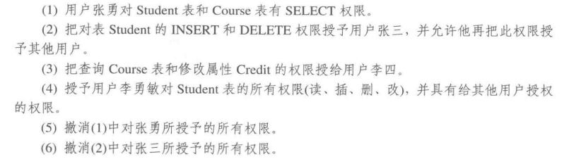


```mysql
CREATE USER 张三@localhost IDENTIFIED BY 'zhangsan';
CREATE USER 李四@localhost IDENTIFIED BY 'lisi';
CREATE USER 张勇@localhost IDENTIFIED BY 'zhangyong';
CREATE USER 李勇敏@localhost IDENTIFIED BY 'liyongming';
-- 14.1
GRANT SELECT ON student TO 李四@localhost;
-- 14.1
GRANT SELECT ON course TO 李四@localhost;
-- 14.2
GRANT INSERT, DELETE ON student TO 张勇@localhost WITH GRANT OPTION;
-- 14.3
GRANT SELECT, UPDATE (credit) ON course TO 张三@localhost;
-- 14.4
GRANT ALL PRIVILEGES ON student TO 李勇敏@localhost WITH GRANT OPTION;
-- 14.5
REVOKE SELECT ON student FROM 李四@localhost;
REVOKE SELECT ON course FROM 李四@localhost;
-- 14.6
REVOKE INSERT, DELETE ON student FROM 张勇@localhost;
```

## 关系代数作业

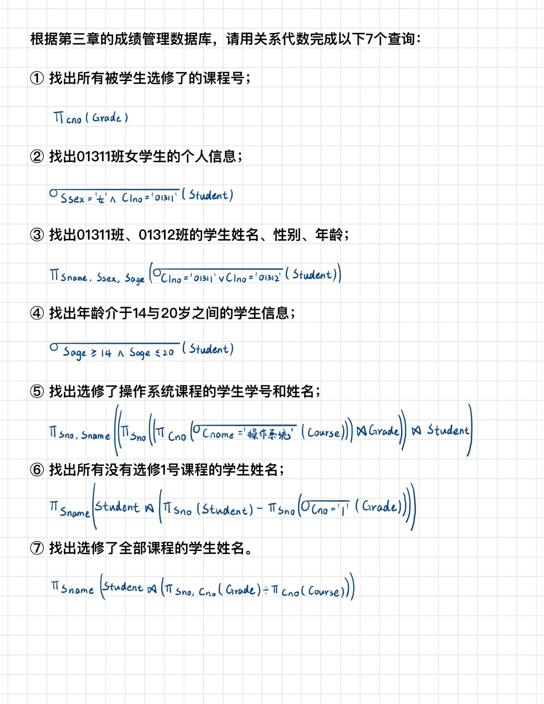

## ER模型

### 第一题

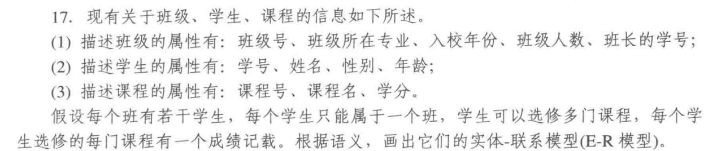

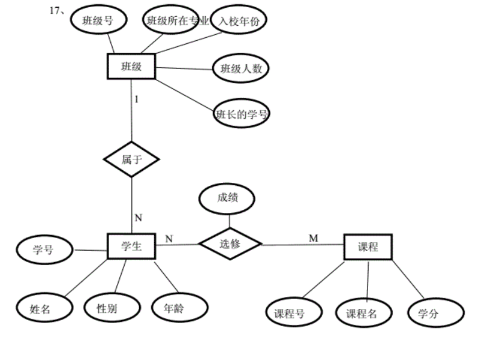

### 第二题

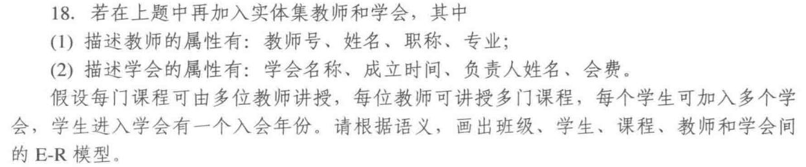

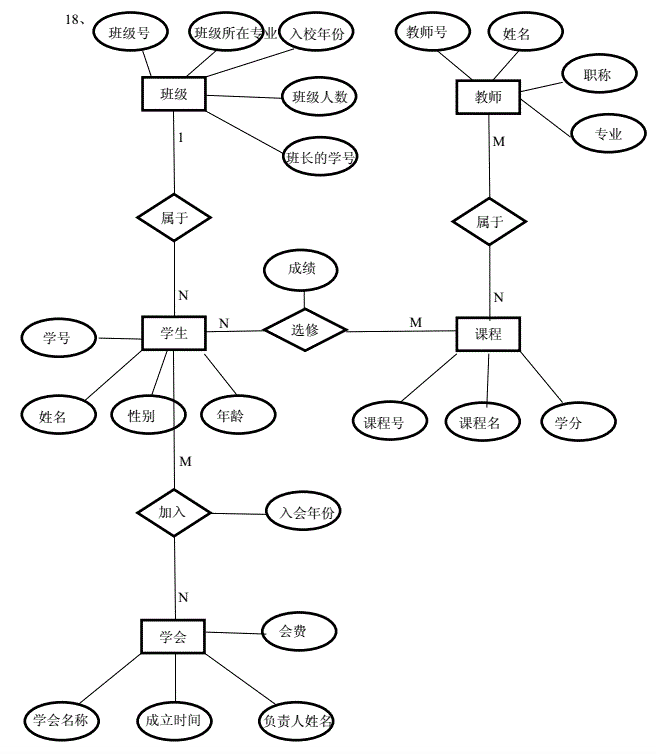

### 第三题

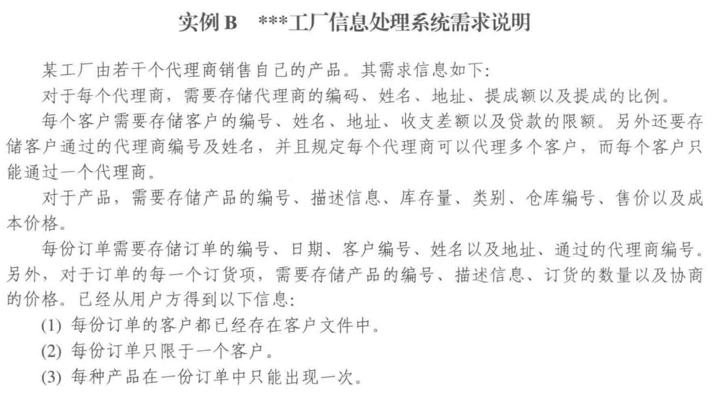


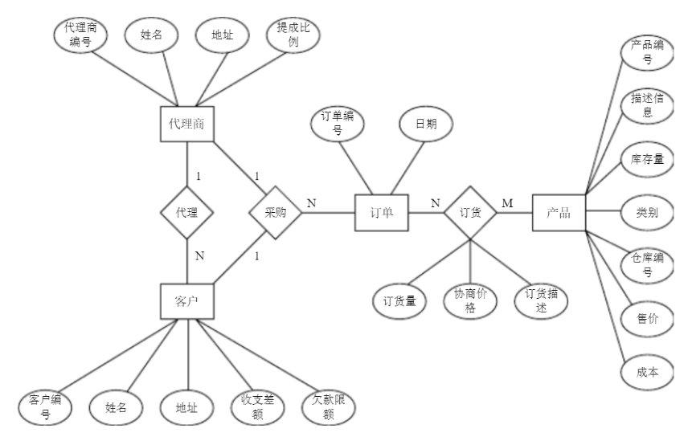

### 例题

在某高校图书借阅业务中,涉及如下实体集：

**读者、图书、书的类型**

读者凭借书证进行图书借阅，要求能查询正被读者借阅的图书以及已经归还的图书，图书一旦丢失还需要照价赔偿。

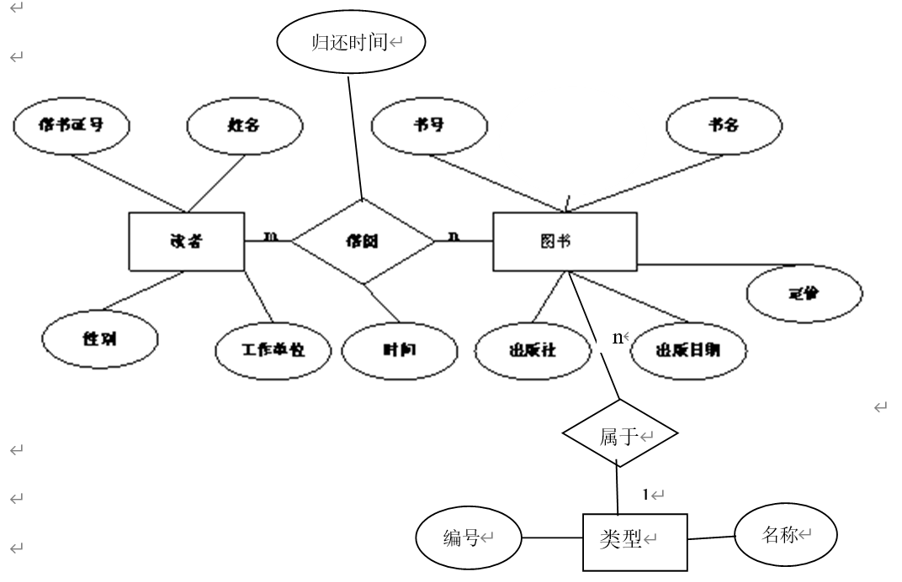

转换为关系模式：

读者（**借书证号**，姓名，性别，工作单位）

图书（**书号**，类型编号，书名，出版社，出版日期，定价，作者）

类型（**编号**，名称）

借阅（**借书证号，书号**，借书时间，还书时间）【或者：借阅（**流水号**，借书证号，书号，借书时间，还书时间）】
