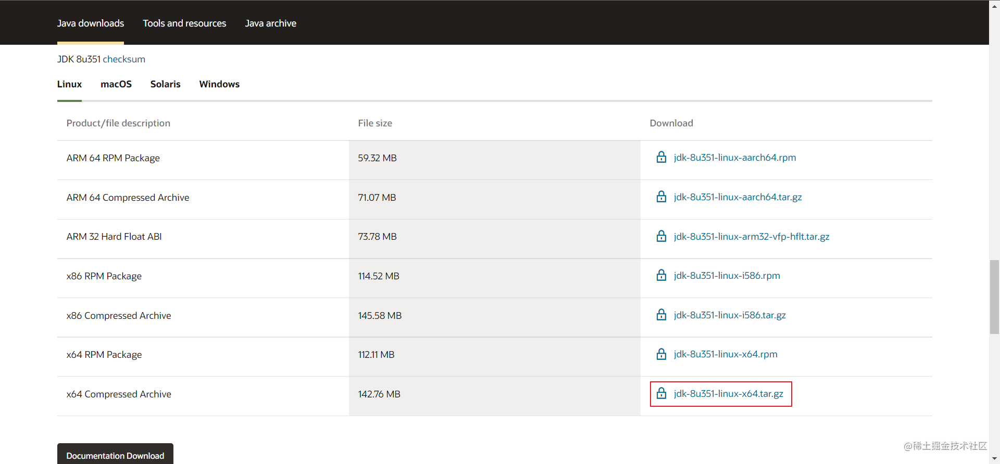

### 背景
JDK是很多服务器所必须的环境，所以有必要了解如何在服务器配置JDK环境。此文章的目的是为了在以后还需要配置JDK环境的时候可以直接参考而不需要再依靠与Google的战略合作伙伴关系（手动Doge）。

### 下载来源
[Java Downloads | Oracle](https://www.oracle.com/java/technologies/downloads/)

这里我们选择X64架构的.tar.gz包，可以利用SSH中的scp命令把文件下载到服务器。
### 安装过程
在服务器上新建java文件夹，存放jdk-8uXXX-linux-x64.tar.gz。
```bash
cd /usr/local/
mkdir java
```
安装Java8：
```bash
tar -zxvf <jdk压缩文件名> <解压目录>
```
### 环境变量配置
```bash
vim /etc/profile
```
以我为例，我的安装目录为`/usr/java/jdk1.8.0_191`，则环境变量的配置为：
```bash
 # 在上面增加下面内容
 JAVA_HOME=/usr/java/jdk1.8.0_191
 JRE_HOME=$JAVA_HOME/jre
 PATH=$PATH:$JAVA_HOME/bin:$JRE_HOME/bin
 CLASSPATH=.:$JAVA_HOME/lib/dt.jar:$JAVA_HOME/lib/tools.jar:$JRE_HOME/lib
 export JAVA_HOME JRE_HOME PATH CLASSPATH
```
### 配置成功
```bash
[root@VM-16-4-centos ~]# java -version
java version "1.8.0_351"
Java(TM) SE Runtime Environment (build 1.8.0_351-b10)
Java HotSpot(TM) 64-Bit Server VM (build 25.351-b10, mixed mode)
[root@VM-16-4-centos ~]# 

```

参考资料：

* [CentOS安装java8_沿辰的博客-CSDN博客_centos java8](https://blog.csdn.net/weixin_44672462/article/details/106496257)

