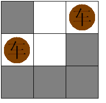

## Brave Game

### Problem Description

十年前读大学的时候，中国每年都要从国外引进一些电影大片，其中有一部电影就叫《勇敢者的游戏》（英文名称：Zathura），一直到现在，我依然对于电影中的部分电脑特技印象深刻。
今天，大家选择上机考试，就是一种勇敢（brave）的选择；这个短学期，我们讲的是博弈（game）专题；所以，大家现在玩的也是“勇敢者的游戏”，这也是我命名这个题目的原因。
当然，除了“勇敢”，我还希望看到“诚信”，无论考试成绩如何，希望看到的都是一个真实的结果，我也相信大家一定能做到的~

各位勇敢者要玩的第一个游戏是什么呢？很简单，它是这样定义的：
1、 本游戏是一个二人游戏;
2、 有一堆石子一共有n个；
3、 两人轮流进行;
4、 每走一步可以取走1…m个石子；
5、 最先取光石子的一方为胜；

如果游戏的双方使用的都是最优策略，请输出哪个人能赢。

input

输入数据首先包含一个正整数C(C<=100)，表示有C组测试数据。
每组测试数据占一行，包含两个整数n和m（1<=n,m<=1000），n和m的含义见题目描述。

output

如果先走的人能赢，请输出“first”，否则请输出“second”，每个实例的输出占一行。

### Sample Input

```
2
23 2
4 3
```

### Sample Output

```
first
second
```

### code

```c++
#include <iostream>
using namespace std;

// 典型的巴什博奕，要讨论n和m的关系，
// 显然，如果有小于m个，那先取者获胜；
// 如果有m+1个，后取者总能获胜。
// 所以某玩家只要当前形势是m+1个，或者m+1个的倍数，那么后者最后肯定能获胜
// 即，n = (m+1)*r + s，那么取s个就好了。
// 简单来说就是最后一手给自己留下<=m个。
int main()
{
    int n, a, b;
    cin >> n;
    while (n--)
    {
        cin >> a >> b;
        if (a % (b + 1) == 0)
            cout << "second\n";
        else
            cout << "first\n";
    }
    return 0;
}
```

## Good Luck in CET-4 Everybody!

### Problem Description

大学英语四级考试就要来临了，你是不是在紧张的复习？也许紧张得连短学期的ACM都没工夫练习了，反正我知道的Kiki和Cici都是如此。当然，作为在考场浸润了十几载的当代大学生，Kiki和Cici更懂得考前的放松，所谓“张弛有道”就是这个意思。这不，Kiki和Cici在每天晚上休息之前都要玩一会儿扑克牌以放松神经。
“升级”？“双扣”？“红五”？还是“斗地主”？
当然都不是！那多俗啊~
作为计算机学院的学生，Kiki和Cici打牌的时候可没忘记专业，她们打牌的规则是这样的：
1、 总共n张牌;
2、 双方轮流抓牌；
3、 每人每次抓牌的个数只能是2的幂次（即：1，2，4，8，16…）
4、 抓完牌，胜负结果也出来了：最后抓完牌的人为胜者；
假设Kiki和Cici都是足够聪明（其实不用假设，哪有不聪明的学生~），并且每次都是Kiki先抓牌，请问谁能赢呢？
当然，打牌无论谁赢都问题不大，重要的是马上到来的CET-4能有好的状态。

Good luck in CET-4 everybody!

Input

输入数据包含多个测试用例，每个测试用例占一行，包含一个整数n（1<=n<=1000）。

Output

如果Kiki能赢的话，请输出“Kiki”，否则请输出“Cici”，每个实例的输出占一行。

### Sample Input

```
1
3
```

### Sample Output

```
Kiki
Cici
```

### code

很明显这道题目的原型还是巴什博弈，很多时候如果想不出解法，就可以换个角度，考虑巴什博弈的（n+1）k (k=0，1，2，3……)奇异局是怎么来的， 我们可以把问题规模变小，找到那个临界点（n+1），那么这道题目也就迎刃而解了，而这道题目的奇异局就在3k（k=0，1，2，3……）处，我们假设只剩下3张牌，先手只能摸1或者2张，剩下的牌后手都可以抓完，而如果是3的倍数，那么剩下的一定是3k+1或3k+2张牌，又可以构造出3k的奇异局，所以处于3k（k=0，1，2，3……）的奇异局中，先手必败。

```c++
#include <iostream>
#include <cstdio>
using namespace std;
typedef long long ll;
int main()
{
    int n;
    while (cin >> n)
    {
        if (n % 3 == 0)
            cout << "Cici" << endl;
        else
            cout << "Kiki" << endl;
    }
    return 0;
}
```

## Fibonacci again and again

### Problem Description

任何一个大学生对菲波那契数列(Fibonacci numbers)应该都不会陌生，它是这样定义的：
F(1)=1;
F(2)=2;
F(n)=F(n-1)+F(n-2)(n>=3);
所以，1,2,3,5,8,13……就是菲波那契数列。
在HDOJ上有不少相关的题目，比如1005 Fibonacci again就是曾经的浙江省赛题。
今天，又一个关于Fibonacci的题目出现了，它是一个小游戏，定义如下：
1、 这是一个二人游戏;
2、 一共有3堆石子，数量分别是m, n, p个；
3、 两人轮流走;
4、 每走一步可以选择任意一堆石子，然后取走f个；
5、 f只能是菲波那契数列中的元素（即每次只能取1，2，3，5，8…等数量）；
6、 最先取光所有石子的人为胜者；

假设双方都使用最优策略，请判断先手的人会赢还是后手的人会赢。

Input

输入数据包含多个测试用例，每个测试用例占一行，包含3个整数m,n,p（1<=m,n,p<=1000）。 m=n=p=0则表示输入结束。

Output

如果先手的人能赢，请输出“Fibo”，否则请输出“Nacci”，每个实例的输出占一行。

### Sample Input

```
1 1 1
1 4 1
0 0 0
```

### Sample Output

```
Fibo
Nacci
```

 ### code

首先定义mex(minimal excludant)运算，这是施加于一个集合的运算。表示最小的不属于这个集合的非负整数。

必胜点和必败点的概念
必败点(P点) 前一个(previous player)选手将取胜的点称为必败点
必胜点(N点) 下一个(next player)选手将取胜的点称为必胜点
比如现在数字已经为18了，那么当前操作人只要给数字+3则必胜，我们就把在此位置称为必胜点。
必胜点和必败点的性质：

- 所有的终结点都是必败点
- 从任何必胜点操作，至少有一种方式进入必败点
- 无论如何操作， 从必败点都只能进入必胜点.

Sprague-Grundy(SG)定理
游戏和的SG函数等于各个游戏SG函数的Nim和。这样就可以将每一个子游戏分而治之，从而简化了问题。而Bouton定理就是Sprague-Grundy定理在Nim游戏中的直接应用，因为单堆的Nim游戏 SG函数满足 SG(x) = x。

比如mex{0,1,2,4}=3、mex{2,3,5}=0、mex{}=0。

对于一个给定的有向无环图，定义关于图的每一个顶点的**Sprague-Grundy**函数g例如以下：g(x)=mex{ g(y) | y是x的后继 },这里的g（x）即sg[x]

比如：取石子问题，有1堆n个的石子。每次仅仅能取{1,3,4}个石子，先取完石子者胜利，那么各个数的SG值为多少？

sg[0]=0，f[]={1,3,4}.

x=1时，能够取走1-f{1}个石子，剩余{0}个，mex{sg[0]}={0}，故sg[1]=1;

x=2时，能够取走2-f{1}个石子，剩余{1}个，mex{sg[1]}={1}，故sg[2]=0；

x=3时，能够取走3-f{1,3}个石子，剩余{2,0}个，mex{sg[2],sg[0]}={0,0}，故sg[3]=1;

x=4时，能够取走4-f{1,3,4}个石子。剩余{3,1,0}个，mex{sg[3],sg[1],sg[0]}={1,1,0},故sg[4]=2;

x=5时。能够取走5-f{1,3,4}个石子。剩余{4,2,1}个，mex{sg[4],sg[2],sg[1]}={2,0,1},故sg[5]=3；

以此类推.....

  x     0  1  2  3  4  5  6  7  8....

sg[x]    0  1  0  1  2  3  2  0  1...

**算法：**

由上述实例我们就可以得到SG函数值求解步骤，那么计算1~n的SG函数值步骤如下：

1、使用数组$f$将 可改变当前状态的方式记录下来。

2、然后我们使用另一个数组将当前状态x 的后继状态标记。

3、最后模拟mex运算，也就是我们在标记值中搜索未被标记值的最小值，将其赋值给SG(x)。

4、我们不断的重复2-3的步骤，就完成了 计算1~n 的函数值。

```c++
#include <stdio.h>
#include <string.h>
int fib[21];    // fib保存Fibonacci数列
int sg[1001];   // sg[]来保存SG值
bool mex[1001]; // mex{}
// 构建SG数组，函数各步骤意义详见上面模板
void get_sg(int n)
{
    int i, j;
    memset(sg, 0, sizeof(sg));
    // 因为SG[0]始终等于0，所以i从1开始
    for (i = 1; i <= n; i++)
    {
        // 每一次都要将上一状态的后继集合重置
        memset(mex, 0, sizeof(mex));
        // 对于属于g(x)后继的数置为1，这里的g(x)即sg[x]
        for (j = 1; fib[j] <= i; j++)
            // 对于状态i，的所有后继为i-f[j]，
            // 在这些后继的sg值中取最小的没有出现的，求出所有的SG值。
            // 标记当前点可以到达的状态
            mex[sg[i - fib[j]]] = 1;
		// 找到最小不属于该集合的数
        for (j = 0; j <= n; j++)
            if (!mex[j])
                break;
        sg[i] = j;
    }
}
int main()
{
    int i, m, n, p;
    // 构建Fibonacci数列
    fib[0] = 1, fib[1] = 1;
    for (i = 2; i < 21; ++i)
        fib[i] = fib[i - 1] + fib[i - 2];
    // 预处理获得sg数组
    get_sg(1000);
    while (scanf("%d%d%d", &m, &n, &p) && m + n + p)
    {
        // ^为异或运算符
        if ((sg[m] ^ sg[n] ^ sg[p]) == 0)
            printf("Nacci\n");
        else
            printf("Fibo\n");
    }
    return 0;
}
```

其实不难发现，Nim游戏就是一个很典型的用SG定理解决的问题，因为Nim游戏在一堆n个石子中可以取1-n个石子，所以单独这一堆石子的SG值为$mex(n−1,n−2,n − 3 , . . . ,n−n)=n$。根据SG定理，每一堆石子总数相互异或即为答案。

## S-Nim

### Problem Description

Arthur and his sister Caroll have been playing a game called Nim for some time now. Nim is played as follows:
 The starting position has a number of heaps, all containing some, not necessarily equal, number of beads.

 The players take turns chosing a heap and removing a positive number of beads from it.

 The first player not able to make a move, loses.
Arthur and Caroll really enjoyed playing this simple game until they recently learned an easy way to always be able to find the best move:
 Xor the number of beads in the heaps in the current position (i.e. if we have 2, 4 and 7 the xor-sum will be 1 as 2 xor 4 xor 7 = 1).

 If the xor-sum is 0, too bad, you will lose.

 Otherwise, move such that the xor-sum becomes 0. This is always possible.
It is quite easy to convince oneself that this works. Consider these facts:

 The player that takes the last bead wins.

 After the winning player's last move the xor-sum will be 0.

 The xor-sum will change after every move.
Which means that if you make sure that the xor-sum always is 0 when you have made your move, your opponent will never be able to win, and, thus, you will win.

Understandibly it is no fun to play a game when both players know how to play perfectly (ignorance is bliss). Fourtunately, Arthur and Caroll soon came up with a similar game, S-Nim, that seemed to solve this problem. Each player is now only allowed to remove a number of beads in some predefined set S, e.g. if we have S =(2, 5) each player is only allowed to remove 2 or 5 beads. Now it is not always possible to make the xor-sum 0 and, thus, the strategy above is useless. Or is it?

your job is to write a program that determines if a position of S-Nim is a losing or a winning position. A position is a winning position if there is at least one move to a losing position. A position is a losing position if there are no moves to a losing position. This means, as expected, that a position with no legal moves is a losing position.

Input

Input consists of a number of test cases. For each test case: The first line contains a number k (0 < k ≤ 100 describing the size of S, followed by k numbers si (0 < si ≤ 10000) describing S. The second line contains a number m (0 < m ≤ 100) describing the number of positions to evaluate. The next m lines each contain a number l (0 < l ≤ 100) describing the number of heaps and l numbers hi (0 ≤ hi ≤ 10000) describing the number of beads in the heaps. The last test case is followed by a 0 on a line of its own.

Output

For each position: If the described position is a winning position print a 'W'.If the described position is a losing position print an 'L'. Print a newline after each test case.

### Sample Input

```
2 2 5
3
2 5 12
3 2 4 7
4 2 3 7 12
5 1 2 3 4 5
3
2 5 12
3 2 4 7
4 2 3 7 12
0
```

### Sample Output

```
LWW
WWL
```

### code

```
#include <stdio.h>
#include <stdlib.h>
#include <string.h>
int n, s[10100], sg[11000];
int cmp(const void *a, const void *b)
{
    return *(int *)a - *(int *)b;
}
int dfs(int x)
{
    int i, e;
    int v[110]; //应该定义到里边
    if (sg[x] != -1)
        return sg[x];
    memset(v, 0, sizeof(v));
    for (i = 0; i < n; i++)
    {
        if (x >= s[i])
        {
            // 寻找当前可到达状态
            dfs(x - s[i]);
            v[sg[x - s[i]]] = 1;
        }
    }
    for (i = 0;; i++)
    {
        if (!v[i])
        {
            e = i;
            break;
        }
    }
    return sg[x] = e;
}
int main()
{
    int i, t;
    while (scanf("%d", &n) != EOF, n)
    {
        // 赋初值-1表示未被访问过
        memset(sg, -1, sizeof(sg));
        // 可执行操作集
        for (i = 0; i < n; i++)
            scanf("%d", &s[i]);
        // 对可执行操作集进行排序
        qsort(s, n, sizeof(s[0]), cmp);
        scanf("%d", &t);
        while (t--)
        {
            int c, sum = 0;
			// 几种可能的堆数及其个数
            scanf("%d", &c);
            while (c--)
            {
                int num;
                scanf("%d", &num);
                sum ^= dfs(num);
            }
            if (sum == 0)
                printf("L");
            else
                printf("W");
        }
        printf("\n");
    }
}
```

## 过山车

### Problem Description

RPG girls今天和大家一起去游乐场玩，终于可以坐上梦寐以求的过山车了。可是，过山车的每一排只有两个座位，而且还有条不成文的规矩，就是每个女生必须找个个男生做partner和她同坐。但是，每个女孩都有各自的想法，举个例子把，Rabbit只愿意和XHD或PQK做partner，Grass只愿意和linle或LL做partner，PrincessSnow愿意和水域浪子或伪酷儿做partner。考虑到经费问题，boss刘决定只让找到partner的人去坐过山车，其他的人，嘿嘿，就站在下面看着吧。聪明的Acmer，你可以帮忙算算最多有多少对组合可以坐上过山车吗？

Input

输入数据的第一行是三个整数K , M , N，分别表示可能的组合数目，女生的人数，男生的人数。0<K<=1000 1<=N 和M<=500.接下来的K行，每行有两个数，分别表示女生Ai愿意和男生Bj做partner。最后一个0结束输入。

Output

对于每组数据，输出一个整数，表示可以坐上过山车的最多组合数。

### Sample Input

```
6 3 3
1 1
1 2
1 3
2 1
2 3
3 1
0
```

### Sample Output

```
3
```

### code

匈牙利算法

```c++
#include<stdio.h>
#include<string.h>

#define MAX 1100
int map[MAX][MAX];
int vis[MAX];//记录这个女生是否已经有搭档
int girl[MAX];//记录女孩当前跟那个男生搭档
int k, n, m;

int find(int x)//判断当前男生可以和那个女生搭档如果有搭档返回1
{              //没有搭档返回0
    int i, j;
    for (i = 1; i <= m; i++) {
        if (map[x][i] && !vis[i])//如果两个人情投意合并且女生没有被标记
        {                     //（此处标记的意思是女生和第i个男生情投意合并且已经组成了搭档）
            vis[i] = 1;
            if (girl[i] == 0 || find(girl[i]))//如果女生没有搭档或者可以换个搭档
            {
                girl[i] = x;
                return 1;
            }
        }
    }
    return 0;
}

int main() {
    int j, i, t, x, y, sum;
    while (scanf("%d", &k), k) {
        scanf("%d%d", &n, &m);
        memset(map, 0, sizeof(map));
        memset(girl, 0, sizeof(girl));
        while (k--) {
            scanf("%d%d", &x, &y);
            map[x][y] = 1;
        }
        sum = 0;
        for (i = 1; i <= n; i++) {
            memset(vis, 0, sizeof(vis));
            if (find(i))
                sum++;
        }
        printf("%d\n", sum);
    }
    return 0;
}
```

## Machine Schedule

Problem Description

As we all know, machine scheduling is a very classical problem in computer science and has been studied for a very long history. Scheduling problems differ widely in the nature of the constraints that must be satisfied and the type of schedule desired. Here we consider a 2-machine scheduling problem.

There are two machines A and B. Machine A has n kinds of working modes, which is called mode_0, mode_1, …, mode_n-1, likewise machine B has m kinds of working modes, mode_0, mode_1, … , mode_m-1. At the beginning they are both work at mode_0.

For k jobs given, each of them can be processed in either one of the two machines in particular mode. For example, job 0 can either be processed in machine A at mode_3 or in machine B at mode_4, job 1 can either be processed in machine A at mode_2 or in machine B at mode_4, and so on. Thus, for job i, the constraint can be represent as a triple (i, x, y), which means it can be processed either in machine A at mode_x, or in machine B at mode_y.

Obviously, to accomplish all the jobs, we need to change the machine's working mode from time to time, but unfortunately, the machine's working mode can only be changed by restarting it manually. By changing the sequence of the jobs and assigning each job to a suitable machine, please write a program to minimize the times of restarting machines.

Input

The input file for this program consists of several configurations. The first line of one configuration contains three positive integers: n, m (n, m < 100) and k (k < 1000). The following k lines give the constrains of the k jobs, each line is a triple: i, x, y. The input will be terminated by a line containing a single zero.

Output

The output should be one integer per line, which means the minimal times of restarting machine.

### Sample Input

```
5 5 10
0 1 1
1 1 2
2 1 3
3 1 4
4 2 1
5 2 2
6 2 3
7 2 4
8 3 3
9 4 3
0
```

### Sample Output

```
3
```

### code

```c++
/*大致题意：
有两台机器A和B以及k个需要运行的任务。每台机器有n,m种不同的模式，而每个任务都恰好能在一台机器上运行。
机器A上有模式 mode_0, mode_1, …, mode_n-1,机器B上有模式： mode_0, mode_1, … , mode_m-1。
开始的工作模式都是mode_0。每个任务有对应的运行模式，(i, x, y)表示i任务对应的A B机器上的运行模式mode_x, mode_y。
每台机器上的任务可以按照任意顺序执行，但是每台机器每转换一次模式需要重启一次。
请合理为每个任务安排一台机器并合理安排顺序，使得机器重启次数尽量少。并求其值。
*/
/*
每个任务要有对应A B机器的模式中至少要有一种来运行，问题转化为，求二分图中最少的点（模式）使得每个边（模式对应的任务）至少和其中的一个点覆盖。
也就是二分图最小顶点覆盖问题
*/
#include<iostream>

using namespace std;
const int MAX = 102;
bool linkMap[MAX][MAX];
int crossPath[MAX];
bool used[MAX];
int n, m;

bool search(int u) {
    for (int i = 1; i < m; i++) {
        if (linkMap[u][i] && !used[i]) {
            used[i] = 1;//保证路径上无重复点出现   
            // 当前机器空闲或者可以换一个工作模式
            if (crossPath[i] == -1 || search(crossPath[i])) {
                crossPath[i] = u;//增广路径的取反
                return true;
            }
        }
    }
    return false;
}

int main() {
    int k;
    while (cin >> n, n) {
        cin >> m >> k;
        memset(linkMap, false, sizeof(linkMap));//构建二分图
        for (int i = 0; i < k; i++) {
            int v1, v2;
            cin >> v1 >> v1 >> v2;
            if (v1 && v2)
                linkMap[v1][v2] = true;//连接左右两边
        }
        int count = 0;
        memset(crossPath, -1, sizeof(crossPath));
        for (int i = 1; i < n; i++) {
            memset(used, 0, sizeof(used));
            if (search(i)) //查找增广路径
                count++;
        }
        cout << count << endl;
    }
    return 0;
}
```

## 棋盘游戏

### Problem Description

小希和Gardon在玩一个游戏：对一个N*M的棋盘，在格子里放尽量多的一些国际象棋里面的“车”，并且使得他们不能互相攻击，这当然很简单，但是Gardon限制了只有某些格子才可以放，小希还是很轻松的解决了这个问题（见下图）注意不能放车的地方不影响车的互相攻击。
所以现在Gardon想让小希来解决一个更难的问题，在保证尽量多的“车”的前提下，棋盘里有些格子是可以避开的，也就是说，不在这些格子上放车，也可以保证尽量多的“车”被放下。但是某些格子若不放子，就无法保证放尽量多的“车”，这样的格子被称做重要点。Gardon想让小希算出有多少个这样的重要点，你能解决这个问题么？


Input

输入包含多组数据， 第一行有三个数N、M、K(1<N,M<=100 1<K<=N*M)，表示了棋盘的高、宽，以及可以放“车”的格子数目。接下来的K行描述了所有格子的信息：每行两个数X和Y，表示了这个格子在棋盘中的位置。

Output

对输入的每组数据，按照如下格式输出： Board T have C important blanks for L chessmen.

### Sample Input

```
3 3 4
1 2
1 3
2 1
2 2
3 3 4
1 2
1 3
2 1
3 2
```

### Sample Output

```
Board 1 have 0 important blanks for 2 chessmen.
Board 2 have 3 important blanks for 3 chessmen.
```

### code

```c++
/*
HDOJ 1281 二分图的最大匹配
把棋盘的行x看成二分图左边的点，列y看成二分图右边的点，
那么就把可以放车的位置看成是一条边，
而二分图的最大匹配中x互不相同，y互不相同，
所以每个匹配都是不同行不同列，
所以最大匹配就是最多边数最多的匹配，最多的车的数量。
而要判断有多少个点是必须放的，只要在得出最大匹配后，
每次去掉一个匹配，再去运算看得出的结果是否与原来的最大匹配数相同，
若相同就不是必须的，若不相同就是必须的。 
*/
#include<iostream>
#include<stdio.h>

using namespace std;
#define N 105

int n, m, k;
int map[N][N], vis[N], match[N], a[N], b[N];

int dfs(int u) {
    int i;

    for (i = 1; i <= m; i++) {
        if (map[u][i] && !vis[i]) {
            vis[i] = 1;
            if (match[i] == -1 || dfs(match[i])) {
                match[i] = u;
                return 1;
            }
        }
    }
    return 0;
}

// 匈牙利算法
int hungary() {
    int ans = 0, i;

    memset(match, -1, sizeof(match));
    for (i = 1; i <= n; i++) {
        memset(vis, 0, sizeof(vis));
        if (dfs(i))
            ans++;
    }
    return ans;
}

int main() {
    int cas, i, ans, sum;
    cas = 1;

    while (scanf("%d%d%d", &n, &m, &k) != EOF) {
        memset(map, 0, sizeof(map));
        for (i = 0; i < k; i++) {
            scanf("%d%d", &a[i], &b[i]);
            map[a[i]][b[i]] = 1;
        }
        ans = hungary();
        sum = 0;
        for (i = 0; i < k; i++) {
            map[a[i]][b[i]] = 0;
            if (hungary() < ans)
                sum++;
            map[a[i]][b[i]] = 1;
        }
        printf("Board %d have %d important blanks for %d chessmen.\n", cas++, sum, ans);
    }
    return 0;
}
```

## Function

### Problem Description

为了测试小朋友们对记忆化深度优先搜索的掌握情况，老师特意出了一个函数来考考小朋友们。
已知w（a,b,c）依次有四种不同的返回值
1）当a,b,c 存在一个小于等于0时返回1
2）当a,b,c 存在一个大于20时返回w(20,20,20)
3）当a<b,且b<c 时返回w(a,b,c-1)+w(a,b-1,c-1)-w(a,b-1,c)
4）其余情况返回w(a-1, b, c) + w(a-1, b-1, c) + w(a-1, b, c-1) - w(a-1, b-1, c-1)
给出a,b,c,求出w(a,b,c)
0<a,b,c<30

PS:比如 w(30,-1,0)既满足条件1又满足条件2，这种时候我们就按最上面的条件来算，所以答案为1。

### Input

有多组测试数据
一行3个整数a,b,c

### Output

一行一个整数w

### Sample Input

```
3 2 2
```

### Sample Output

```
9
```

### code

观察题目，直接递归绝对会被卡（是多组输入）。最后递归的时候abc都只会小于等于20，所以直接拿个数组记录一下就可以了。

```c++
#include <iostream>
#include <cstdio>
#define ll long long
#define INF 0x3f3f3f3f
using namespace std;

ll d[21][21][21];
ll x, y, z;

void init()
{
    for (int i = 0; i <= 20; i++)
        for (int j = 0; j <= 20; j++)
            for (int k = 0; k <= 20; k++)
                d[i][j][k] = INF;
}

ll w(ll a, ll b, ll c)
{
    if (a <= 0 || b <= 0 || c <= 0)
        return 1;
    if (a > 20 || b > 20 || c > 20)
        return w(20, 20, 20);
    // 如果前面已经算出来该数则直接返回
    if (d[a][b][c] != INF)
        return d[a][b][c];
    if (a < b && b < c)
    {
        d[a][b][c] = w(a, b, c - 1) + w(a, b - 1, c - 1) - w(a, b - 1, c);
        return d[a][b][c];
    }
    d[a][b][c] = w(a - 1, b, c) + w(a - 1, b - 1, c) + w(a - 1, b, c - 1) - w(a - 1, b - 1, c - 1);
    return d[a][b][c];
}

int main()
{
    init();
    while (cin >> x >> y >> z)
    {
        if (x == -1 && y == -1 && z == -1)
            break;
        printf("w(%lld, %lld, %lld) = %lld\n", x, y, z, w(x, y, z));
        // printf("w(%I64d, %I64d, %I64d) = %I64d\n",x,y,z,w(x,y,z));
    }
    return 0;
}
```

## FatMouse

### Problem Description

小老鼠准备了M磅的猫粮，准备去和看守仓库的猫做交易，因为仓库里有小老鼠喜欢吃的五香豆。
仓库有N个房间；第i个房间有J[i] 磅的五香豆，需要用F[i]磅的猫粮去交换；
需要指出的是：**老鼠如果要和某个房间的猫做交易，就必须交换该房间所有的五香豆！**
现在，请帮忙计算一下，小老鼠通过交易最多能够得到多少磅的五香豆？

### Input

输入包含多组测试用例。
每组测试数据首先一行是2个非负整数M和N，接着的N行，每行分别包含2个非负整数J[i]和F[i]，数据的具体含义详见题目描述。
输入数据以两个-1结束。
题目保证所有的数据不超过1000.

### Output

请计算并输出小老鼠最多能够得到的五香豆数量，每组数据输出一行。

### Sample Input

```
5 3
7 2
4 3
5 2
20 3
25 18
24 15
15 10
-1 -1
```

### Sample Output

```
12
25
```

### code

```c++
#include <bits/stdc++.h>
using namespace std;
int main()
{
    int value[1005], cost[1005];
    // dp[j]背包容量为j的最优值。
    int dp[1005];
    int m, n;
    while (cin >> m >> n)
    {
        if (m == -1 && n == -1)
            return 0;
        memset(dp, 0, sizeof(dp));
        memset(value, 0, sizeof(value));
        memset(cost, 0, sizeof(cost));
        for (int i = 0; i < n; i++)
        {
            cin >> value[i] >> cost[i];
        }
        // 遍历cost[i]
        for (int i = 0; i <= n; i++)
        {
            // 倒叙遍历是为了保证物品i只被放入一次！。但如果一旦正序遍历了，那么物品0就会被重复加入多次！
            // 从后往前循环，每次取得状态不会和之前取得状态重合，这样每种物品就只取一次了。
            for (int j = m; j >= cost[i]; j--)
            {
                dp[j] = max(dp[j], dp[j - cost[i]] + value[i]);
            }
        cout << "***************" << endl;
        for (int j = 0; j <= m; j++)
        {
            cout << dp[j] << endl;
        }
        cout << "***************" << endl;
        }
        if (dp[m] < 0)
            cout << "-1" << endl;
        else
            cout << dp[m] << endl;
    }
}
```

## 猫和老鼠

### Problem Description

小老鼠准备了M磅的猫粮，准备去和看守仓库的猫做交易，因为仓库里有小老鼠喜欢吃的五香豆。
仓库有N个房间；
第i个房间有J[i] 磅的五香豆，需要用F[i]磅的猫粮去交换；
需要指出的是：
**1、老鼠如果要和某个房间的猫做交易，就必须交换该房间所有的五香豆！**
**2、还有个特殊的情况，小老鼠有强迫症——它一定要把自己所有的猫粮都用完才行！**
现在，请帮忙计算一下，在必须用完所有的猫粮的前提下，小老鼠通过交易最多能够得到多少磅的五香豆？

### Input

输入包含多组测试用例。
每组测试数据首先一行是2个非负整数M和N，接着的N行，每行分别包含2个非负整数J[i]和F[i]，数据的具体含义详见题目描述。
输入数据以两个-1结束。
题目保证所有的数据都不超过1000.

### Output

请计算并输出小老鼠最多能够得到的五香豆数量，如果不能满足小老鼠的强迫症，请输出-1；
每组数据输出一行。

### Sample Input

```
5 3
7 2
4 3
5 2
20 3
25 18
24 15
15 10
-1 -1
```

### Sample Output

```
11
-1
```

### code

```c++
#include <bits/stdc++.h>
using namespace std;
int main()
{
    int w[1005], v[1005];
    int f[1005];
    int m, n;
    while (cin >> m >> n)
    {
        if (m == -1 && n == -1)
            return 0;
        // 初始化为负无穷    
        memset(f, 0xaf, sizeof(f));
        memset(w, 0, sizeof(w));
        memset(v, 0, sizeof(v));
        f[0] = 0;
        for (int i = 0; i < n; i++)
        {
            cin >> w[i] >> v[i];
        }
        for (int i = 0; i <= n; i++)
        {
            for (int j = m; j >= v[i]; j--)
            {
                f[j] = max(f[j], f[j - v[i]] + w[i]);
            }
        }
        if (f[m] < 0)
            cout << "-1" << endl;
        else
            cout << f[m] << endl;
    }
}
```

## 超级密码

### Problem Description

DD小朋友今年三年级，最近，声称设计了一套“超级密码”系统！
说实话，这套所谓的“超级密码”一点也不难：
对于一个给定的字符串，你只要提取其中的数字，然后连在一起构成一个整数，再乘以DD小朋友的幸运数字513，就是解密后的结果了~
比如，字符串“ads2d4,122”，提取后的整数是24122，然后乘以513，就能得到解密后的结果：12374586。
注：题目保证解密后的结果在32位整数范围。

### Input

输入首先包括一个正整数N，表示有N组测试用例。
每组数据占一行，包含一个长度不超过30的字符串。

### Output

请根据题目要求输出解密后的结果，每组数据输出一行。

### Sample Input

```plain
2
ads2d4,122
0023asdf2AA90
```

### Sample Output

```plain
12374586
11947770
```

### code

```c++
#include <stdio.h>
#include <string.h>

int main(void)
{
    int n, len, base, ans;
    char str[35];
    scanf("%d", &n);
    while (n--)
    {
        base = 1;
        ans = 0;
        scanf("%s", str);
        len = strlen(str);
        for (int i = len - 1; i >= 0; i--)
        {
            if (str[i] >= '0' && str[i] <= '9')
            {
                ans += base * (str[i] - '0');
                base *= 10;
            }
        }
        ans *= 513;
        printf("%d\n", ans);
    }
    return 0;
}
```

