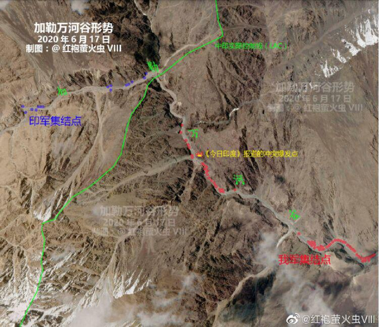
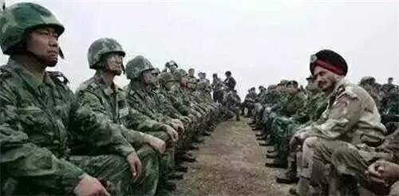

## Problem A

### Problem Description

一个十进制非负整数，它的每个数字加起来的和，称为它的数字位之和。

比如：15的位和等于1+5=6

### Input

输入包含多组数据；
每组数据包含一个非负整数，不超过10^9

### Output

对于每组数据，输出该数字的位和，每组输出占一行。

### Sample Input

```
1
11111
12345
99999
```

### Sample Output

```
1
5
15
45
```

### code

```c++
#include <bits/stdc++.h>
using namespace std;

int main()
{
    long data;
    int temp;
    while (cin >> data)
    {
        temp = data % 10;
        while (data / 10 != 0)
        {
            data /= 10;
            temp = temp + data % 10;
        }
        cout << temp << endl;
    }
}
```

## Problem three

### Problem Description

给定一个长度不超过30位的由'1'-'9'组成的正整数N，要求删除其中的K位数字，在不改变数字原来的相对顺序的前提下，请告诉我们，剩下的数字组成的最小的正整数是多少？

### Input

输入包括多组测试数据，每组数据占一行，包括两个正整数N和K，含义见题目描述。
题目保证每组数据中的K，一定小于本组N的长度。

### Output

请输出剩下的数字组成的最小的正整数。
每组数据输出一行。

### Sample Input

```
147283 2
3254 1
```

### Sample Output

```
1283
254
```

### code

```c++
#include <iostream>
using namespace std;

int main(void)
{
    char c;
    string a;
    int m;
    while (cin >> a >> m)
    {
        for (int i = 0; i < a.length() && m > 0; i++)
        {
            if (a[i] > a[i + 1])
            {
                for (int j = i + 1; j < a.length(); j++)
                {
                    a[j - 1] = a[j];
                }
                m--;
                i -= 2;
                if (i < 0)
                    i = -1;
                a = a.substr(0, a.length() - 1);
            }
        }
        int flag = 0;
        for (int j = 0; j < a.length() - m; j++)
        {
            if (!flag && a[j] == '0')
            {
                continue;
            }
            cout << a[j];
            flag = 1;
        }
        cout << endl;
    }

    return 0;
}
```

## Problem C

### Problem Description

2020年注定是不平凡的一年。

新冠疫情尚未平息，中印边界冲突又引起全球关注。特别是6月15日印方的突然挑衅更是造成地区局势高度紧张。

下面简单介绍下这段时间中印边界冲突的来龙去脉。

这两个月来，印度突然在加勒万河谷对我采取冒进策略。要知道，加勒万河是我国的传统领土，位于中印边界西段实际控制线中方一侧，中印两国过去对此毫无争议。加勒万河发源于我国的白石滩，流入北南走向的印度实控的什约克河，向西流入印度河，地势险峻，是典型高山峡谷地貌，附近气温常年低于零下，方圆几十平方公里除了哨站荒无人烟。尽管如此，由于印度一侧地理条件较好，印度近年来大力投资这个地区，有基建和兵力上的优势。

什约克河地区是印度长期经营的边境地带，印度一直在加勒万河谷以西以北的争议领土上围绕高地构建兵站和哨所，修建公路和桥梁，妄图利用我军在加勒万河谷地区基建不强的特点，蚕食我国领土。我国的实控线在加勒万河谷附近，印度试图在雨季前修建桥梁道路，前出据点，妄图造成既成事实。

4月份开始，印度开始在什约克河地区修建桥梁道路，并将实控线东移到我加勒万河和什约克河以东。5月6日凌晨，印度边防部队乘夜色在加勒万河谷地区越线进入中国领土、构筑工事并设障，阻拦中方边防部队正常巡逻，蓄意挑起事端，试图单方面改变边境管控现状。中方边防部队不得不采取必要措施，加强现场应对和边境地区管控，并且多次与印度军人在河谷地区对峙。

6月15日晚，在中印边境加勒万河谷地区，印军违背承诺，再次越过实控线非法活动，蓄意发动挑衅攻击，引发双方激烈肢体冲突，造成人员伤亡。出于降调考虑，我国防部在事后的声明中，只是简单地说印军“越境发动挑衅攻击”。因此我们也只能根据印度媒体和当地地图来还原这场21世纪最大伤亡的械斗。

综合印度媒体的描述，15日晚间到16日凌晨，印军集中精干人员，渡过加勒万河谷，爬山前往我加勒万边防公路工地，试图干扰中方晚间施工作业，并试图在河对岸造成既成事实。按照印度媒体的说法，印军此次挑衅的位置，已经深入我国实控线一公里以内。印军进入工地后强行阻拦，打伤我施工人员，并毁坏施工队财产，与我施工队发生冲突。



解放军附近的部队随后赶到，并与印度方面双方爆发激烈冲突，印军称解放军使用了带有铁丝网的木棍、指虎、工兵铲等攻击印媒所谓“手无寸铁”的印军，印军随后还呼叫了增援，根据印度记者晚些时候发布的报道，这些前来增援的印军包括了列城14军第三步兵师步兵，比哈尔12、16营，旁遮普3团，第3中型炮团、第8山地炮团，可以说是“精锐尽出”，这也解释了为啥解放军最终俘虏了大量团营级的校级军官。

这两批人和我军先后战斗了6个小时，随后这群印度人被从山上赶到山下河谷附近，印媒还称解放军从高往低丢“石头”攻击在河滩上的印军，不少印军士兵最终掉进加勒万河冰冷的水中。根据印度国防部发布的消息，印军最终有3人当场死亡，17人伤重不治死亡，78人受伤，其中22人伤势严重。此外，还有多名士兵和军官被解放军扣押，这些人包括1名中校3名少校，直到6月18日才被释放返回印度。

对于我军的伤亡情况，外交部明确的回应是“威胁我军生命安全”，而不是“造成双方伤亡”。外网只有印度的自媒体或者官方媒体援引所谓“军方消息人士”报道一个又一个夸张的数字，当然印度官方也没有权威人士为这些夸张的伤亡数字背书。这场冲突是一场“足够复古”的“着甲械斗”，和冷兵器战争时代绝大部分情况一样，败军的主要伤亡都发生在溃退被另外一方追击的情况下。考虑到我军最终控制了战场，俘虏了多名印军高级军官，印军这些所谓“战果”不值一晒了。由于本次事件印军单方面出击又单方面吃亏，因此本着降调谈判的原则，我军也没有公布进一步的受伤数字，避免刺激印度人。

随着中印两国的降调，以及莫迪当局6月18日的单方面宣布胜利，本次21世纪以来伤亡数字最大的斗殴以印度方面损失近百人结束了。这次事件到目前尚未结束，印军并未在加勒万河谷地区与我军脱离接触，并且列城方面的第3步兵师和14军炮兵部队也开始向加勒万河谷地区靠拢。印空军还往拉达克地区调派米格-29、刚刚到货的阿帕奇武装直升机等武器，向我西部战区施加军事压力。但双方领导人都明白，中印作为世界上的两个大国，开战是不可想象的。于是，两国商定举行第二次军长级会谈，本次回头中方派出的是西部战区少将刘一丁。

在第二次军长级会谈中，两国代表一致同意严格约束本国部队，尽量避免直接冲突，如果冲突实在不可避免，那就用文斗代替武斗。



如上图所示，文斗的规则是：首先，双方的士兵分别坐成一排，然后，两国分别选出一些士兵进行团体PK。具体的说，每位士兵都有一个CF（穿越火线）的Rating（分数），如果哪一方挑选出的士兵的Rating之和更大，哪一方就赢了！当然，挑选士兵是有限制条件的：尽管人数不限制，但是双方都不能挑选座位相邻的士兵！

作为学过《ACM程序设计》这门课的大学生，你一定知道其中的奥妙，为了祖国的胜利，现在，请发挥你的专业技能，帮刘一丁将军计算出中方挑选的士兵的Rating之和的最大值吧。

### Input

每组测试用例占2行，首先一行是一个正整数N（N<=100000），表示中方士兵的数量。

接下来一行是N个正整数，依次表示N位士兵的CF的Rating。其中，Rating的取值范围是小于等于5000。

### Output

每组数据输出一行，即中方在约定的规则下派出士兵的Rating之和的最大值。

### Sample Input

```
5
1500 1921 2134 1462 2403
```

### Sample Output

```
6037
```

### code

```c++
#include <bits/stdc++.h>
using namespace std;

 typedef long long ll;

ll n;
int a[100005];
ll dp[100005];

int main()
{

	while (cin >> n)
	{
		memset(a, 0, sizeof(a));
		memset(dp, 0, sizeof(dp));

		for (int i = 1; i <= n; i++)
			cin >> a[i];
		
		dp[1] = a[1];
		for (int i = 2; i <= n; i++)
		{
			dp[i] = max(dp[i-2] + a[i], dp[i-1]);
		}
		cout << dp[n] << endl;
	}
}

```

## Problem D

### Problem Description

给定一个输入数列（由n个各不相同的正整数组成），请首先构造出对应的二叉搜索树，然后输出这棵二叉搜索树的层次遍历序列。

如果你对二叉搜索树不太熟悉，请看下面的介绍：

二叉搜索树的形状与我们插入的值的顺序密切相关。准确地说：

1.如果将值k插入一棵空树，那么该树成为只有一个节点k的树；

2.如果将值k插入非空树，那么，如果k小于根，则将其插入左子树；否则将k插入右子树；

3.二叉搜索树的左右子树满足同样的规则。

### Input

输入包含多组测试用例。

每组测试用例的第一行是一个整数n（n <= 100），表示节点数。
第二行是n个整数的数列，k1到kn，为了使问题简化，我们用1到n这n个数表示k1到kn序列。

### Output

每组数据输出一行，即二叉搜索树的层次遍历序列。
为了使问题简化，每个整数后面都加一个空格。

### Sample Input

```
4
1 3 4 2
```

### Sample Output

```
1 3 2 4 
```

### code

```c++
#include <iostream>
#include <stdio.h>
#include <algorithm>
#include<cstring>
using namespace std;
typedef long long ll;

ll a[10001];

int main()
{
	int g;
	cin >> g;
	while (g--)
	{
		memset(a, 0, sizeof(a));
		int n; cin >> n;
		ll sum = 0;
		for (int i = 0; i < n; i++) {
			cin >> a[i];
			sum += a[i];
		}
		
		if (sum % 6 != 0) cout << "ZTY Win!" << endl;
		else cout << "XQ Win!" << endl;
	}
}
```

## Problem five

### Problem Description

给定一个输入数列（由n个各不相同的正整数组成），请首先构造出对应的二叉搜索树，然后输出这棵二叉搜索树的层次遍历序列。

如果你对二叉搜索树不太熟悉，请看下面的介绍：

二叉搜索树的形状与我们插入的值的顺序密切相关。准确地说：

1.如果将值k插入一棵空树，那么该树成为只有一个节点k的树；

2.如果将值k插入非空树，那么，如果k小于根，则将其插入左子树；否则将k插入右子树；

3.二叉搜索树的左右子树满足同样的规则。

### Input

输入包含多组测试用例。

每组测试用例的第一行是一个整数n（n <= 100），表示节点数。
第二行是n个整数的数列，k1到kn，为了使问题简化，我们用1到n这n个数表示k1到kn序列。

### Output

每组数据输出一行，即二叉搜索树的层次遍历序列。
为了使问题简化，每个整数后面都加一个空格。

### Sample Input

```
4
1 3 4 2
```

### Sample Output

```
1 3 2 4 
```

### code

```c++
#include<bits/stdc++.h>
using namespace std;


typedef struct BiTNode {
	int data;
	struct BiTNode* lchild, * rchild;
}BITNode;


BITNode* createNode(int a) {
	BITNode* tem = (BITNode*)malloc(sizeof(BITNode));
	tem->data = a;
	tem->lchild = tem->rchild = NULL;
	return tem;
}

void Inserts(BITNode* root, BITNode* a) {
	if (a->data > root->data) {
		if (root->rchild) Inserts(root->rchild, a);
		else root->rchild = a;
	}
	else {
		if (root->lchild) Inserts(root->lchild, a);
		else root->lchild = a;
	}
}

void bfs(queue<BITNode*> q) {
	queue<BITNode*> p;
	while (!q.empty()) {
		BITNode* temp = q.front();
		q.pop();
		cout << temp->data << " ";
		if(temp->lchild)
			p.push(temp->lchild);
		if(temp->rchild)
			p.push(temp->rchild);
	}
    if(!p.empty())
        bfs(p);
}

int main(void) {
	int n;
	while (cin >> n) {
		BITNode* root;
		for (int i = 0; i < n; i++) {
			if (i == 0) {
				int num;
				cin >> num;
				root = createNode(num);
			}
			else {
				int num;
				cin >> num;
				BITNode* node = createNode(num);
				Inserts(root, node);
			}
		}
		queue<BITNode*> q;
		q.push(root);
		bfs(q);
		cout << endl;
	}
	return 0;
}

```

## Problem six

### Problem Description

我们知道，ACM/ICPC是一项特别考验参赛学生智力和毅力的竞赛活动，如果说参加其它竞赛需要以天为单位进行准备的话，那么ACM竞赛则必须以年为单位做准备，任何“三天打渔两天晒网”的态度都很难在该项比赛中有突出表现。
Tom也是一个ACM爱好者，从2000年1月1日就开始了ACM/ICPC的练习，一直坚持到现在。可惜的是，他一直采用的是这种“三天打渔两天晒网”的训练方式，也就是说，每做三天的训练，一定会休息两天，如此反复，直到今天。
现在的问题是：给你一个日期，你能计算出这一天Tom是在训练还是休息吗？

### Input

输入数据首先包含一个整数T(T<=20)，表示有T组测试数据，然后是T行，每行包含一个格式如“YYYY/MM/DD”的日期，题目保证所有日期在2000年1月1日和今天之间.

### Output

对于每个测试用例，如果Tom在这一天是训练，则请输出“Fishing”，否则，请输出“Resting”。

### Sample Input

```
2
2000/01/03
2000/01/04
```

### Sample Output

```
Fishing
Resting
```

### code

```c++
#include <iostream>
#include <string>
using namespace std;
int main()
{
    int h[13] = {0, 31, 28, 31, 30, 31, 30, 31, 31, 30, 31, 30, 31};    
    int uh[13] = {0, 31, 29, 31, 30, 31, 30, 31, 31, 30, 31, 30, 31};
    int n;
    cin >> n;
    // getchar();
    for (int i = 0; i < n; i++)
    {
        int a, b, c;
        scanf("%d/%d/%d", &a, &b, &c); //<1>
        int q = 0;
        // 闰年
        if ((a % 4 == 0 && a % 100 != 0) || a % 400 == 0)
        {
            for (int k = 1; k < b; k++)
            {
                q = q + uh[k];
            }
        }
        // 不是闰年
        else
        {
            for (int k = 1; k < b; k++)
            {
                q = q + h[k];
            }
        }

        q = q + c;
        // cout << q << endl;
        for (int j = 2000; j < a; j++)
        {
            if ((j % 4 == 0 && j % 100 != 0) || j % 400 == 0)
            {
                q = q + 366;
                // cout << 366 << endl;
            }
            else
            {
                q = q + 365;
                // cout << 365 << endl;
            }
        }
        // cout << "date:" << q << endl;
        if (q % 5 == 1 || q % 5 == 2 || q % 5 == 3)
            cout << "Fishing" << endl;
        else
            cout << "Resting" << endl;
    }
}
```

