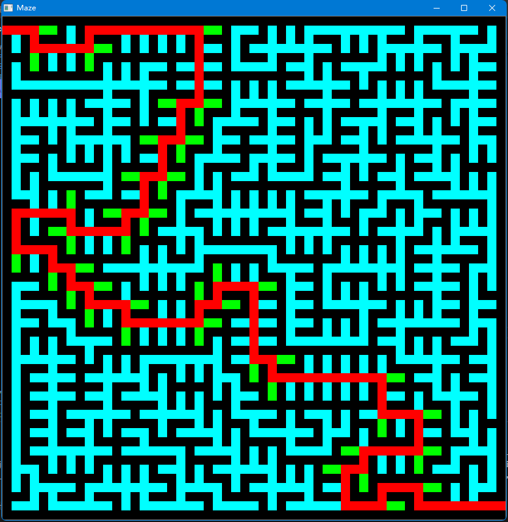

# VSCode文件配置

### c_cpp_properties.json

```
{
    "configurations": [
        {
            "name": "Win32",
            "compilerPath": "D:/mingw64/bin/g++.exe", //这里改成自己的路径
            "includePath": [
                "${workspaceFolder}/**",
                // 这里添加自己的OpenCV路径
                "D:/mingw64/include",
                "D:/OpenCV/opencv_build_cmake/install/include",
                "D:/OpenCV/opencv_build_cmake/install/include/opencv2"
    
            ],
            "defines": [
                "_DEBUG",
                "UNICODE",
                "_UNICODE"
            ],
            "cStandard": "c11",
            "cppStandard": "c++17",
            "intelliSenseMode": "clang-x64"
        }
    ],
    "version": 4
}
```

### launch.json

```
// https://code.visualstudio.com/docs/cpp/launch-json-reference
{
    "version": "0.2.0",
    "configurations": [
        
    {
        "name": "(gdb) Launch", // 配置名称，将会在启动配置的下拉菜单中显示
        "type": "cppdbg", // 配置类型，cppdbg对应cpptools提供的调试功能；可以认为此处只能是cppdbg
        "request": "launch", // 请求配置类型，可以为launch（启动）或attach（附加）
        "program": "${fileDirname}/${fileBasenameNoExtension}.exe", // 将要进行调试的程序的路径
        "args": [], // 程序调试时传递给程序的命令行参数，一般设为空即可
        "stopAtEntry": false, // 设为true时程序将暂停在程序入口处，相当于在main上打断点
        "cwd": "${workspaceFolder}", // 调试程序时的工作目录，此为工作区文件夹；改成${fileDirname}可变为文件所在目录
        "environment": [], // 环境变量
        "externalConsole": true, // 使用单独的cmd窗口，与其它IDE一致；为false时使用内置终端
        "internalConsoleOptions": "neverOpen", // 如果不设为neverOpen，调试时会跳到“调试控制台”选项卡，你应该不需要对gdb手动输命令吧？
        "MIMode": "gdb", // 指定连接的调试器，可以为gdb或lldb。
        "miDebuggerPath": "D:/mingw64/bin/gdb.exe", // 调试器路径，Windows下后缀不能省略，Linux下则不要
        "setupCommands": [
            { // 模板自带，好像可以更好地显示STL容器的内容，具体作用自行Google
                "description": "Enable pretty-printing for gdb",
                "text": "-enable-pretty-printing",
                "ignoreFailures": false
            }
        ],
        "preLaunchTask": "Compile" // 调试会话开始前执行的任务，一般为编译程序。与tasks.json的label相对应
    }]
}
```

### tasks.json

```
// https://code.visualstudio.com/docs/editor/tasks
{
    "version": "2.0.0",
    "tasks": [
        {
        "label": "Compile", // 任务名称，与launch.json的preLaunchTask相对应
        "command": "D:/mingw64/bin/g++.exe",   // 要使用的编译器，C++用g++
        "args": [
            "${file}",//当前文件名
            "-o",    // 指定输出文件名，不加该参数则默认输出a.exe，Linux下默认a.out
            "${fileDirname}/${fileBasenameNoExtension}.exe",
            "-g",    // 生成和调试有关的信息
            "-m64", // 不知为何有时会生成16位应用而无法运行，加上此条可强制生成64位的
            "-Wall", // 开启额外警告
            "-static-libgcc",     // 静态链接libgcc，一般都会加上
            "-finput-charset=UTF-8",
            "-fexec-charset=GBK", // 生成的程序使用GBK编码，不加这条会导致Win下输出中文乱码；繁体系统改成BIG5
            "-std=c++17", // 要用的语言标准，根据自己的需要修改。c++可用c++14
            // 扩展参数
            // -I 头文件目录
            // -L 库文件目录
            // -l 库文件
            // 这里换成自己的文件路径
            "-I", "D:/OpenCV/opencv_build_cmake/install/include",
            "-I", "D:/OpenCV/opencv_build_cmake/install/include/opencv2",
            "-L", "D:/OpenCV/opencv_build_cmake/install/x64/mingw/lib",
            "-l", "libopencv_calib3d420",
            "-l", "libopencv_core420",
            "-l", "libopencv_dnn420",
            "-l", "libopencv_features2d420",
            "-l", "libopencv_flann420",
            "-l", "libopencv_highgui420",
            "-l", "libopencv_imgcodecs420",
            "-l", "libopencv_imgproc420",
            "-l", "libopencv_ml420",
            "-l", "libopencv_objdetect420",
            "-l", "libopencv_photo420",
            "-l", "libopencv_stitching420",
            "-l", "libopencv_video420",
            "-l", "libopencv_videoio420",
            "-l", "opencv_core420",
            "-l", "opencv_imgproc420",
            "-l", "opencv_imgcodecs420",
            "-l", "opencv_video420",
            "-l", "opencv_ml420",
            "-l", "opencv_highgui420",
            "-l", "opencv_objdetect420",
            "-l", "opencv_flann420",
            "-l", "opencv_imgcodecs420",
            "-l", "opencv_photo420",
            "-l", "opencv_videoio420",
            // 中文编码
            // "-finput-charset=GBK"
            ], // 编译的命令，其实相当于VSC帮你在终端中输了这些东西
        "type": "process", // process是把预定义变量和转义解析后直接全部传给command；shell相当于先打开shell再输入命令，所以args还会经过shell再解析一遍
        "group": {
            "kind": "build",
            "isDefault": true // 不为true时ctrl shift B就要手动选择了
        },
        "presentation": {
            "echo": true,
            "reveal": "always", // 执行任务时是否跳转到终端面板，可以为always，silent，never。具体参见VSC的文档
            "focus": false,     // 设为true后可以使执行task时焦点聚集在终端，但对编译C/C++来说，设为true没有意义
            "panel": "shared"   // 不同的文件的编译信息共享一个终端面板
        },
        "problemMatcher":"$gcc" // 捕捉编译时终端里的报错信息到问题面板中，修改代码后需要重新编译才会再次触发
        // 本来有Lint，再开problemMatcher就有双重报错，但MinGW的Lint效果实在太差了；用Clang可以注释掉
    }],
}
```

# 迷宫算法

```
// Peter Pan
// 21-10-25
#include<stdio.h>
#include<stdlib.h>
#include<unistd.h>
#include<time.h>
#include<iostream>
#include<algorithm>
#include<sys/timeb.h>
#include<Windows.h>
#include<opencv.hpp>
#include<opencv2/opencv.hpp>
#include <opencv2/highgui/highgui.hpp>
#define IN_MAXSIZE 100
#define INCREASE 10
#define SElemType Single_Point 
#define FALSE 0
#define TURE 1
#define a 0     //a表示路 
#define b 1	    //b表示墙 
using std::random_shuffle;
using namespace cv;
typedef struct 
{
	int x;    //行坐标 
	int y;	  //列坐标 
    int direction = 1;     //方向
}SElemType;

typedef struct
{
	SElemType *base;
	SElemType *top;
	int stacksize;
}SqStack;

const int n = 181;
const int k = n / 2;
const int N = k * k;

// 迷宫的大小 n * n
int Init_Stack(SqStack *);     
int Push(SqStack *,SElemType);         
int Pop(SqStack *,SElemType *);  
int* randperm(int limit);
void DFSmaze(SElemType [],int [][n],int [][k]); 
void PrintMaze(int maze[][n]);
void draw(int x,int y,int flag);
bool MazePath(int maze[][n], SElemType start, SElemType end);
int Pass(SElemType pos);
bool StackEmpty(SqStack S);
void NextPos(SElemType* curpos, int direction);
void MakePrint(SElemType e, int print);
void PrintPath(SqStack *);

const int limit = 4; 
const int node_size = 4;
const int sleep_time = 5;
const int wait_key = 1;
int* choices;
int maze[n][n];
struct timeb seed;
// 长度 宽度 CV通道数
Mat mat(node_size * n, node_size * n, CV_8UC3);

int main()
{
	ftime(&seed);
	srand(seed.time * 1000 + seed.millitm);
	choices = (int*)malloc(limit * sizeof(int));
	choices = randperm(limit);

	int i,j;
	
	int smaze[k][k];
	// 结构体数组 
	SElemType r[(k)*(k)];   
	
	// 把所有点都先初始化为墙。
	for(i=0;i<n;i++)
		for(j=0;j<n;j++)
		{
			maze[i][j] = b;
		}

	// 先使得横坐标和纵坐标都为偶数的变为路。
	for(i=1;i<n-1;i=i+2)
		for(j=1;j<n-1;j=j+2)
		{
			maze[i][j] = a;
		}

	// 定义起始点和结束点。
	maze[1][0]=a;	
	maze[n-2][n-1]=a;
		
	// 存储结构体数组的横坐标和纵坐标。
	for(i=0;i<k*k;i++)   //结构体数组赋初值，索引从零开始
	{
		r[i].x = i/k;
		r[i].y = i%k;
	}
	// 数组中所有的初值全部置为FALSE，表示这些位置都没有被访问。
	for(i=0;i<k;i++) 
		for(j=0;j<k;j++)
			smaze[i][j] = FALSE;

	// DFS首先访问的节点。
	smaze[0][0] = TURE;  // 初始节点 
	DFSmaze(r,maze,smaze);
	PrintMaze(maze);     // 打印生成迷宫 
	namedWindow("Maze");
	for (int i = 0; i < n; i++)
	{
		for (int j = 0; j < n; j++)
		{
			if (maze[i][j] == 1)
			{
				draw(i, j, 1);
			}
			else if(maze[i][j] == 0)
			{
				draw(i, j, 2);
			}
		}
	}
	imshow("Maze", mat);
	waitKey(1000);
	printf("Please enter 0 to continue.\n");
	SElemType start, end;
	start.x = 1; start.y = 0;
	end.x = n - 2; end.y = n - 1;
	MazePath(maze, start, end);
	system("pause");
	return 0;
}

void PrintPath(SqStack * s) {
	int count = 0;
	while (s->base < s->top)
	{
		printf("(%d, %d)-->", s->base->x, s->base->y);
		count++; s->base++;
		if (count % 8 == 0)
			printf("\n");
	}
	
}

void PrintMaze(int maze[][n]) {
    for(int i=0;i<n;i++)     // 打印生成迷宫 
	{	
		for(int j=0;j<n;j++)
		{
			printf("%d ",maze[i][j]);
		}
		printf("\n");
	}
}

int Init_Stack(SqStack *t)     //初始栈 
{
	t->base = (SElemType *)malloc(IN_MAXSIZE*sizeof(SElemType));
	if(!(t->base))
		return 0;
	t->top = t->base;
	t->stacksize = IN_MAXSIZE;
	return 1;   
}

int Push(SqStack *t,SElemType e)   //入栈 
{
	if(t->top-t->base>=t->stacksize)    
	{
		t->base = (SElemType *)realloc(t->base,(t->stacksize+INCREASE)*sizeof(SElemType));
		if(!t->base)
			return 0;
		t->top = t->base + t->stacksize;	
		t->stacksize += INCREASE; 
	}
	*(t->top++) = e;
	return 1;  
} 

int Pop(SqStack *t,SElemType *e)     //出栈 
{

	if(t->top==t->base)
		return 0;
	*e = *(--t->top);
	return 1;
}

/*
循环弹栈，弹出一个，则将其二维数组中的FALSE改为TURE表示该元素已经被访问了。
然后寻找其上下左右没有被访问的元素，找到一个，则将夹在两个蓝色圈中的墙打破，使其变成路，然后找到的未访问的元素入栈。
*/
void DFSmaze(SElemType r[N],int maze[n][n],int smaze[k][k]) //深度优先算法 
{
	SElemType e;		     // 结构体变量e
	SqStack s;               // 栈里面的存储的为结构体
	if(Init_Stack(&s)==1)      // 初始栈 
		printf("OK\n"); 
	else
		printf("Fail\n");      
	Push(&s,r[0]);  //压栈r[0]
	printf("initializeing maze......\n");
	while(Pop(&s,&e))  //栈不空时，进行循环 
	{
		choices = randperm(limit);
		for(int i=0;i<limit;i++) {
			switch(choices[i]) {
				//0，1，2，3分别对应上右下左
				case 0: {
					// 点不能为外墙并且该结点未被访问过
					if(e.x - 1 >= 0 && smaze[e.x-1][e.y]!=TURE) // 上
					{
						// 该节点的状态变成访问过。
						smaze[e.x-1][e.y] = TURE;
						maze[2*e.x][2*e.y+1] = a; //打墙 
            			// 这里面r是一个一维结构体数组，每个结构分别存储X坐标和Y坐标。
						Push(&s,r[(e.x-1)*k+e.y]);	
					} 
					break;
				}
				case 1: {
					if(e.y + 1 < k  && smaze[e.x][e.y+1]!=TURE) // 右 
					{
						smaze[e.x][e.y+1] = TURE;      
						maze[2*e.x+1][2*(e.y+1)] = a;    
						Push(&s,r[(e.x)*k+e.y+1]);	
					}
					break;
				}
				case 2: {
					if(e.x + 1 < k && smaze[e.x+1][e.y]!=TURE) // 下
					{
						smaze[e.x+1][e.y] = TURE;
						maze[2*(e.x+1)][2*e.y+1] = a; 
						Push(&s,r[(e.x+1)*k+e.y]);	
					}
					break;
				}
				case 3: {
					if(e.y - 1 >= 0 && smaze[e.x][e.y-1]!=TURE) // 左 
					{
						smaze[e.x][e.y-1] = TURE;
						maze[2*e.x+1][2*e.y] = a;
						Push(&s,r[(e.x)*k+e.y-1]);	
					}
					break;
				}
			}
		}
	} 
} 

int* randperm(int limit)
{
	Sleep(sleep_time);
	ftime(&seed);
	srand(seed.time * 1000 + seed.millitm);
	int* numbers;
	numbers = (int*)malloc(limit * sizeof(int));
	for (int i = 0; i < limit; i++)
		numbers[i] = i;
	random_shuffle(numbers, numbers + limit);
	return numbers;
}

void draw(int x,int y,int flag)
{
	int red, green, black;
	if (flag == 1)
	{
		red = 0, green = 0, black = 0;
	}
	else if (flag == 2)
	{
		red = 0, green = 255, black = 255;
	}
	else if (flag == 3)
	{
	
		red = 255, green = 0, black = 0;
	}
	else if (flag == 4)
	{
		red = 0, green = 255, black = 0;
	}
	// 每个点像素为50?50
	for (int i = x * node_size; i < x * node_size + node_size; i++)
	{
		for (int j = y * node_size; j < y * node_size + node_size; j++)
		{
			mat.at<Vec3b>(i, j)[0] = black;
			mat.at<Vec3b>(i, j)[1] = green;
			mat.at<Vec3b>(i, j)[2] = red;
		}
	}
}

bool MazePath(int maze[][n], SElemType start, SElemType end)
{
	SqStack S;
	// SElemType* e;
	Init_Stack(&S);      // 初始栈 
	SElemType curpos = start;
    // 初始点变为红色
    draw(start.x, start.y, 3);
	imshow("Maze", mat);
	waitKey(wait_key);
    Push(&S, start);
    int direction;
	int curstep = 1;
    int temp_direction;
	do {
		if(Pass(curpos)) {
			if(curpos.x == end.x && curpos.y == end.y) {
				PrintPath(&S);
				return true;
			}
            // 加入当前道路
            MakePrint(curpos, 2);
			NextPos(&curpos, curpos.direction);
            // 如果路不通就往反方向走
            temp_direction = (curpos.direction + 2) % 4;
			if(maze[curpos.x][curpos.y] != 0) {
                NextPos(&curpos, temp_direction);
				curpos.direction = curpos.direction % 4 + 1;
				continue;
			}
            Push(&S, curpos);
            draw(curpos.x, curpos.y, 3);
			imshow("Maze", mat);
			waitKey(wait_key);
			if(curpos.x == end.x && curpos.y == end.y) {
				PrintPath(&S);
				return true;
			}
			curstep++;
		} else {
			if(!StackEmpty(S)) {
                // 从栈中循环谈栈
				Pop(&S, &curpos);
                direction = Pass(curpos);
                if(direction) {
                    curpos.direction = direction - 1;
                }
                // 该块标识为不能通过
				MakePrint(curpos, 3);

                draw(curpos.x, curpos.y, 4);
				imshow("Maze", mat);
				waitKey(wait_key);
				while(!StackEmpty(S) && curpos.direction == 5) {
                    Pop(&S, &curpos);
                    // 该块标识为不能通过
					MakePrint(curpos, 3);
				}
				if(curpos.direction <= 4 && Pass(curpos)) {
					curpos.direction++;
					Push(&S, curpos);

                    draw(curpos.x, curpos.y, 3);
					imshow("Maze", mat);
					waitKey(wait_key);

					NextPos(&curpos, curpos.direction);
					Push(&S, curpos);
					MakePrint(curpos, 2);

					draw(curpos.x, curpos.y, 3);
					imshow("Maze", mat);
					waitKey(wait_key);
					if(curpos.x == end.x && curpos.y == end.y) {
						PrintPath(&S);
						return true;
					}
				}
			}
		}
	} while(!StackEmpty(S));
	return false;
}

int Pass(SElemType pos)
{
    // 右
    if(pos.y+1 <= n-1 && maze[pos.x][pos.y+1] == 0) {
        printf("right\n");
        return 1;
    }

    // 下
	// attention
    if(pos.x+1 <= n-1 && maze[pos.x+1][pos.y] == 0) {
        printf("down\n");
        return 2;
    }

    // 左
    if(pos.y-1 >= 1 && maze[pos.x][pos.y-1] == 0) {
        printf("left\n");
        return 3;
    }

    // 上
    if(pos.x-1 >= 1 && maze[pos.x-1][pos.y] == 0) {
        printf("up\n");
        return 4;
    }

	printf("No way!\n");
    return 0;
}

bool StackEmpty(SqStack S) {
	if(S.top == S.base)
		return true;
	else
		return false;
}

// 1、2、3、4对应的搜索顺序分别为右、下、左、上
void NextPos(SElemType* curpos, int direction) 
{
	switch(direction) {
		case 1: {
			curpos->y++;
			break;
		}
		case 2: {
			curpos->x++;
			break;
		}
		case 3: {
			curpos->y--;
			break;
		}
		case 4: {
			curpos->x--;
			break;
		}
	}
}

// 留下标记
void MakePrint(SElemType e, int print)
{
	maze[e.x][e.y] = print;
}
```

### 运行结果

