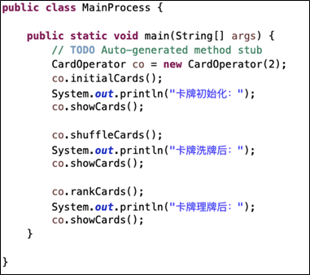
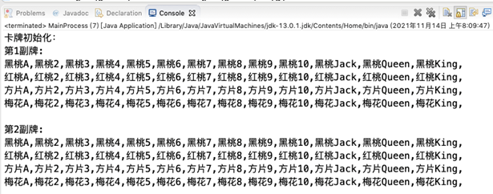
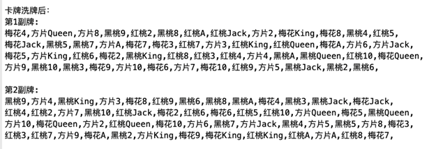
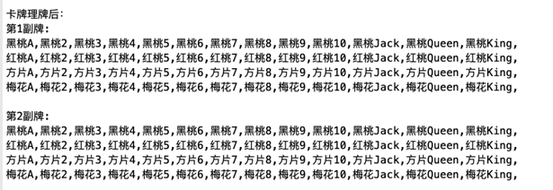

# 完成一个“卡牌操作”的类

题目要求：

1.以面向对象方式写一个“卡牌操作”类：CardOperator

2.具有以下功能（类似扑克的功能）：

* 功能1：初始化卡牌，initialCards（）

* 功能2：显示卡牌，showCards（）

* 功能3：洗牌（将牌打乱），shuffleCards（）

* 功能4：理牌（重新排序），rankCards（）

3.写一个主控程序：MainProcess类（包含main函数）

* 调用CardOperator完成各种卡牌操作

* MainProcess类如下图（直接copy即可）



* 输出结果如下图所示







### CardOperator.java

```
package cn.itcast.train.demo2;

public class CardOperater {
    private static int numPerCards = 52;
    //  private int cards_num;
    //  private int[][] cards;


    public int[][] CardOperater(int userInputCardsNum) {
        int[][] cards = new int[userInputCardsNum][numPerCards];
        for (int i = 0; i < userInputCardsNum; i++) {
            cards[i] = initialCards();
        }
        return cards;
    }

    public static int[] initialCards() {
        int[] cardArray = new int[52];
        for (int i = 0; i < cardArray.length; i++) {
            cardArray[i] = i;
        }
        return cardArray;
    }

    public static void showCards(int[][] cardArrays) {
        int cardTypeNumber;
        int cardValueNumber;
        int count = 0;
        String cardString;
        for (int i = 0; i < cardArrays.length; i++) {
            System.out.printf("第%d副卡牌\n", i + 1);
            for (int j = 0; j < numPerCards; j++) {
                cardTypeNumber = cardArrays[i][j] / 13;
                cardValueNumber = cardArrays[i][j] % 13;
                cardString = judge(cardTypeNumber, cardValueNumber);
                if (count % 13 == 12)
                    System.out.println(cardString);
                else {
                    System.out.printf("%s ", cardString);
                }
                count++;
            }
            System.out.println();
        }
    }

    private static String judge(int cardTypeNumber, int cardValueNumber) {
        String cardType = "";
        String cardValue = "";
        switch (cardTypeNumber) {
            case 0 -> {
                cardType = "黑桃";
            }
            case 1 -> {
                cardType = "红桃";
            }
            case 2 -> {
                cardType = "方片";
            }
            case 3 -> {
                cardType = "梅花";
            }
            default -> {
                System.out.println("初始化错误");
                System.exit(2);
            }
        }
        switch (cardValueNumber) {
            case 0 -> {
                cardValue = "A";
            }
            case 10 -> {
                cardValue = "Jack";
            }
            case 11 -> {
                cardValue = "Queen";
            }
            case 12 -> {
                cardValue = "King";
            }
            default -> {
                cardValue = String.valueOf(cardValueNumber + 1);
            }
        }

        return cardType + cardValue;
    }

    public int[][] shuffleCards(int[][] cardArray) {
        for (int i = 0; i < cardArray.length; i++) {
            for (int j = 0;j < numPerCards; j++) {
                int index = (int) (Math.random() * (numPerCards));
                int tmp = cardArray[i][j];
                cardArray[i][j] = cardArray[i][index];
                cardArray[i][index] = tmp;
            }
        }
        return cardArray;
    }

    public static int[][] rankCards(int[][] cardArray) {
        for (int[] ints : cardArray) {
            qSort(ints, 0, ints.length - 1);
        }
        return cardArray;
    }

    public static void qSort(int[] array, int p, int r) {
        int q;
        if (p < r) {
            q = partition(array, p, r);
            qSort(array, p, q - 1);
            qSort(array, q + 1, r);
        }
    }

    public static int partition(int[] array, int p, int r) {
        int x = array[r];
        int i = p - 1; // 指向的是比主元素小的位置
        int temp;
        for (int j=p;j<=r-1;j++) {
            if (array[j] <= x) {
                i++;
                temp = array[i];
                array[i] = array[j];
                array[j] = temp;
            }
        }
        temp = array[i+1];
        array[i+1] = array[r];
        array[r] = temp;
        return i + 1;
    }

}
```

### MainProcess.java

```
package cn.itcast.train.demo2;

public class MainProcess {
    public static void main(String[] args) {
        int[][] cards;
        int[][] shuffledCards;
        int[][] rankedCards;
        CardOperater co = new CardOperater();
        int userInputCardsNum = 3;
        cards = co.CardOperater(userInputCardsNum);
        System.out.printf("初始化%d副卡牌\n", userInputCardsNum);
        CardOperater.showCards(cards);
        System.out.println("打乱卡牌");
        shuffledCards = co.shuffleCards(cards);
        CardOperater.showCards(shuffledCards);
        System.out.println("重新洗牌");
        rankedCards = CardOperater.rankCards(shuffledCards);
        CardOperater.showCards(rankedCards);
    }
}
```

