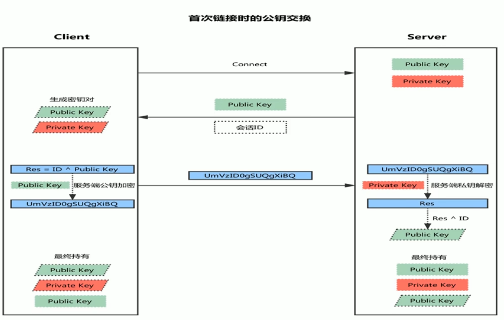

## SSH服务

### ssh服务介绍

ssh: secure shell, protocol, 22/tcp,安全的远程登录，实现加密通信，代替传统的telnet协议。

具体软件实现：

* OpenSSH：ssh协议的开源实现，CentOS默认安装。

* dropbear：另一个开源项目的实现。

SSH协议版本：

* v1：基于CRC-32做MAC，不安全；man-in-middle
* v2：双方主机协议选择安全的MAC方式，基于DH算法做密钥交换，基于RSA或DSA实现身份认证。

### ssh加密通讯原理




* 客户端发起链接请求
* 服务端返回自己的公钥，以及一个会话ID（这一步客户端得到服务端公钥）
* 客户端生成密钥对
* 客户端用自己的公钥对会话ID进行异或运算，计算出一个Res值，并用服务端的公钥加密
* 客户端发送加密后的值到服务端，服务端用私钥解密，得到Res
* 服务端用解密后的值Res异或会话ID，计算出客户端的公钥（这一步服务端得到客户端公钥）
* 最终：双方各持有三个密钥，分别为自己的一对公、私钥，以及对方的公钥，之后的所有通讯都会被加密


SSH依旧有安全风险（在第一次连接的时候，黑客做中间人，客户端与服务端一起骗）。

服务器端公钥由私钥生成。

### ssh密码登录


第一次连接风险提示。

```bash
[root@localhost docker]# ssh localhost
The authenticity of host 'localhost (::1)' can't be established.
ECDSA key fingerprint is SHA256:ivjH6BRqMxFecZIumnPUpU6shIvfDDDrtkWrbMf2vRY.
ECDSA key fingerprint is MD5:be:36:5c:8b:77:23:d2:95:5a:9f:c0:8c:e6:b9:32:81.
Are you sure you want to continue connecting (yes/no)? yes
Warning: Permanently added 'localhost' (ECDSA) to the list of known hosts.
root@localhost's password: 
Last login: Sun Oct 30 04:15:13 2022
```

查看服务端的ecdsa文件

```bash
vim ssh_host_ecdsa_key.pub

scdsa-sha2-nistp256 AAAAE2VjZHNhLXNoYTItbmlzdHAyNTYAAAAIbmlzdHAyNTYAAABBBACR1wWzGc0Cxtl6+XzesEYv69Wpj3DWW0di8HVVZywsZ8FzZWU7kG9rWmQRIyqCntHr3o3G63UaKf0bxHevw/E=
```

删除前面的文件描述，修改成如下内容。

```
AAAAE2VjZHNhLXNoYTItbmlzdHAyNTYAAAAIbmlzdHAyNTYAAABBBACR1wWzGc0Cxtl6+XzesEYv69Wpj3DWW0di8HVVZywsZ8FzZWU7kG9rWmQRIyqCntHr3o3G63UaKf0bxHevw/E=
```

可以看到base64解密后的ecdsa与风险提示中的一摸一样，可以确定此机器的IP没有被伪造。

```bash
[root@docker ssh]# base64 -d ssh_host_ecdsa_key.pub | md5sum
be365c8b7723d2955a9fc08ce6b93281  -
```

在客户端这边，会把服务端的公钥下载到本地。

```bash
[root@docker ssh]# cd ~/.ssh
[root@docker .ssh]# ls
known_hosts
[root@docker .ssh]# cat known_hosts 
localhost ecdsa-sha2-nistp256 AAAAE2VjZHNhLXNoYTItbmlzdHAyNTYAAAAIbmlzdHAyNTYAAABBBACR1wWzGc0Cxtl6+XzesEYv69Wpj3DWW0di8HVVZywsZ8FzZWU7kG9rWmQRIyqCntHr3o3G63UaKf0bxHevw/E=
124.223.164.9 ecdsa-sha2-nistp256 AAAAE2VjZHNhLXNoYTItbmlzdHAyNTYAAAAIbmlzdHAyNTYAAABBBACOxTyIZlgI6aas1Y2C4/VbZ0ht8GKhZDww/URax13buJF6nQECuPHVKMwnw6dnCNxvBEJxny0hJgubgh4e/CU=
```

在服务端查看相应公钥。

```bash
cd /etc/ssh
cat ssh_host_ecdsa_key.pub
AAAAE2VjZHNhLXNoYTItbmlzdHAyNTYAAAAIbmlzdHAyNTYAAABBBACOxTyIZlgI6aas1Y2C4/VbZ0ht8GKhZDww/URax13buJF6nQECuPHVKMwnw6dnCNxvBEJxny0hJgubgh4e/CU= root@VM-16-4-centos
```

发现与客户端保存的公钥一致。

### ssh密钥登录


客户端生成公私钥并把公钥上传至服务端

```bash
[root@docker ~]# cd ~/.ssh
[root@docker .ssh]# ls
known_hosts
[root@docker .ssh]# ssh-keygen -t rsa
Generating public/private rsa key pair.
Enter file in which to save the key (/root/.ssh/id_rsa): 
Enter passphrase (empty for no passphrase): 
Enter same passphrase again: 
Your identification has been saved in /root/.ssh/id_rsa.
Your public key has been saved in /root/.ssh/id_rsa.pub.
The key fingerprint is:
SHA256:nSmH5cGcmoKJzK+R+17+mr20/waG1S0TbzJAWgA8Yv4 root@docker
The key's randomart image is:
+---[RSA 2048]----+
|     ....oo      |
|    o o  =...    |
|   o . .. *o +   |
| o ..o   B.+* +  |
|  + o.. So*  *   |
|   o  E..oo      |
|  o . . .. .     |
|   + o + .  .    |
|  ooo +o=o.o.    |
+----[SHA256]-----+
[root@docker .ssh]# ssh-copy-id -i ~/.ssh/id_rsa.pub root@124.223.164.9
/usr/bin/ssh-copy-id: INFO: Source of key(s) to be installed: "/root/.ssh/id_rsa.pub"
/usr/bin/ssh-copy-id: INFO: attempting to log in with the new key(s), to filter out any that are already installed
/usr/bin/ssh-copy-id: INFO: 1 key(s) remain to be installed -- if you are prompted now it is to install the new keys
root@124.223.164.9's password: 

Number of key(s) added: 1

Now try logging into the machine, with:   "ssh 'root@124.223.164.9'"
and check to make sure that only the key(s) you wanted were added.

[root@docker .ssh]# ls
id_rsa  id_rsa.pub  known_hosts


```

连接成功

```bash
[root@docker .ssh]# ssh root@124.223.164.9
Last login: Sat Oct 29 23:13:20 2022 from 60.176.47.101
[root@VM-16-4-centos ~]# 
```

### 设置passpharse防止私钥泄露

```bash
[root@docker .ssh]# ssh-keygen -p
Enter file in which the key is (/root/.ssh/id_rsa): 
Enter new passphrase (empty for no passphrase): 
Enter same passphrase again: 
Your identification has been saved with the new passphrase.
[root@docker .ssh]# ls
id_rsa  id_rsa.pub  known_hosts
[root@docker .ssh]# cat id_rsa.pub 
ssh-rsa AAAAB3NzaC1yc2EAAAADAQABAAABAQDKloRUyP3V6dqQtzbapHeUCorSHVskAHk1l8HIU8MJP9P8tJBw5gWeJfBoyDOKRpQnIyvbdaoLNtaPWxmAdO+QldWm78r6/9Lg6lhU8tLMq6MF6QgKegS1s0jLXYA3Kf7LANLI7tJXLLdLvzwYrnK5nO4YY+SxQTgAg0A2kn2vqMPIrJjWUG1vuaMtfu/EHmcUi1wnQP4R3BWiKbYvigBWAD7WBaZlKJg3xk8vQorOpqdbrZX7YIrJloxZFchv8X39bKAr406SMyQK/uIgNeupHNTZ5QWzRYQaTGPESFGFGtWEsS0oG/Mq2PAef5t8YE40hkBG9eUi8FpJtlKiUm2Z root@docker
[root@docker .ssh]# ssh root@124.223.164.9
Enter passphrase for key '/root/.ssh/id_rsa': 
Last login: Sun Oct 30 11:51:42 2022 from 60.176.40.155
[root@VM-16-4-centos ~]# 
```

为私钥进行加密，利用密码才能登录

### 利用ssh-agent代理passpharse

```bash
[root@VM-16-4-centos ~]# ssh-agent bash
[root@VM-16-4-centos ~]# ps aux|grep agent
root      2646  0.0  0.1  29744  6976 ?        Sl   Oct14   3:48 /usr/local/qcloud/tat_agent/tat_agent
root      2770  0.0  0.0  97488  1728 ?        Sl   Oct14   0:20 /usr/local/qcloud/stargate/bin/sgagent -d
root      5449  0.0  0.2 159260  9576 ?        S    Oct14   0:20 barad_agent
root      5457  0.0  0.2 165576 10508 ?        S    Oct14  18:47 barad_agent
root      5458  0.6  0.3 745876 14696 ?        Sl   Oct14 143:48 barad_agent
root     16635  0.0  0.0  72552   780 ?        Ss   12:25   0:00 ssh-agent bash
root     16687  0.0  0.0 112816   980 pts/3    S+   12:25   0:00 grep --color=auto agent
[root@VM-16-4-centos ~]# ssh-add 
Identity added: /root/.ssh/id_rsa (/root/.ssh/id_rsa)
Identity added: /root/.ssh/id_ecdsa (/root/.ssh/id_ecdsa)
[root@VM-16-4-centos ~]# ssh root@124.223.164.9
Last login: Sun Oct 30 12:23:53 2022 from 60.176.40.155
[root@VM-16-4-centos ~]# exit
logout
Connection to 124.223.164.9 closed.
[root@VM-16-4-centos ~]# ssh-keygen -t ecdsa -p
Enter file in which the key is (/root/.ssh/id_ecdsa): 
Enter new passphrase (empty for no passphrase): 
Enter same passphrase again: 
Pass phrases do not match.  Try again.
[root@VM-16-4-centos ~]# ssh-keygen -t ecdsa -p
Enter file in which the key is (/root/.ssh/id_ecdsa): 
Enter new passphrase (empty for no passphrase): 
Enter same passphrase again: 
Your identification has been saved with the new passphrase.
[root@VM-16-4-centos ~]# ssh-add
Identity added: /root/.ssh/id_rsa (/root/.ssh/id_rsa)
Enter passphrase for /root/.ssh/id_ecdsa: 
Identity added: /root/.ssh/id_ecdsa (/root/.ssh/id_ecdsa)
[root@VM-16-4-centos ~]# 

```

重新实现免密登录

```bash
[root@VM-16-4-centos ~]# ssh root@124.223.164.9
Last login: Sun Oct 30 12:25:53 2022 from 124.223.164.9
```

代理程序为临时性的，数据存储在内存中，当重启代理程序时需要重新输入口令。

```bash
[root@docker .ssh]# ssh-agent bash
[root@docker .ssh]# ssh-add
Enter passphrase for /root/.ssh/id_rsa: 
Identity added: /root/.ssh/id_rsa (/root/.ssh/id_rsa)
[root@docker .ssh]# ssh-add
Enter passphrase for /root/.ssh/id_rsa: 
Identity added: /root/.ssh/id_rsa (/root/.ssh/id_rsa)
[root@docker .ssh]# ssh root@124.223.164.9
Last login: Sun Oct 30 12:31:01 2022 from 60.176.40.155
[root@VM-16-4-centos ~]# exit
logout
Connection to 124.223.164.9 closed.
[root@docker .ssh]# exit
exit
[root@docker .ssh]# ssh root@124.223.164.9
Enter passphrase for key '/root/.ssh/id_rsa': 
Last login: Sun Oct 30 12:32:12 2022 from 60.176.40.155
[root@VM-16-4-centos ~]# 
```

当我们的电脑不在身边时，其实就需要把私钥拷贝，先在服务器设置好key的验证，那么不管我们在哪里都能登录服务器了。
